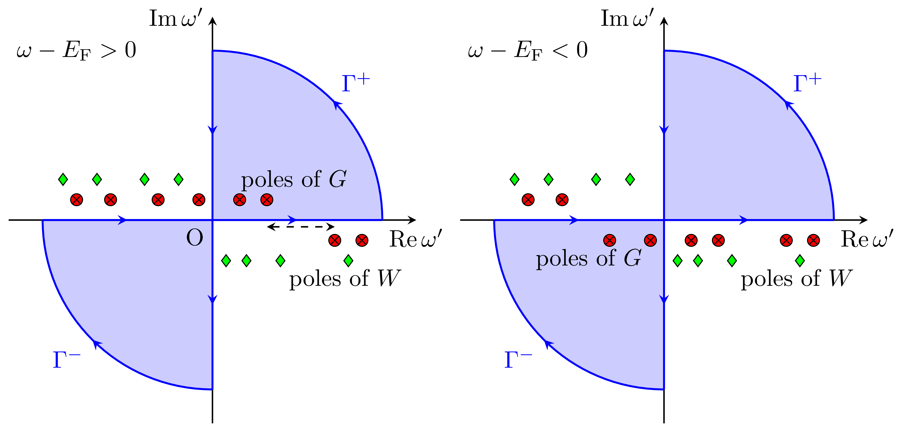

# 自己エネルギー計算の実装について

## 実行プログラム
- `hsfp0_sc` : QSGW計算で使用。$W$はエルミート化される。off-diagonal を含めた自己エネルギーを計算する。
- `hsfp0` : スペクトル関数, 準粒子寿命計算で使用。$W$はエルミート化されず、自己エネルギーの対角成分(複素数)のみを計算。

## 並列化
以下のMPI並列化が実装されている。
 - $q$点: 第一還元ゾーン中のk点数。
 - $k$点: 第一ゾーン中のk点数 `GWinput` の `n1n2n3` で指定した量
 - $ω'$並列: hsfp0_scのみ, $G$と$W$の振動数での畳み込み積分における並列化

> [!TIP]
> $ω'$並列は$q,k$並列に比べ効率が悪いためデフォルトでは使用されない。使用する場合は`--nwpara=XX`を実行時引数に指定する。

## 自己エネルギー(相関)の計算
以下の計算を行う。
$$
\braket{𝜙_{𝒒n}|𝛴^\mathrm{c}(ω)|𝜙_{𝒒m}} = \sum_{𝒌n'} \sum_{μν}
\braket{𝜙_{𝒒n}|𝜙_{𝒒-𝒌n'}E^{𝒌}_{μ}} \braket{E^{𝒌}_{ν}𝜙_{𝒒-𝒌n'}|𝜙_{𝒒m}}
\int_{-∞}^{∞} \frac{idω'}{2π}
\frac{ W^c_{μν}(𝒌,ω') }{ω-ω' - ε_{𝒒-𝒌n'} ±iδ}
$$

$ω'$についての積分($G$と$W$の畳み込み)を数値的にどのように計算するか。が問題となる。実$ω'$の近傍には$G$の極があり, 実$ω'$軸上の数値計算を困難としている。
これを計算する方法として、解析接続を用いる手法、周回積分を用いる手法が知られている。ecaljでは後者を使用している。
複素数に拡張した$ω'$空間で, 以下のような周回積分を考える。$W^\mathrm{c}(ω) → 0 (|ω| → ∞)$より$Γ^±$上の積分値はゼロとなる。この経路は$W$の極を避けるようにしている。

{ width=100% class="centered-image" }

よって, 虚軸積分寄与と留数の寄与から実軸積分が計算できる。
$$
\int_{-∞}^{∞} \frac{idω'}{2π}
\frac{ W^c_{μν}(𝒌,ω') }{ω-ω' - ε_{𝒒-𝒌n'} ±iδ}
=  \mp \text{Res}(W, ω-ε_{𝒒-𝒌n'})
-\int_{-∞}^{∞} \frac{dω'}{2π}
\frac{ W^c_{μν}(𝒌,iω') }{ω-iω' - ε_{𝒒-𝒌n'} ±iδ} 
$$
