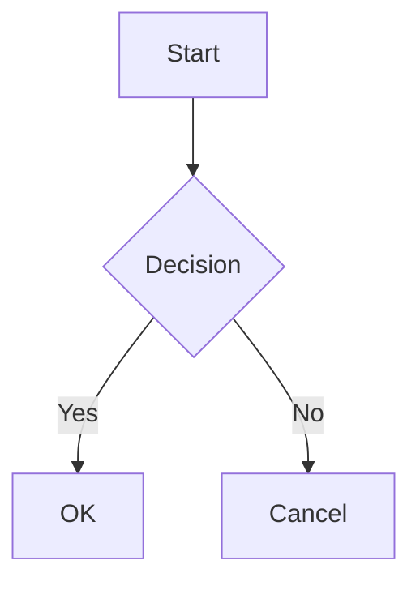

# Implementation of $W$ with RPA response function

## MPI

```mermaid
graph TD
    A[Start] --> B{Decision}
    B -->|Yes| C[OK]
    B -->|No| D[Cancel]
```
<!-- diagram id="1" caption: "System Design Flow" -->
## $Z$:zmel
