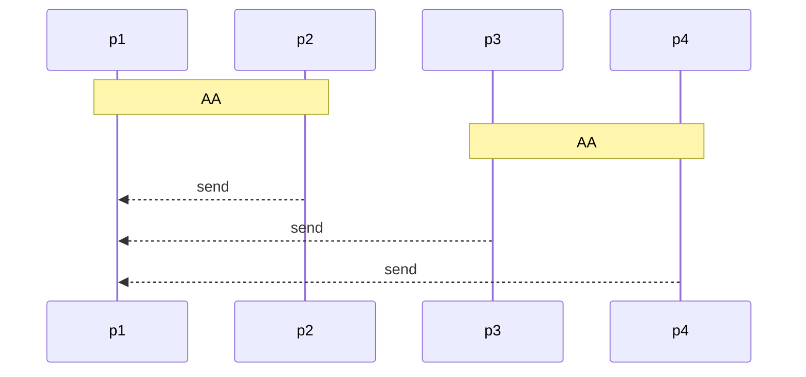

# Implementation of $W$ with RPA response function

## MPI

```mermaid
sequenceDiagram
    participant p1
    participant p2
    participant p3
    participant p4
note over p1,p2:AA
note over p3,p4:AA
p2-->>p1:send
p3-->>p1:send
p4-->>p1:send
```

## $Z$:zmel
