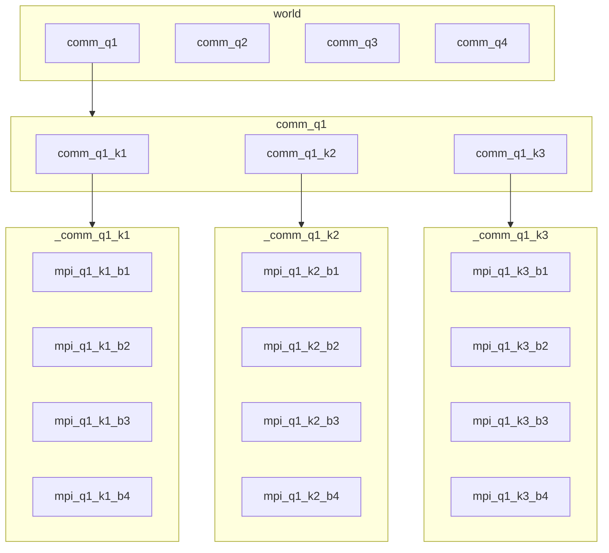

# Implementation of $W$ with RPA response function
テストページ
## MPI

```mermaid
graph TB
    direction TB
    world
    subgraph world
        comm_q1
        comm_q2
        comm_q3
        comm_q4
    end

    comm_q1 --> _comm_q1
    subgraph _comm_q1 [comm_q1]
        comm_q1_k1
        comm_q1_k2
        comm_q1_k3
    end

    comm_q1_k1 --> _comm_q1_k1
    subgraph _comm_q1_k1
        mpi_q1_k1_b1
        mpi_q1_k1_b2
        mpi_q1_k1_b3
        mpi_q1_k1_b4
    end
    comm_q1_k2 --> _comm_q1_k2
    subgraph _comm_q1_k2
        mpi_q1_k2_b1
        mpi_q1_k2_b2
        mpi_q1_k2_b3
        mpi_q1_k2_b4
    end
    comm_q1_k3 --> _comm_q1_k3
    subgraph _comm_q1_k3
        mpi_q1_k3_b1
        mpi_q1_k3_b2
        mpi_q1_k3_b3
        mpi_q1_k3_b4
    end
```

The number of parallel processes is divided by q-points, k-points, and MPB basis.
