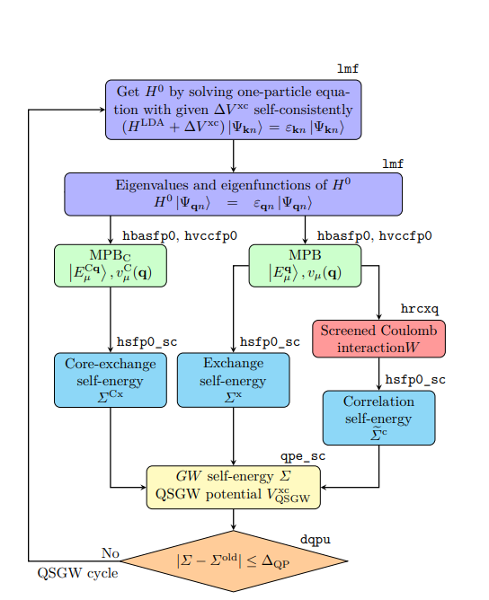
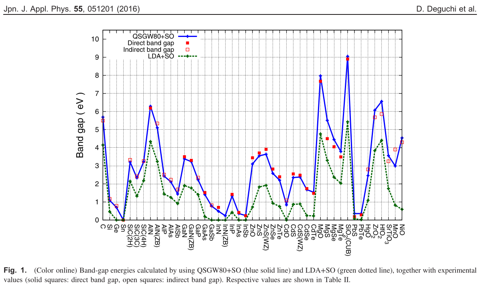

# ecalj MainDocument
**This is a MainDocument of ecaljdoc. All files in ecaljdoc are linked from this file.**

* Here we give [GetStarted](#getstarted) and followed by install and QSGW overview.
* [Qiita Japanese](https://qiita.com/takaokotani/items/9bdf5f1551000771dc48) may be a help, but most of all are here.

## Licence 
 [AGPLv3](https://www.gnu.org/licenses/agpl-3.0.html).  For publications, we hope to make a citation as;
    [1] ecalj package available from https://github.com/tkotani/ecalj/.

## Install
To install ecalj, look into [install](../install/install.md), as well as [install for ISSP](../install/install.md)

## Features of ecalj package

1. **All electron full-potential PMT method**
   
   The PMT method means; a mixed basis method of two kinds of augmented waves, that is, APW+MTO.
   In other words, the PMT method= the linearized (APW+MTO) method, which is unique except the [Questaal](https://www.questaal.org/) having the same origin with ecalj. We found that MTOs and APWs are very comlementary, corresponding to the localized and the extented natures of eigenfunctions. That is, very localized MTOs (damping factor $\exp(-\kappa r)$ where $\kappa \sim 1 $ a.u.; this implies only reaching to nearest atoms) together with APWs (cutoff is $\approx 3$ Ry) works well to get reasonable convergences.  We can perform atomic-position relaxation at GGA/LDA level. Because of including APWs, we can describe the scattering states very well.
  (This fig is taken from [nfp-manual](../presentations/nfpmanual.pdf))
   
   The current PMT formulation is given in

   [1][KotaniKinoAkai2015, PMT formalism](../presentations/KotaniKinoAkai2015FormulationPMT.pdf)   
   [2][KotaniKino2013, PMT applied to diatomic molecules](../presentations/KotaniKino2013PMTMolecule.pdf).

   Since we have automatic settings for basis-set parameters, we don't need to be bothered with the parameter settings. Just crystal structures (POSCAR) are needed for calculations. 
   <!-- In principle, it is possible to perform reasonable calculations just from crystal structures and very minimum setting.  -->
    * Our method uses smooth Hankel functions described in [A][SmoothHankel paper ](../presentations/Bott1988.pdf), which was used in [B][nfp paper](../presentations/Bott1988.pdf). Our PMT is on top them.

    In addition to PMT basis, we use local orbitals together.
2. **PMT-QSGW method** 
   
   The PMT-QSGW means 
   `the Quasiparticle self-consistent GW method (QSGW) based on the PMT method`.
   After converged, we can easily make band plots without the Wanneir interpolation. This is because an interpolation scheme of self-energy is internally built in.
   We can handle even magnetic metals. Since we have implemented ecalj on GPU, we can handle ~40 atoms with four GPUs.
   [3][Kotani2014,Formulation of PMT-QSGW method](../presentations/Kotani2014QSGWinPMT.pdf)
   [4][D.Deguchi PMT-QSGW applied to a variety of insulators/semiconductors](../presentations/deguchi2016.pdf)
   [5][M.Obata GPU implementation](https://arxiv.org/abs/2506.03477), where we treat Type II GaSb/InAs (40 atoms) with four GPUs.

3. **Dielectric functions and magnetic susceptibilities**
    We can calculate GW-related quantities such as dielectric functions, spectrum function of the Green's functions, Magnetic fluctuation, and so on. 

4. **The Model Hamiltonian with Wannier functions** 
   We can generate the effective model (Maxloc Wannier and effective interaction between Wannier funcitons). 
   This is originally from codes by Dr.Miyake, Dr.Sakuma, and Dr.Kino. The cRPA given by Juelich group is implemented. We are now replacing this with a new version MLO (Muffin-Tin-orbail-based localized orbital).


# Overview of QSGW 

* Band calculations (LDA level) are performed with the program `lmf`. The initial setting file is `ctrl.foobar` ( `foobar` is user-defined). Before running `lmf`, it is necessary to run `lmfa`, which is a spherically symmetric atom calculation to determine the initial conditions for the electron density (`lmfa` finishes instantaneously). 
* A file `sigm.foobar` is the key for QSGW calculations. The file `sigm.foobar` contains the non-local potential $\Delta V_{\rm xc}=V_{\rm xc}^{\rm QSGW}-V_{\rm xc}^{\rm LDA}$. By adding this potential term to the usual LDA calculation performed by `lmf`, we can perform QSGW calculations. See figure below.
* Thus the problem is how to generate $V_{\rm xc}^{\rm QSGW}({\bf r},{\bf r}')$. This is calculated from the self-energy  $\Sigma({\bf r},{\bf r}',\omega)$, which is calculated in the GW approximation. Roughly speaking, we obtain $V_{\rm xc}^{\rm QSGW}({\bf r},{\bf r}')$ with removing the omega-dependence in $\Sigma({\bf r},{\bf r}',\omega)$.
* Therefore, the calculation of $V_{\rm xc}^{\rm QSGW}$ is the major part of the QSGW cycle, and is calculated in a double-structure loop. That is, there is an inner loop of `lmf`, and an outer loop to calculates $V_{\rm xc}^{\rm QSGW}$ using the eigenfunctions given by `lmf`. This outer loop can be executed with a python script called gwsc (which runs fortran programs). The computational time for QSGW is much longer than that of LDA calculation. As a guideline, it takes about 10 hours for 20 atoms (depending on the number of electrons). 
* Here is the QSGW cycle shown in Figure 1 in https://arxiv.org/abs/2506.03477 . MPB meand the mixed product basis to expand products of eigenfunctions. 
 
* We have [GPU acceleration for QSGW](https://arxiv.org/abs/2506.03477).  Thus we can handle large systems. With 4 GPU, we can compute systems with 40 atoms per cell with surfaces. (As for lmf part, GPUs are not efficiently used yet.)
* As noted, we can perform QSGW virtually without parameter settings by hands. Thus I think ecalj is one of the easiest code to perform GW for users. See band database in QSGW at https://github.com/tkotani/DOSnpSupplement/blob/main/bandpng.md
(this is a supplement of https://arxiv.org/abs/2507.19189).  This is away from complete one, but showing the ability of ecalj.

 This is taken from  [4][D.Deguchi](../presentations/deguchi2016.pdf)


<!-- 
## 基礎知識check 
* LDA計算の流れ
* MT division of space
* 基底関数 MTOとAPW　（AugmentationとMT内の原子的な波動関数). 3つの成分をもつ。envelope + true - counter
* バンド計算法PMT=LMTO+LAPW法. ３つの成分で電荷も表現する。MTOの張る空間の不満足な部分を3Ry以下程度のAPWでサポートする。
* 独立粒子近似とは
* Hartree-Fock(HF)近似で水素Hがきちんと解ける。一様ガスではフェルミ面で状態密度がゼロになる。
* LDAでは一様ガスがきちんと解けるがHのバンドギャップはかなり小さい。
* LDAとHFは両極にある。HFではSiのバンドギャップは10eV以上（なぜか？）　ハイブリッド法HSE。自己相互作用。
* 交換項の重要性。H2のbonging-antibondingを区別するには、占有状態へのプロジェクタの役割をするFock項が重要
* GW近似. Fock項にくわえて相関項。分極媒質中を走る荷電粒子の感じる時間依存ポテンシャル。スクリーンHF+クーロンホール
　バンドギャップ、dバンドの位置、Uの効果
* QSGW法。GW近似における自己エネルギーからいくらか強引に時間依存性をとりのぞいて特殊な交換相関項をつくる。
* （できたら線形応答理論の基礎、ステップ関数のフーリエ変換、古典的な減衰振動系でのグリーン関数（線形応答関数）。）

## ecalj 何ができるか？

* LDA計算 
VWN,PBE-GGA,LDA+Uがえらべる。
構造緩和（格子変化は手動）、Colinear,  SOC(軸を選べる）, AFの対称性を入れることができる。
ESM法でのスラブ計算. 最適化しきれてないので現状では構造緩和などでは優位性がない。

* QSGW計算：
self-consistent GW法。特殊な交換相関項を作る計算であるといえる。
自己エネルギースペクトルプロット。
インパクトイオン化率（オージェによる寿命）。
GPU化、自動化セッテイング。
GW法でのバンドプロットが直接に可能。
QSGWでは現状全エネルギー計算ができない。バンド構造（固有値、波動関数）のみ。
* 線形応答などの計算。
RPAでの誘電率計算、スピンゆらぎ計算 （改良の余地。金属でもできる。ドルーデウエイト(q→0）
MaxlocWannier(内蔵している）、MLO（新しいモデル化法：まだ余地あり）。 自動化がすこしできてないところがある。
その他の物理量についても応用できるはず。
* かなりの部分で自動計算が可能。QSGW法ではMaterial Projectから1500個程度の構造ファイルを持ってきて自動化でQSGW計算しているが
ほぼ問題なく可能。個別にセッティングを手動でいじらなくても良い（4f,5fについては自動化がまだ設定できてないが基本的に可能）
バンドプロットも対称ラインも含め自動化してある。データはgnuplotなどでプロットするので読みやすい。結晶構造についてはPOSCARとの相互コンバータあり。
複数のPOSCARを一括計算するecalj_autoも梱包してある（整備中）。 -->


# GetStarted
Here we explain DFT/QSGW calculations with ecalj. Then we explain how to make band plots. For simplicity, we treat paramagetic cases (nsp=1), no 4f, no SOC.
We explain things step by step.

Further details are explained at [UsageDetailed](./UsageDetailed.md)

## Step 0. Get POSCAR
We first need POSCAR (crystal structure in VASP format). 
You can find samples of POSCAR in ecalj/ecalj_auto/INPUT/testSGA/POSCARALL as
```bash
cd ecalj
mkdir TEST
cd TEST
mkdir test1
mkdir test2
cat ecalj_auto/INPUT/testSGA/joblist.bk
cp ../ecalj_auto/INPUT/testSGA/POSCARALL/POSCAR.mp-2534 test1
cp ../ecalj_auto/INPUT/testSGA/POSCARALL/POSCAR.mp-8062 test2
```

For example, POSCAR of mp-2534 GaAs is given as:
```POSCAR
Ga1 As1
1.0
   3.5212530000000002    0.0000000000000000    2.0329969999999999
   1.1737510000000000    3.3198690000000002    2.0329969999999999
   0.0000000000000000    0.0000000000000000    4.0659929999999997
Ga As
1 1
direct
   0.0000000000000000    0.0000000000000000    0.0000000000000000 Ga
   0.2500000000000000    0.2500000000000000    0.2500000000000000 As

```
This is another POSCAR for ba2pdo2cl2 (QSGW results are shown below):
```
POSCAR_ba2pdo2cl2
1.0
-2.06443 2.06443 8.40383 
2.06443 -2.06443 8.40383 
2.06443 2.06443 -8.40383 
Ba Pd O Cl 
2 1 2 2 
Cartesian
0.0 0.0 6.5153213224
0.0 0.0 10.2923386776
0.0 0.0 0.0
0.0 2.06443 0.0
2.06443 0.0 0.0
0.0 0.0 3.1625293056
0.0 0.0 13.6451306944
```

If you have cif and like to convert it to `POSCAR`, do
`cif2cell foobar.cif -p vasp --vasp-cartesian --vasp-format=5`.


## Step 1. convert POSCAR to ctrls
Then we convert POSCAR to ctrls by vasp2ctrl.
ctrls is the structure file used in ecalj.

```
vasp2ctrl POSCAR.mp-2534 
mv ctrls.POSCAR.mp-2534.vasp2ctrl ctrls.POSCAR.mp-2534
cat ctrls.mp-2534
```
ctrls.mp-2534 contains crystal structure equivalent to POSCAR:
```
cat ctrls.mp-2534 
STRUC
     ALAT=1.8897268777743552
     PLAT=       3.52125300000       0.00000000000       2.03299700000  
                 1.17375100000       3.31986900000       2.03299700000 
                 0.00000000000       0.00000000000       4.06599300000 
  NBAS=2
SITE
     ATOM=Ga POS=     0.00000000000       0.00000000000       0.00000000000 
     ATOM=As POS=     1.17375100000       0.82996725000       2.03299675000 
```


- MEMO: 
    - ctrl2vasp ctrl.mp-2534 can convert back to VASP file. Check this by VESTA. We can use viewvesta (convert and invoke VESTA).
    - many unused files are generated (forget them).

## Step 2. Get ctrl from ctrls
ctrl is a basis input file for ecalj. We generate template of ctrl  by ctrlgenM1.py.
Minimum explanations are embedded in the generated ctrl file.
Number of k points (nk1 nk2 nk3), APW cutoff (pwemax), nspin, so(spin orbit switch) are only what we need to tweak usually.

When we run lmf, we can add command line option such as -vnspin=2. Then const foobar=1 defined in the ctrl file is overridden (referred with {foobar}). save.* file show which -vfoobar you used.

It is possible to enforce symmetry, antiferro symmetry.
<!-- ctrlgenM1.pyの内部ではlmfa,lmchk(原子球サイズ決定）などを呼んでいる。
これ以後の計算にはctrl.foobarのみ残しておけば良い（ムダファイルが大量にできているのは消して良い）.  -->
We only need ctrl file in the following calculations (while some tmp* kinds of files are generated).

```bash
ctrlgenM1.py mp-2534
```
If no problem, you see
```
...
=== End of ctrlgenM1.py. OK! A template of ctrl file, ctrlgenM1.ctrl.mp-2534, is generated.
```
Here `ctrlgenM1.py` internally calls `lmf` and `lmchk`, which generate irrelevant files which are automatically deleted.
'SiteInfo.lmchk and PlatQlat.chk' are explained later on (these are easily reproduced by ctrl).

Then copy as
```
cp ctrlgenM1.ctrl.mp-2534 ctrl.mp-2534
```
and edit `ctrl.foobar` if necessary. 

How to edit? Explanations are embedded in ctrl.foobar (please let me know wrong descriptions). Possible points to rewrite in ctrl.foobar:
1. Number of k points (nk1,nk2,nk3).
2. nsp=2 if magnetic
3. SpinOrbitCoupling: so=0 (none), so=1 (LdotS), 2 (LzSz). nsp=2 is required for so=1,2. so=1 does not yet support QSGW. SOC axis can also be freely selected, but currently (0,0,1) default and (1,1,0) are supported (m_augmbl.f90). If you want to set SO=1 in QSGW, currently, run QSGW calculation with so=0 or so=2 to obtain ssig file, then set so=1
4. xcfun (choice of LDA exchange correlation term). Only =1:BH, =2:VWN, =103:PBE-GGA.
5. LDA+U settings (not explained yet).
6. ssig=1.0 (If you choose QSGW80, use ssig=0.8. Effective for QSGW calculations.
$V^{\rm xc QSGW}-V^{\rm xc LDA}$ is stored in a file `sigm.foobar`. We add ssig $\times (V^{\rm xc QSGW}-V^{\rm xc LDA})$ to the potential in the lmf calculation as long as `sigm.foobar` file is available.

* `lmchk --pr60 foobar` allows you to check the recognized symmetries by `lmf`. Turning off --pr60 or reducing 60 will reduce the verbosity of output.

At this point, you can visually check the following check files.
* SiteInfo.chk
MT radius Atomic positions
* PlatQlat.chk
Primitive lattice vector (plat) Primitive reciprocal lattice vector (qlat)

[Here we explain details of ctrl file](./lmf.md).

 **Hereafter, we only use `ctrl.foobar` (`ctrls.foobar` is used hereafter.). We can delete other files.**


### Install VEST 
It is convenient to see crystal structures with VESTA.
(I installed VESTA-gtk3.tar.bz2 (ver. 3.5.8, built on Aug 11 2022, 23.8MB) on ubuntu 24)
At ecalj/StructureTool/, we have 'viewvesta' command. Try 
```
viewvesta ctrl.si
```
to see the structure in VESTA. At /StructureTool, we have converters, 
```vasp2ctrl``` and ```ctrl2vasp```.  
<small>(We have ~/ecalj/GetSyml/README.org. Not need to see this)</small>


## Step 3. LDA calculation
1. Run lmfa at first. It is for spherical atomic electron densities, contained in the crystals. lmfa ends instantaneously.
   ```bash
   lmfa ctrl.mp-2534
   ```
   gives spherical atom calculation for initialization.`lmfa` calculates spherically symmetric atoms and generates the files required for lmf below. 
   Check `conf ` section in the console output as
   ```bash
   lmfa ctrl.mp-2534 |grep conf
   ```
   . This shows atomic configuration (there are no side effects even if `lmfa` is repeated). The initial condition of electron density for lmf is given as the superposition of spherically symmetric atomic densities given by lmfa. In addition, lmfa calculations are performed with the logarithmic derivative of the radial wave function at the MT sphere edge fixed (READP True in default ctrlgenM1.py setting). The derivatives are contained in `atmpnu.*` files. So, `atmpnu.*` are needed for `lmf`.

2. After `lmfa`, we run LDA calculation as:

   ```bash
   mpirun -np 8 lmf mp-2534 |tee llmf 
   ```

   * mp-2534 (GaAs) gives 5.75 $\AA$ for GaAs, while the experimental value is 5.65$\AA$.
   * llmf contains information of iterations, check eigenvalue and fermi energies, band gap.
   * rst.mp-2534 is generated. Self-consistent charge included.
   * You can change lattice constant as ALAT=1.8897268777743552*5.65/5.75 in ctrl file. simple math operators such as `* + - / ** ` can be possible in ctrl.
   * Note: ctrlp is intermediate file generated by python from ctrl. Fortran calls a python code internally.(ctrl2ctrlp.py is responsible for the math)
   * check save.mp-2534. Show history of lmfa and lmf. one line per iteration. Show your console options. c,x,i,h
   LDA energy shown two values need to be the same (but slight difference).
   Repeat lmf stops with two iteration.
   * SiteInfo.lmchk : Site infor
   * PlatQlat.chk : Lattice info
   * estaticpot.dat : electrostatic potential of smooth part.

NOTE:
We have deguchi paper https://sci-hub.tw/https://doi.org/10.7567/JJAP.55.051201
All calculation is by the default setting in QSGW on the PMT method. 
> No empty spheres. EH=-1,EH=-2, MT radius is -3% untouching.
> RSMH=RSMH2=R/2

## Step 4. Create k-path and BZ for band plot
After the calculation converges, it might be necessary to make a band plot with `job_band` command explain later on. The normality of the calculation of bands can be confirmed by the band plot (for magnetic systems, check the total magnetic moment and the magnetic moment for each site).

Before `job_band`, run ```getsyml gaas```. Install any missing packages with pip. It is on spglib by Togo and seekpath. After finished, view BZ.html. It shows the k-path in the BZ ashow show below for ba2pdo2cl2. 
It is an interactive figure written with plotly, so you can read the coordinate values.

```
getsyml mp-2534
```


* Samples of BZ.html by getsyml are seen at https://ecalj.sakura.ne.jp/BZ/.


## Step 5. band plot
（this is a case for ba2pdo2cl2 ）
```
>job_band ctrl.ba2pdo2cl2 -np 8
```

A gnuplot script can be created. Edit it if necessary. If you edit syml.ba2pdo2cl2 before `job_band`, you can adjust the symmetry line and mesh size.

* The following picture is the LDA bands for the default calculation of ba2pdo2cl2 (the names of the symmetric points can be confirmed with BZ.html. In addition, look into `syml.foobar`). 0 eV is the Fermi energy. Since this is metallic, we see no band gap.
.

* The defaults are fine except for the k-mesh setting. For example, it is better to increase the k mesh for Fe. In general, for semiconductors, 4 4 4 for Si is a reasonable level, 6 6 6 is a level that can be used for a paper, and 8 8 8 is a level for checking accuracy. For metals such as Fe, 8 8 8 is a reasonable level.

Here we are talking about band energies.

* In ecalj, the k mesh for `lmf` (ctrl) and the k mesh for GW (n1n2n3 specified in GWinput) can be different. The former has affected little on computational time, but the latter has a large effect (thus we want to reduce `n1n2n3` in `GWinput`).

* In ecalj's band plot mode, theoretically degenerated bands because of symmetry at the BZ edge are not degenerated. This is because there are limited numbers of APW basis functions, so run the band plot with pwemax=4, etc. (Temporary solution: We want to automate it).


### job_tdos, job_fermisurface, job_pdos
`job_pdos` calculates PDOS, `job_tdos` calculates total DOS, and `job_fermisurface` draws the Fermi surface with Xcrysden.
`job_fermisurface` can be used to draw the shape of the CBM bottom as ellipsoid of Si.
xxx 

<!-- ### job_pdos,job_tdos, job_fermisurface 
For band plot, we use job_band. Before this, we need to generate symmetry lines writtenin [syml.foobar](syml.md)。This can be generated  by getsyml foobar.

This generates syml.mp-2534.
[BZ.html](https://ecalj.sakura.ne.jp/BZgetsyml/) contains BZ and symmetry lines.
For bandplot,
```
job_band mp-2534 -np 8 [options]
```
At the end of job_band, you can add options for lmf as -vso=1 -vnspin=2.
(these are for SOC as perturbation)
We use gnuplot for band plot bandplot.isp1.glt.

In the similar manner, we can run job_pdos, job_tdos, job_fermisurface. -->

## Step 6. QSGW calculation
We now run QSGW calculations. qSGW is compuationally very expensive. So we recommend you to run smaller systems at first.

For QSGW calculations, we need one additional input file `GWinput`, whose template is generated by mkGWinput [GWinput](./gwinput.md) as
```
mkGWinput ctrl.mp-2534
```
Then copy and edit GWimput.tmp to GWinput.

In `GWinput`, n1n2n3 should be smaller than nk1 nk2 nk3 in ctrl file
in order to reduce computational time (1/2 or 2/3 of ctrl, for example)
If 6x6x6 for Si, it is reasoble. Except k points, not need to modify so much (ask us).
`GWinput` is explained [here](./gwinput.md). Input system is different from ctrl.

### flow of QSGW calculation with the script gwsc
We run the QSGW calculations with gwsc. For semiconductors, several QSGW iterations are fine, close enough to final results.
QSGW is to obtain band structures (or one-body Hamiltonian), the total energy is not yet.

`QPU` file contains diagonal components of GW calculations.
Note that our `Mixed Produce basis` is a key technology for the GW calculation.
```
gwsc -np NP [--phispinsym] [--gpu] [--mp] nloop extension
```
(--phispinsym is for magnetic materials to keep the same basis for up and down)


Then console outputs of `gwsc` is somthing like
```
### START gwsc: ITERADD= 1, MPI size=  4, 4 TARGET= si
===== Ititial band structure ====== 
---> No sigm. LDA caculation for eigenfunctions 
0:00:00.226245   mpirun -np 1 /home/takao/bin/lmfa si     >llmfa
0:00:00.807062   mpirun -np 4 /home/takao/bin/lmf  si     >llmf_lda
===== QSGW iteration start iter 1 ===
0:00:03.071054   mpirun -np 1 /home/takao/bin/lmf si     --jobgw=0 >llmfgw00
0:00:03.904403   mpirun -np 1 /home/takao/bin/qg4gw    --job=1 > lqg4gw
0:00:04.431022   mpirun -np 4 /home/takao/bin/lmf si     --jobgw=1 >llmfgw01
0:00:05.918216   mpirun -np 1 /home/takao/bin/heftet --job=1    > leftet
0:00:06.444439   mpirun -np 1 /home/takao/bin/hbasfp0 --job=3    >lbasC
0:00:07.064558   mpirun -np 4 /home/takao/bin/hvccfp0 --job=3    > lvccC
0:00:07.812283   mpirun -np 4 /home/takao/bin/hsfp0_sc --job=3    >lsxC
0:00:08.545956   mpirun -np 1 /home/takao/bin/hbasfp0 --job=0    > lbas
0:00:09.156775   mpirun -np 4 /home/takao/bin/hvccfp0 --job=0    > lvcc
0:00:09.884064   mpirun -np 4 /home/takao/bin/hsfp0_sc --job=1    >lsx
0:00:10.644292   mpirun -np 4 /home/takao/bin/hrcxq   > lrcxq
0:00:11.482931   mpirun -np 4 /home/takao/bin/hsfp0_sc --job=2    > lsc
0:00:12.460776   mpirun -np 1 /home/takao/bin/hqpe_sc    > lqpe
0:00:13.019735   mpirun -np 4 /home/takao/bin/lmf si     >llmf
===== QSGW iteration end   iter 1 ===
OK! ==== All calclation finished for  gwsc ====
```
... 

The console outputs are redirected to log files `l*`. `lsxC` is the exchange self-energy due to cores. `lsx` is for exchange. `lsc` is correlation. `lvcc` is for Coulomb matrix。
In this calculation we run `gwsc -np 8 1 si`, where 1 is the number of QSGW iteration.
If you repeat gwsc, we have additional QSGW iterations on top the previous calculations.

For La2CuO4, I had 
```
2025-06-27 19:09:01.465241   mpirun -np 1 echo --- Start gwsc ---
--- Start gwsc ---
option=   -vssig=0.8 
### START gwsc: ITERADD= 5, MPI size=  32, 32 TARGET= lcuo
===== Ititial band structure ====== 
---> We use existing sigm file
0:00:00.041902   mpirun -np 32 /home/takao/bin/lmf lcuo   -vssig=0.8  >llmf_start
We found QPU.5 -->start to generate QPU.6...
===== QSGW iteration start iter 6 ===
0:00:18.111042   mpirun -np 1 /home/takao/bin/lmf lcuo   -vssig=0.8  --jobgw=0 >llmfgw00
0:00:18.233440   mpirun -np 1 /home/takao/bin/qg4gw   -vssig=0.8 --job=1 > lqg4gw
0:00:18.488197   mpirun -np 32 /home/takao/bin/lmf lcuo   -vssig=0.8  --jobgw=1 >llmfgw01
0:00:40.910973   mpirun -np 1 /home/takao/bin/heftet --job=1   -vssig=0.8 > leftet
0:00:41.052760   mpirun -np 1 /home/takao/bin/hbasfp0 --job=3   -vssig=0.8 >lbasC
0:00:43.290214   mpirun -np 32 /home/takao/bin/hvccfp0 --job=3   -vssig=0.8 > lvccC
0:01:00.327823   mpirun -np 32 /home/takao/bin/hsfp0_sc --job=3   -vssig=0.8 >lsxC
0:01:45.547149   mpirun -np 1 /home/takao/bin/hbasfp0 --job=0   -vssig=0.8 > lbas
0:01:46.806858   mpirun -np 32 /home/takao/bin/hvccfp0 --job=0   -vssig=0.8 > lvcc
0:01:59.034735   mpirun -np 32 /home/takao/bin/hsfp0_sc --job=1   -vssig=0.8 >lsx
0:02:45.526614   mpirun -np 32 /home/takao/bin/hrcxq  -vssig=0.8 > lrcxq
0:06:51.996781   mpirun -np 32 /home/takao/bin/hsfp0_sc --job=2   -vssig=0.8 > lsc
0:23:31.022636   mpirun -np 1 /home/takao/bin/hqpe_sc   -vssig=0.8 > lqpe
0:23:33.062303   mpirun -np 32 /home/takao/bin/lmf lcuo   -vssig=0.8  >llmf
===== QSGW iteration end   iter 6 ======== QSGW iteration start iter 7 ===
0:24:12.969096   mpirun -np 1 /home/takao/bin/lmf lcuo   -vssig=0.8  --jobgw=0 >llmfgw00
...
```
This is without GPU. We see one QSGW iteration requires 24 minutes (start timing is shown at the top of lines).
Since I had 5th-QSGW iteration finished (checked  by the existence of QPU.5run), it start from 6th iteration.

---
Here is a case of ba2pdo2cl2.

Run
```
mkGWinput ba2pdo2cl2
```
to generate GWinput.tmp, which is a setting file for QSGW.
After copying this to GWinput, you may need to edit GWinput.
Minimum thing to edit is the number of k points for the self energy (n1n2n3).
Compared with k points in ctrl (nk1,nk2,nk3), we use small numbers.
(We often use 1/2 or 2/3 of k points given in ctrl as nk1,nk2,nk3).

There are another setting in GWinput. However, we usually do not need to touch things except n1n2n3 if you treat non-magnetic semiconductors.

Then you can run QSGW calculation with 
```
gwsc -np 32 1 ba2pdo2cl2
```
. Here 1 means the number of QSGW iterations. QSGW iteration is quite time-consuming. `gwsc` gives minimum help (we need to explain options elsewhere).

The iteration is kept in `rst.foobar`:electron density, `sigm.*`:vxcqsgw.
(Remove these files in addition to *run files/directories if you like to start from the beginning).

* It requires 53 minutes to run one iteration of QSGW.

* job_band ba2pdo2cl2 -np 32 gives the following picture. QSGW one-shot changes band structure around Ef from that in LDA.But still metallic, no band gaps.


* To continue QSGW iteration, run
```
gwsc -np 32 nx ba2pdo2cl2
```
Since you did 1 already. You will have the results of 1+nx QSGQ iteration. 

* when we run 8 iterations as for ba2pdo2cl2, we had band gap 2.1 eV. We saw band gap after 4th iteration.

* For comparison with experiments, we recommend to use ssig=0.8
(set in ctrl.foobar file), which is called as QSGW80.

* Spin-orbit coupling. After you obtain `sigm.foobar`, you set SO=1 (LdotS scheme) and run lmf. Then you can include effect of SOC. Sinc SO=1
is not implemented in the whole gwsc cycle, we have to include SOC just at the end step (We include SOC after we fix VxcQSGW).

* If you run 
```
gwsc -np 32 5 ba2pdo2cl2 -vssig=0.8
```
, this overide ssig, which is defined in ctrl.ba2pdo2cl2, in lmf calculations. (Check it in save.ba2pdo2cl2)

* Example of QSGW for KTaO3 (perovskite,mp-3614）


## lmchk 
  ```
  lmchk mp-2534
  ```
  is to check the crystal symmetry. In addition determine MT radius. and Check the ovarlap of MTs. Defaults setting is with -3% overlap.(no overlap).

  - symmetry
  - MT overlap
If you have less symmetry rather than the symmetry of lattice for magnetic systems,
you have to set crystal symmetry by hand.

This can be done by adding space group symmetry generator to SYMGRP (instead of `find`).
We need to pay attention for this point in the case of SOC.

### how to write space-group operation 
For example r3x means 3-fold axis along x. How to express space-group operations in ecalj are explained at [SYMGRP section at lmf.md](lmf.md#symgrp).


## How to start over calcualtions
Remove mix* rst* (mix* is mixing files)
If MT radius are changed, start over from lmfa (remove atm* files)

- As long as converged, no problem. 
- If you have 3d spagetti-like entangled bands at Ef, need caution.


# jobmaterials.py: mini database for computational tests
At ecalj/MATERIALS/, type `./jobmaterials.py`. It shows a help with a list of materials.
It contains samples of simple materials. It performs LDA calculations and generates GWinput for materials.

* How to run 
  ```
  ./job_materials.py
  ``` 
  gives a help, showing a list of materials. Then

  ```
  ./job_materials.py Si
  ``` 
  performs LDA calculation of Si at ecalj/MATERIALS/Si/. '--all' works as well instead of 'Si'.
  >job_materials.py works as follows for given names.
  Step 1. Generate ctrls.* file for Materials.ctrls.database. (names are in DATASECTION:)
  Step 2. Generate ctrl by ctrlgenM1.py
  Step 3. Make directtory such as Si/ and run lmf, lmfa, mkGWinput. 


* Key input files are
```ctrls.si,ctrl.si```
. See sections below. ```rst.si``` contains self-consistent electron density. Check iterations with the output file `save.si`. The console output of lmf is in llmf. Not need to know all the console outputs. 

* Before QSGW, it is better to confirm the LDA level calculations are fine. In order to do the confirmation, band plot is convenient.
For band plot we need the symmetry line as `syml.si` which can
be generated by
    ```
    getsyml si
    ```
  Then run 
  ```
  job_band si -np 8
  ```
  results band plots in the gnuplot.


-----

This is the end of GetStarted. Goto [UsageDetailed](./UsageDetailed.md)