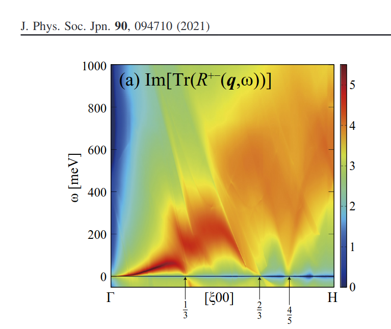
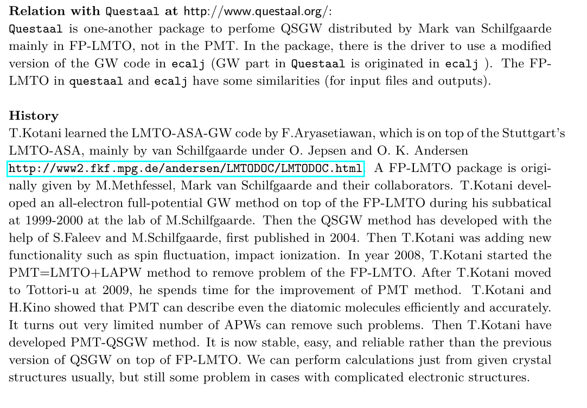

# UsageDetailed

## console output
Console output is now mainly for debug purpose. 
But we still need to read some of output data from the console output (we are trying to modify this).
From console output, we can check convergence behevior, band energies, Fermi energies, whether sigm, rst are correctly read in or not.

## save.foobar
* save.foobar records starting history invoking lmf,lmchk, and lmfa. In addition, it give  total energies, a line
per iteration of lmf. At each line,'i: intermediate, c: converged, x:iteration max without converged'.
* In addition, -vfoobar=xxx is recorded (overriding variables in ctrl).

* Two total energies Kohn-Sham and Harris-Folker is given---[both should be virtually the same](lmf.md#q-should-the-harris-foulkes-and-hohenberg-kohn-sham-functionals-agree-at-self-consistency). 
But some differences for bigger systems. Take one of them.

* log file
log.foobar generated by lmf,lmchk,lmfa are currently used for debuggging purpose.

## Spin polarized case without SOC
To treat magnetic systems, we have to set MMOM (ititial condition of spin magnetic moments) 
in addition to set nspin=2 in ctrl.foobar. The spin magnetic moments are specified as the
difference of number of electrons between spin channels, isp=1 and isp=2.

For example, run 
```
./job_materials.py NiO
```
at ecalj/MATERIALS/. For safe, it might be better to remover ecalj/MATERIALS/NiO/ in advance.
Then we see console output ending with
```
...
Finished!: tail NiO/save.nio:c mmom= 0.0000 ehf(eV)=-86704.349038 ehk(eV)=-86704.348942 sev(eV)=-142.498970
============ end  ================================
```
. Try `cat save.nio`  at ecalj/MATERIALS/NiO/. It shows iteration history of lmf. Last line in save.nio
should show `c mmom= 0.0000 ehf(eV)=-86704.349038 ehk(eV)=-86704.348942 sev(eV)=-142.498970` (energies may be slightly different). `c ` means converged.
ehf and ehk are [total energies by two formulas](./lmf.md#q-should-the-harris-foulkes-and-hohenberg-kohn-sham-functionals-agree-at-self-consistency).
Note that total energy is not meaningful in QSGW

Look into ctrl.nio, which is generated from ctrls.nio supplied by the mini database handled by `job_materials.py`
ctrl.nio contains 
```
SITE    ATOM=Niup POS=  .0   .0   .0 # ← Niup site 
        ATOM=Nidn POS= 1.0  1.0  1.0 # ← Nidn site
        ATOM=O POS=  .5   .5   .5
        ATOM=O POS= 1.5  1.5  1.5
SPEC
    ATOM=Niup Z=28 R=2.12
      MMOM=0 0  1.2 0　       # ← initial spin
      EH=-1 -1 -1 -1  RSMH=1.06 1.06 1.06 1.06 
      EH2=-2 -2 -2  RSMH2=1.06 1.06 1.06 
      KMXA={kmxa}  LMX=3 LMXA=4 NMCORE=1
    ATOM=Nidn Z=28 R=2.12
      MMOM=0 0 -1.2 0        # ← initial spin
      EH=-1 -1 -1 -1  RSMH=1.06 1.06 1.06 1.06 
      EH2=-2 -2 -2  RSMH2=1.06 1.06 1.06 
      KMXA={kmxa}  LMX=3 LMXA=4 NMCORE=1
```
Here we have two sites named Niup and Nidn. `MMOM=0 0 1.2 0` means initial spin moment within MTs: that is `MMOM= {s} {p} {d} {f}`, where `{s} {p} {d} {f}` are number of spin moments for each $l$ at atomic sites.
Separators after MMOM can be space or comma. In addition, we set `nspin=2` defined at the `% const` line in ctrl file.

Calculated spin moments within MT are at 'true mm' column in the console output, and shown in the `mmom.nio.chk` as
```
# Qtrue    MagMom(up-dn) Rmt   MT
1 8.527587  1.200085  2.120000 Niup    
2 8.527604 -1.200081  2.120000 Nidn    
3 5.380352 -0.000002  1.700000 O       
4 5.380352 -0.000002  1.700000 O    
```
Note it is overwritten at every iteration. These are shown in concole output as `true mm' as well.
Atomic site index are given in 'Siteinfo.chk'.  Total Magnetic Moments are shown as
```
 Magnetic moment=     2.241805 !this is a case of bulk Fe
```

With the setting in GWinput generated by `job_materials.py NiO`, we can run gwsc as
```
gwsc -np 32 5 nio 
```
I needed 275 sec with 32 MPI per QSGW cycle. I used this qsub script.
```
!/bin/sh
#$ -N NioTest
#$ -pe smp 32
#$ -cwd
#$ -M takaokotani@gmail.com
#$ -m be
#$ -V
#$ -S /usr/bin/bash
export OMP_NUM_THREADS=1
EXEPATH=/home/takao/bin/
$EXEPATH/gwsc -np 32 5 nio >& lgwsc
```
After calculations, remove temporary files with `rm __*` or `cleargw .`, which were already in your bindir.
You can run `job_band` and so on in the same manner of DFT with nspin=1.

* cat save.nio shows total energies (but not meaningufl)
* We can effectively use [antiferro symmetry for calculation (only for so=0,2)](#antiferro-symmetry-without-soc) 

## orbital moments
When so=1, orbital moments within MTs are shown in at `orbitalmom.chk:` in the console output as
```
IORBTM:  orbital moments :
 ibas  Spec        spin   Moment decomposed by l ...
    1    Pr           1    0.000000   -0.011483   -0.010535   -4.881144    0.000234
    1    Pr           2    0.000000    0.012332    0.003604    0.000373   -0.000090
 total orbital moment   1:   -4.886708
    2    N            1    0.000000   -0.004174    0.001584    0.000291    0.000129
    2    N            2    0.000000    0.004622    0.000236    0.000045    0.000006
 total orbital moment   2:    0.002738
```

## Antiferro symmetry without SOC
We can perform LDA/QSGW calculation with the AF symmetry (not for SOC=1).
Only up spin are calculated. Then charge density and eigenvalues are
symmetrized for the antiferro symmetry.

See ~/ecalj/Samples/AFsymmetry.
To set AF symmetry, We have to set a line in ctrl file as
```
SYMGRPAF i:(1,1,1)  #Antiferro symmetry operation
```
Here SYMGRPAF is the generator of the antiferro magnetic symmetry that 
`g =  i:(1,1,1) * $i \sigma_y$ should be the generator of magnetic space group, whereas 
```
SITE    ATOM=Niup POS=  .0   .0   .0  AF=1    #Antiferro pair
        ATOM=Nidn POS= 1.0  1.0  1.0  AF=-1
```
should contains the `AF=` to specify antiferro pairs.
Note that the space group operation `i:(1,1,1)` (this is inversion with translation) 
is explained at [SYMGRP](./lmf.md#symgrp).

In addition, we have an example of ctrl.nise for NiSe. 
```
  SYMGRPAF  i:(0,0,1/2)
  ATOM=Niup POS=     0.00       0.000   0.000 AF=1
  ATOM=Nidn POS=     0.00       0.000   0.500 AF=-1
```
, where inversion with (0,0,1/2) translation gives AF symmetry.

(README_mmtarget.aftest.txt shows the fixed-moment method for antiferro symmetry ---> need to be fixed).


## Spin-orbit coupling
We have a switch `HAM_SO` in the ctrl file 

* For LDA/GGA, set nspin=2 and so=1. Then we can perform calculations including SOC. so=1 is for soc included (so=2 is for LzSz mode neglecting LxSz+LySy.
* In the case of semiconductors such as GaAs, we need to include so=1 to see the band structure at the top of valence.
* Currently, QSGW can not be performed with so=1. So we first have to run gwsc with
so=0 or 2. After we get sigm file, we run lmf with --vso=1 (nit=1 can be fine) as a perturbation.

* We can treat only colinear spins. Spin axis is along (0,0,1) as default. We can choose other direction with SOCAXIS. See ecalj/Samples/SOCAXIS. Not checked completely, but it seems work well.

### Band plot with spin orbit coupling.
* method 1: only apply SOC for band plot
  ```bash
  job_band mp-2534 -np 8 -vso=1 -vnspin=2
  ```
  Caution: when you set nspin=2, the size of rst is twiced. No way to move it back to rst for nspin=1. So you may need to keep rst.

* method 2. single iteration and SO=1
  ```bash
  mpirun -np 8 lmf -vso=1 -vnspin=2 -vnit=1
  ```
  Then we have revised rst.foobar. Then run `job_band mp-2534 -np 8 -vso=1 -vnspin=2`.

* method 3. full iteration SO=1
  ```bash
  mpirun -np 8 lmf -vso=1 -vnspin=2 -vnit=1
  ```
  Then run `job_band mp-2534 -np 8 -vso=1 -vnspin=2`

## Forces and Atomic position relaxiation  
See ecalj/Samples/LaGaO3_relax.
We have to set `DYN` category (only relaxiation). 
We can set directions for relaxation with `SITE_ATOM_RELAX 0 0 1` or so.
No cell optimizations.  

* CAUTION:
    For DYN mode, we treat the atomic position file `AtomPos.lagao3`. If it exists, we use atomic positions written in the file. 
    See `ecalj/SRC/subroutins/main_lmf.f90`. You find `call ReadAtomPos(irpos)` which override positions specified by ctrl file. 
    I have checked relaxation of the Perovskite LaGaO3 worked well. Since we do not use so much about the relaxation mode, be careful
    (I think some possible developments since atomic forces calculated well).

## Fermi surface 
See a sample at ecalj/Samples/FermiSurface
Run `job_fermisurface cu -np 4 10 10 10` after ctrl.cu converged. This write down all band energies (around
Ef) for 10x10x10 in BZ. Then we can view it with `xcrysden as xcrysden --bxsf fermiup.bxsf`
With `–allband` option to `job_fermisurface`, we have all the bands. Then we can see iso-energy surface at any energy.

## PROCAR mode 
See a sample at ecalj/Samples/MgO_PROCAR
We can generate PROCAR file containing the size of eigenfuncitons**2. 
The sample (run job file) generates eps file showing fat band of O2 compon`ents.
 Run jobprocar. This gives *.eps file which shows Fat band picture.
 PROCAR (vasp format) is generated and analysed by a script BandWeight.py.

# Spectrum of the Green's function
(not yet...)

# Maxloc wannier
Our own implementation of Wannier90 is included. It works with the command `genMLWF`, where we can run cRPA in it.
Actually `~/ecalj/SRC/TestInstall/srvo3_crpa/` is a sample but too small computational sample.
(We feel difficulty to use the idea of Wannier90 (outer window and so on) from the view of automaiton.
So we are developing MLO.)

## LDA+U
We have samples 
* https://github.com/tkotani/ecalj/tree/master/Samples/GdNldau

* ~/ecalj/Samples/ReNcub 

*  IDU=, UH=, JH= specify parameters for LDA+U.  IDU=#,#,#,... specifies which l-channels are to have U and the type of LDA+U implementation.
          0 in a particular l-channel means no U is to be applied, 1 or 2 are for particular forms of LDA+U.  For example,
             IDU= 0 0 0 1  UH= 0 0 0 -0.28    JH=0 0 0 0


## BoltTrap 
--boltztrap option is to generate files required for boltztrap.
See `~/ecalj/Samples/Boltztrap`


## Dielectric function
`~/ecalj/Samples/EPS`
Dielectric functions for Cu and GaAs. For Cu, we have intraband and interband contributions separately.
See [dielectric fuctnion](optical.md).

## Impact ionization rate
`~/ecalj/Samples/IIR`

## Spin fluctuation
`~/ecalj/Samples/Magnon`
It is via the MaxlocWannier. We are going to move to MLO instead. Here is a figure (this is on top of LDA) for the spin fluctuation of Fe in [Okumura2021](https://github.com/ecalj/ecaljdoc/blob/main/presentations/okumura2021.pdf).


## Effective Screening Medium (ESM)
We can apply electric field to slab model. ESM combined with QSGW is quite unique.
Used in the paper https://journals.aps.org/prb/abstract/10.1103/PhysRevB.101.205120
Ask us.

## lmf and ctrl
See [lmf and ctrl](lmf.md)

## gwsc and GWiput
See [gwsc](gwsc.md). 
For GPU, see [ecaljgpu](ecaljgpu.md) and [gwsc for GPU for ISSP](UsageISSP.md) together.
See [explanation of GWinput](gwinput.md).

## getsyml: automatic symmetry line and BZ for band plot
See [syml](syml.md)

These citations are required.
1.Y. Hinuma, G. Pizzi, Y. Kumagai, F. Oba, I. Tanaka, Band structure diagram paths based on crystallography, Comp. Mat. Sci. 128, 140 (2017)
2.Cite spglib that is essential for getsyml.

### ecalj/Samples/
* MLO: new localized basis
  Maximally localized Wannier function and cRPA interaction
* MLWF_samples
  Wannier function generator and cRPA 
  wannier90 method implemented in ecalj and cRPA. 
  (a cRPA method by Juelich group).
  See Samples_MLWF/README.
   ~/ecalj/README_wannier.md This is going to be replaced with README_MLO.md
* mass_fit_test
  Effective mass calculation. See README. probably not maitained\dots

## ecalj_auto
This is a suit of python scripts to run thousands of gwsc calculations automatically.
[ecalj_auto](auto.md)

## Background charge and fractional Z
[backcround charge](Memo_bgcharge.md)

### How to perform paper-quarilty QSGW calculations with minimum costs. 

The accuracy of band gaps can be  ~0.1eV or larger for larger band gap materials.. 
In cases, it is easy, but in cases not so easy. So, it is better to use your own "simple criterion".
"Not stick to convergence so much. Just stick to Reproducibility."

## 4f and 5f atoms
We need special care to tread atoms where 4f and 5f are fractionally filled.
We have not yet include following setting in ctrlgenM1.py as for 4f/5f atoms (2025-08-07).

Here is the setting for RareEarth rocksalt nitrides ReN such as ErN.
1. Set nsp=2, so=2 (since QSGW can not treat so=1 now). (If necessary set so=1 after QSGW).
2. SYMGRP r4z. This is needed since we have lower symmetry rather than the lattice. It fixes the direction of spins and orbital moments.
3. Our setting is
    ```
    --- ctrl.ern
      ATOM=Er Z=68 R=2.58
          PZ=0,5,0,5
          IDU=0 0 0 12  UH=0 0 0 0.773  JH=0 0 0 0.0945  MMOM=0 0 0 3
          EH=-1 -1 -1 -1  RSMH=1.29 1.29 1.29 1.29
          EH2=-2 -2 -2 -2  RSMH2=1.29 1.29 1.29 1.29
          KMXA={kmxa}  LMX=3 LMXA=6 NMCORE=1
          (pwemax=2, nk=8 8 8 was used)
    --- GWinput
    (n1n2n3 6 6 6 was used)
    (tol 1d-2 was used)
    lcutmx(atom)
    6 2  
    ```
    Here PZ is the principle quantum number of local orbitals. This sets 5p and 5f as local orbitals. Run `lmfa crn|grep conf` to check atomic configulation.
    * IDU,UH,JH are the LDA+U parameters, only for initial condition. Since IDU is 10+2, we skip U effect when sigm exists.
    * MMOM is the initial magnetic moments.
    * LMXA=6 to expand augmented waves is needed.
    * Make sure READP=T.

With these settings, we can perform series of calculations finished for 4f ReN. 
Input files are available from [here](../data/RENctrlGWinput.tar.gz). Ask us when you like to use them.


## QPU and QPD files
This contains the contents of self-energy


## Papers
It is instractive to reproduce samples in [Deguchi paper](https://github.com/ecalj/ecaljdoc/blob/main/presentations/presentations/deguchi2016.pdf). 
We can set up templates for your calculations. Ask us.
We have a latest paper at https://arxiv.org/abs/2506.03477 for GPU version. 
It shows some details of computational steps in ecalj.
In Japanese, pages by Dr.Gomi at http://gomisai.blog75.fc2.com/blog-entry-675.html and https://qiita.com/takaokotani/items/9bdf5f1551000771dc48.


##  How to perform paper-quarilty QSGW calculations with minimum costs. 
We expect that the accuracy of band gaps can be  ~0.1eV (or larger for larger band gap materials). 
In cases, it is easy but in cases not so easy (magnetic metals requires many number of iterations). 
So, it is better to use your own "simple criterion".
"Not stick to convergence so much. Just stick to Reproducibility."
### LDA calculation
 We need to confirm LDA-level of calculations first.
 The ctrl file is generated just from ctrls.* (crystal structure file)
 For calculation of QSGW, use large enough NKABC, so as to avoid
 convergence check on them. 
### QSGW: how to check convergence
QSGW iteration cycle by gwsc contains (1) and (2)
  (1) One-body self-consistent calculation 
      (where we add sigm = Sigma-Vxc^LDA to one-body potential).
      to determine one-body Hamiltonian $H_0$.
  (2) For given $H_0$, we calculate sigm file.

Big iteration cycle of QSGW is made from (1)+(2).
(gwsc script. not run_arg is a subroutine of bash script) 
With (1), we have small iteration cycle of one-body calculaiton with keeping given sigm.

In `save.*`, we see total energy (but not the total energy in the QSGW
mode with sigm file), a line per each iteration of (1). A line "c ..." is the final
iteration cycle of (1)."x ..." is unconverged 
(but no problem as long as we finally see "c ...").

The command `"grep '[cx] ' save.*"` gives an indicator for 
going to be converged or not.
Or you can take "grep gap llmf.*run" (see it bottom.)

Another way:
`dqpu QPU.3run QPU.6run` 
is to compare two QPU files which contains QP energies.
(note: QP energies shown are calculated just at the begininig of iteration).

For insulater, (I think), comparing band gap for each iteration 
is good enough to check onvergence. But for metal, it is better to plot energy bands
for some of final iterations, and overlapped(`cd QSGW.*run` and run `job_band`).

Another way is `grep rms lqpe*`. This gives rmsdel. Diffence of self-energy
(at least we see it is getting smaller for initial first cycles). 


### How to make 80%QSGW +20% LDA, and SO setting
  Note that sigm file contains $V_{\rm xc}^{\rm QSGW}-V_{\rm xc}^{\rm LDA}$.
  If sigm exists, lmf read it, and run self-consistent calculations
  with adding sigm to the one-body potential.

  Justifications of QSGW80 are:
  * https://iopscience.iop.org/article/10.7567/JJAP.55.051201/pdf
  * https://journals.aps.org/prb/abstract/10.1103/PhysRevB.101.205120
  * https://journals.aps.org/prb/abstract/10.1103/PhysRevB.108.165104

#### 1. QSGW80(NoSC)
  For practical prediction of band structure, such as band gap and so
  on, it may be better to use 80% QSGW +20% LDA procedure when you
  make band plot.  After, you have rst and sigm files determined self-consistently
  Run 
  ```
  job_band gaas -np 4 -vssig=0.80 
  ```
  (Confirm ssig is defined and cited as `ScaledSigma={ssig}` in the ctrl file). This gives a result of QSGW80nosc in the TableII.

#### 2. QSGW80(Nosc)+SO 
   80%QSGW+20%LDA with SO=1 (L.S method).
   If you like to include L.S method 

```
mpirun lmf gaas -np 4 -vssig=0.80 -vso=1 -vnspin=2
```
This procedure makes self-consistency with keeping the sigm file. This may/(or may not) required. If you expect large obital moment this procedure may be needed.

```
job_band gaas -np 4 -vssig=0.80 -vso=1 -vnspin=2
```
NOTE: nspin=2 is required for so=1. rst and sigm are expanded for npsin=2 (you can not run with nspin=1, after rst and sigm are expanded).
  
#### 3. QSGW80
  With ssig=0.80, you can run QSGW calculaiton in gwsc.
  Then you have self-consistent results of QSGW80.
  You can simultaneously use the setting so=2 (Lz.Sz scheme).
  Be careful for z-direction and setting of SYMOPS (so as to keep the z-axis), for so=2.
  If you like to get results of QSGW80+SO, you need to set so=1 after self-consistent of sigm atteined.

#### 4. Example of GaAs   
  Good example to check band gap, and SO splitting at top of valence of Gamma point for ZB structure as GaAs.
  Before run it, make sure your ctrl file include variables ssig, so, nspin by
  ```   
  >grep ssig ctrl.gaas
  >grep so   ctrl.gaas
  >grep nspin ctrl.gaas
  ```   
  to know the variable ssigm is defined and used as 
  `ScaledSigma={ssig}, NSPIN={nspin}`. For `-vso=1` work, you also need to so is defined and `SO={so}` is set in ctrl.


## How to do version up? git minimum

Be careful to do version up ecalj. It may cause another problem.
If you are not good at git, make another clone. 
Do not mix up with previous version (e.g. where you install)

>cd ecalj  
>git log  
   This shows what version you use now.

>git diff > gitdiff_backup
This is to save your changes added to the original (to a file git_diff_backup ) for safe.
I recommend you do take git diff >foobar as backup.
>git stash also move your changes to stash.

>git checkout -f
     CAUTION!!!: this delete your changes in ecalj/.
     This recover files controlled by git to the original which was just downloaded.

>git pull
    This takes all new changes. It is safer to use `git fetch` and `gitk --all` (`git checkout FETCH_HEAD -b youbranch`) to checkout your local branch.


I think it is recommended to use 
>gitk --all 

and read this document. Difference can be easily taken,
e.g. by 
>git diff d2281:README 81d27:README 
(here d2281 and 81d27 are several digits of the begining of its version id). 

>git show 81d27:README 

is also useful.  

## error messages and caution

### Bandplot for FSMOMMETHOD/=0
  Even when you use FSMMOMMETHOD/=0 in GWinput for gwsc,
  you need to set FSMOMMETHOD=0 (or comment it out) when you run job_band_nspin2.
  [If you run job_band_nspin2 with FSMOMMETHOD/=0, it make a shift (adding bias magnetic field).]
  Anyway confusing. If necessary, I have to make it straight.

### For molecules, we may use --systype=molecule for ctrlgemM1.py.
  Then we have 
  >TETRA=0
  >N=-1 #Negative is the Fermi distribution function W= gives temperature.
  >W=0.001 #W=0.001 corresponds to T=157K as shown in console
  >In addiiton, FSMOM (n_up-n_down) is needed (FSMOMMETHOD=1)if we
  have magnetic moment.

### core>evalence message.
  Ecore is grater than Evalence.
  For safe, we do not allow this.
  Compare ECORE file and valence levels, shown in log file or console output.

### Back ground charge and fractional Z.
You can use fractional numbers for ATOM_Z, and also can set valence charge by BZ_ZBAK (I removed BZ_VAL).
You see console out put, e.g, 
>Charges: valence 19.80000 cores 8.00000 nucleii -28.00000
>hom background .20000 deviation from neutrality: 0.00000
This is a case with BZ_ZBAK=.2

NOTE: at the first iteration, Charges: shows such as
>Charges: valence 8.00000 cores 20.00000 nucleii -28.00000
>hom background 0.12300 deviation from neutrality: 0.12300

because of the initial condition by superposition of atoms. It shows
deviation seems nonzero. But charge should be conserved from the next iteration.

### convergence problem.
We need to use smaller ITER b, such as 0.015, 0.01, 0.005. 

### Use PZ or not.
If spillout of core is not so small (more then 0.05 or something.),
it is better to use PZ(lo). Treat the core as valecne. Bi4d is such a case. Maybe use PZ=0,0,4.9

### We use only CORE1 treatment only (exchange only core)
See 10.1103/PhysRevB.76.165106 (Eq.35 and after).
Now I usually not use CORE2 (CORE1 only).

### a little unstable when metal GGA, especially when we have large empty regions. (still problematic?)
(negative density points appears: console output). I am not so sure about this is serious or not.

### total enegry is not meaningful in QSGW mode
Even gwsc, we see total energy in lmf cycle. But it might be taken just an indicator to the convergence.

### Do we use VWN or GGA for QSGW? ===
In principle, QSGW results should not depend on VWN or GGA.  But there is minor dependence, because
1. frozen core density.
2. core eigenfunctions.
3. radial basis functions
4. Slight numerical reason
(This is probably because Sigma-interpolation procedure But not exactly figured out yet →
affect about 0.02eV as for band gap for GaAs.). In anyway, use VWN (HAM_XCFUN=1)
as standard. And such technical things affects, 0.05 eV level of error for band gap.

### numerical accuaray of QSGW band energies
As for the band gaps 0.1 eV is a kind of limiting accuaray for usual semiconductors with 0~3 eV band gap materials.
For Si or something simple, you may be able to have better accuracy. However, QSGW is on the so many parameters.
So, just say ~0.1eV level of accuracy. Convergence check is expected for the technical developments in future.

### TOTE files
In gw_lmfh, `hqpe` gives TOTE.UP and QPU files (DN and QPD as well). They contains the same values.

### The Fermi energies in GW
We use two kinds of Fermi energy $E_{\rm FEERMI}^{\rm smear}$ and $E_{\rm FEERMI}^{\rm tetra}$.
This is because of numerical techniques.

One is $E_{\rm FEERMI}^{\rm tetra}$, contained in EFERMI, for the polarization function since we use tetrahedron method for it.

The other is $E_{\rm FEERMI}^{\rm smear}$ for $ G \times W$ since we use smeared pole technique for $G$.
$E_{\rm FEERMI}^{\rm smear}$ is given at the beginning of $ G \times W$ calculations. 
See lsx,lsc,lsxC (for mpirun, we have them in stdout.0000*).

### one-show QSGW (not one-shot GW) =
  one-shot QSGW can be useful in cases.
  As it contains off-diagonal part, we can resolve band tanglement problem in Ge (no band gap).

### Anisotropic Q0P 
   In cases, we are worrying about the anisotropy. The offset Gamma method uses the 1/10 of gamma cell.
   It seems not so bad, however, we may need to examine the anisotropy problem again in future.  
   It is problematic to use unbalanced k points for anisotropic cell. See Copmuter Physics Comm. 176(2007)1-13.

### mixbeta and mixpriorit 
If not stable convergence in gwsc, try to set
mixbeta 0.5
in GWinput.

### Check Used MTOs
 Near beginig of console output, what MTO you use is shown as: (GaAs case).
 ```
 sugcut:  make orbital-dependent reciprocal vector cutoffs for tol= 1.00E-06
 spec      l    rsm    eh     gmax    last term    cutoff
  Ga       0*   1.13  -1.00   6.579    1.19E-06    1459
  Ga       1*   1.13  -1.00   7.028    1.26E-06    1807
  Ga       2*   1.13  -1.00   7.475    1.09E-06    2109
  Ga       3    1.13  -1.00   7.920    1.06E-06    2637
  Ga       0*   1.13  -2.00   6.579    1.19E-06    1459
  Ga       1*   1.13  -2.00   7.028    1.26E-06    1807
  Ga       2    1.13  -2.00   7.475    1.09E-06    2109
  As       0*   1.18  -1.00   6.300    2.13E-06    1243
  As       1*   1.18  -1.00   6.720    1.26E-06    1471
  As       2*   1.18  -1.00   7.140    1.37E-06    1837
  As       3    1.18  -1.00   7.558    1.05E-06    2229
  As       0*   1.18  -2.00   6.300    2.13E-06    1243
  As       1*   1.18  -2.00   6.720    1.26E-06    1471
  As       2    1.18  -2.00   7.140    1.37E-06    1837
 ```

### History (not latest description)
