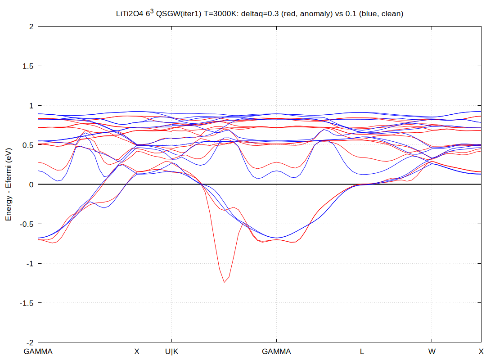
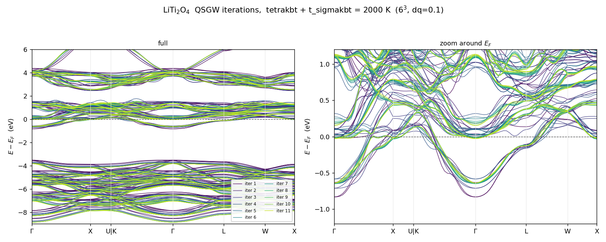

# kBT — 有限温度の自己エネルギー計算 (`tetrakbt` / `t_sigmakbt`)

ecalj branch `t_sigmakbt` / 2026-06

金属の QSGW が反復ごとに振動して収束しないことがある。原因は Fermi 面の
鋭い応答で、**電子温度を入れて Fermi 面を物理的に広げる**のがここで述べる方法である。

$W$ 側($\chi_0$)と $\Sigma$ 側($G$)にそれぞれ別のキーがあり、
**両方を同じ温度にして使う**のが本来の形である。

| キー | どこに効くか | 実装 |
|---|---|---|
| `tetrakbt` + `t_tetrakbt` | $\chi_0$ の占有数(→ $W$) | `main` |
| `t_sigmakbt` | $\Sigma_x=Gv$、$\Sigma_c=G(W-v)$ の占有数 | branch `t_sigmakbt` |

---

## 1. なぜ要るか

金属の QSGW は、k メッシュが Fermi 面の鋭い応答(ネスティング)を解像すると
反復ごとに振動しうる。テトラヘドロン法は Fermi 面を「厳密に」標本化するので
$W$ に鋭い小 $q$ 構造が立ち、$\Sigma$ が毎反復の Fermi 面のずれに強く反応する。

**電子温度で Fermi 面を広げるのが根本的な正則化**である。
$\mathrm{Im}\,\chi_0$ を $\omega$ 方向に平滑化する `SmearX0` は症状だけを扱う
対症療法で、こちらとは別物である。

実測では LiTi₂O₄(金属スピネル)で、**$6^3$ と $9^3$ のメッシュ依存が消え**、
QSGW が安定した。

---

## 2. $\chi_0$ 側 — `tetrakbt`

`ctrlg.<sname>.toml` の `[gw]`:

```toml
[gw]
tetrakbt   = true     # chi0 を有限温度テトラヘドロンで (method B')
t_tetrakbt = 2000.0   # 電子温度 (K)。kBT[eV] ~ T/11604
```

何が起きるか:

- $\chi_0$ の占有因子が温度 $T$ の Fermi 分布になる
  (`tetwt5` / `lindtet6_kbt`、エネルギー畳み込みの method B'。$T\to0$ で厳密に元へ戻る)
- `heftet`(GW フローの `imode=1`)が**有限温度の Fermi 準位を二分法で解き
  `EFERMI_kbt` に書く**。$\chi_0$ のテトラヘドロンがそれを読むので、
  占有数と $E_F$ が同じ温度を指す

出力での確認:

```
tetrakbt_init: T[K], kbt[Ry], kbt[eV]  2000  0.12667E-01 0.17234E+00
```

---

## 3. $\Sigma$ 側 — `t_sigmakbt`

`tetrakbt` だけでは **$\Sigma$ は $T=0$ のまま**である($G$ の極は Gaussian の
`esmr` で平滑化され、Fermi 準位も $T=0$ のもの)。`t_sigmakbt` はそこを揃える。

```toml
[gw]
tetrakbt   = true
t_tetrakbt = 2000.0
t_sigmakbt = 2000.0   # Sigma 側の電子温度 (K)。0 (既定) で従来どおり
```

**`t_sigmakbt == t_tetrakbt` にすること。** そうして初めて $\chi_0$($W$)と
$\Sigma$($G$)が一つの物理的な温度を共有する。

### 何が変わるか

`t_sigmakbt > 0` のとき、`sigmakbt_setup` が 2 つのことをする:

1. **自己エネルギーの Fermi 準位を `EFERMI_kbt` に切り替える**
   ($T=0$ の `EFERMI` ではなく、`tetrakbt` と同じ $\mu$)
2. **占有数の核を Gaussian から Fermi–Dirac に替える**
   — $\Sigma_x = Gv$ と $\Sigma_c = G(W-v)$ の両方

Gaussian 平滑化(幅 `esmr`)

$$
w(e_l,e_h;\varepsilon_k)=\int_{e_l}^{e_h}\frac{1}{\sqrt2\,\sigma}
\exp\Bigl[-\Bigl(\frac{x-\varepsilon_k}{\sigma}\Bigr)^2\Bigr]dx
\tag{1}
$$

が、Fermi–Dirac の累積分布

$$
\Phi(x)=\frac{1}{1+e^{-x/k_BT}},
\qquad
w(e_l,e_h;\varepsilon_k)=\Phi(e_h-\varepsilon_k)-\Phi(e_l-\varepsilon_k)
\tag{2}
$$

に置き換わる。$k_BT\to0$ で鋭い階段関数に戻り、既定(`t_sigmakbt = 0`)では
式 (1) の従来の挙動をそのまま再現する。

### 出力での確認

```
sigmakbt_setup: t_sigmakbt[K]=  2000.0 kbt[Ry]=  0.12667E-01 ef<-EFERMI_kbt=   0.123456
```

### `EFERMI_kbt` が無いとき

`t_sigmakbt > 0` でも `EFERMI_kbt` が無ければ、**警告を一行出して
$\Sigma$ 側の有限温度は適用されない**(従来どおり動く):

```
sigmakbt_setup: WARNING t_sigmakbt>0 but EFERMI_kbt missing (need tetrakbt/heftet).
                Sigma-side finite-T NOT applied.
```

`EFERMI_kbt` を書くのは `tetrakbt` を有効にした `heftet` なので、
**`t_sigmakbt` は単独では使えない。** 必ず `tetrakbt = true` と併せて設定すること。

::: warning esmr は既定のままにすること
`t_sigmakbt > 0` にしても、$\Sigma$ 側の**状態範囲**は依然 `esmr` で決まっている。
`esmr` を既定(0.01 Ry)より下げたり $T$ を 3000 K より上げたりすると、
警告なしに占有数が切り捨てられる。[§7.3](#_7-3-不整合-—-側の状態窓が-esmr-のまま) を見よ。
:::

---

## 4. 温度の選び方

$k_BT$ を、**k メッシュが Fermi 面領域で持つエネルギー間隔と同程度以上**に取る:

$$
k_BT \gtrsim \frac{v_F \cdot (\text{BZ の大きさ})}{N}
\tag{3}
$$

LiTi₂O₄ の $6^3$ / $9^3$ では $T = 1000$–$3000$ K($k_BT = 0.086$–$0.26$ eV)が
使える範囲だった。**求めたい量が $T$ について収束していること**、できれば
**同じ $T$ で 2 つの k メッシュが一致すること**を確認すること。

### 温度を上げると何が直るか

LiTi₂O₄ の QSGW 第 1 反復を $T$ だけ変えて重ねたもの
(いずれも $6^3$、`deltaq_scale = 0.3`。共通の静電ゼロで揃え、$T=0$ の
$E_F$ を原点に取った)。


*図をクリックすると拡大する。*

---

$T=0$($T=0$ テトラヘドロン `lindtet6`、黒)では Ti-3d $t_{2g}$ 帯が
Γ–L 上で **−3.9 eV まで落ち込む**。これは分散ではなく $q\to0$ head の破綻で、
温度を上げると単調に消える:

| $T$ | Γ–L 上 ($x\approx2.7$) の $t_{2g}$ 帯の底 |
|---|---|
| 0 (`lindtet6`) | −3.91 eV |
| 1000 K | −1.31 eV |
| 2000 K | −0.66 eV |
| 3000 K | −0.50 eV |

**これが有限温度を入れる理由である。** ただし $T\to0$ で method B′ が
`lindtet6` に厳密に戻ること自体は変わらない($T=0$ が壊れているのは
テトラヘドロン法ではなく、その上での金属の $q\to0$ の扱いのほうである)。

### 高温では `deltaq_scale` を小さく取ること

上の図の 3000 K(赤)は Γ–L では収まっているのに、**K–Γ の中央に
別のスパイクが残る**。これは `deltaq_scale`(offset-Gamma の $q_0$ head の
シフト量)が大きすぎるためで、**温度の問題ではない**。同じ 3000 K で
`deltaq_scale` を 0.3 から 0.1 に下げると消える:



赤 = `deltaq_scale = 0.3`(K–Γ 中央に −1.24 eV のスパイク)、
青 = `deltaq_scale = 0.1`(消える)。$6^3$、$T$ = 3000 K、QSGW 第 1 反復。

---

つまり **`tetrakbt` / method B′ 本体の問題ではなく、offset-Gamma の
$q\to0$ head が高温 × 大きい `deltaq` で破綻する**。
高い $T$ を使うときは `deltaq_scale` も併せて小さくすること。

---

## 5. サンプル — `Samples/kBT/`

`ecalj/Samples/kBT/` に LiTi₂O₄ の**収束した計算一式**(入力と結果)がある。
GW を 11 反復するので計算が重く、`testecalj` のターゲットにはしていない。
**手法が何を変えるかを、収束した結果そのもので見るためのもの。**

設定は $6^3$、`deltaq_scale = 0.1`、`tetrakbt = t_sigmakbt = 2000` K。



QSGW 反復 1(紫)から 11(黄)まで。反復 3–4 以降は $E_F$ 近傍でも線が重なり、
金属にもかかわらず振動せずに収束している。

---

置いてあるもの:

| | |
|---|---|
| `input/` | `ctrlg` / `PB` / `syml` と LDA 収束済みの `rst` |
| `results/sigm.liti2o4` | 11 反復後の収束した自己エネルギー。これを使えば GW をやり直さずバンドが描ける |
| `results/QPU.1run` … `.11run` | 各反復の QP エネルギー |
| `results/band_iter/`, `results/bnd_iterations.tar.gz` | 反復ごとのバンド(図と、展開すれば数値も) |
| `results/EFERMI`, `EFERMI_kbt` | $T=0$ と有限温度の Fermi 準位 |
| `results/finiteT_evidence.txt` | 実行ログからの抜粋(下記) |
| `plots/` | 上の $T$ 依存図と `deltaq` 比較図 |

両側が実際に有効になっていることは、このログで確認できる:

```
 tetrakbt_init: T[K], kbt[Ry], kbt[eV] 2000  0.12667E-01  0.17234E+00
 sigmakbt_setup: t_sigmakbt[K]= 2000.0 kbt[Ry]= 0.12667E-01 ef<-EFERMI_kbt= 0.267452
  0.277063046836211D+00 ... ! efermi           (T=0)
  0.267452126929387D+00 ... ! efermi_kbt       (有限温度)
```

2 行目の `ef<-EFERMI_kbt` が、$\Sigma$ 側が $T=0$ の `EFERMI`(0.2771 Ry)ではなく
**有限温度の `EFERMI_kbt`(0.2675 Ry)を使っている**ことを示す。
ここが食い違ったままだと $\chi_0$ と $\Sigma$ が別の Fermi 準位を見ることになる。

---

## 6. 実装の場所

| ファイル | 役割 |
|---|---|
| `SRC/subroutines/wfacx.f90` | `m_wfac` の Fermi–Dirac 核(`fd_cdf` / `fd_iav`)と `sig_fd` ゲート |
| `SRC/subroutines/genallcf_mod.f90` | `sigmakbt_setup`(`EFERMI_kbt` の読み込みと FD の有効化) |
| `SRC/subroutines/m_GWinput.f90` | `t_sigmakbt` の読み取り |
| `SRC/subroutines/main_hsfp0.sc.f90` | `hs_ef` の一点で有効化(両バイナリ) |

`set_sigma_fd(.true., kbt)` は `sxcf` のループに入る前に一度だけ呼ばれ、
以後 `wfacx` / `wfacx2` / `weavx2` が FD 核を使う。

---

## 7. 実装の検証と既知の限界

2026-09-16 にコードを読み直して確認した結果。**骨格は正しいが、精度の限界が 1 つ、
整合性の穴が 1 つ、理論の範囲についての注意が 1 つある。**

### 7.1 恒等式は厳密 (確認済み)

`lindtet6_kbt` ([tetwt5.f90:629-673](https://github.com/tkotani/ecalj/blob/main/SRC/subroutines/tetwt5.f90#L629)) の method B′ は

$$
\int dE\,(-f'(E))\,\theta(E-e_a)\theta(e_b-E) = f(e_a)-f(e_b)
\tag{4}
$$

を **k 積分の内側**で使っている。$E$ 積分と $k$ 積分が交換するので厳密である。
得られる分子は Adler–Wiser の $f_a-f_b$ であって $f_a(1-f_b)$ ではない
— 応答関数として正しいのはこちら。

個別に確認したもの:

- **ゲート**(tetwt5.f90:651) — a/b が窓の外で平坦になる場合分けを全部たどったが、
  どれも $T=0$ の値と一致する
- **node zero-skip**(tetwt5.f90:667) — `lindtet6` が恒等的に 0 になる条件そのもの。
  `knorm` は全節点で正規化されるので、飛ばしても整合する
- `efermia` ≠ `efermib` でも (4) は成立する(それぞれの Fermi 準位での $f$ になる)
- **`EFERMI_kbt`**([main_heftet.f90:368](https://github.com/tkotani/ecalj/blob/main/SRC/subroutines/main_heftet.f90#L368))
  — NOS を熱核で畳み込んで二分法。$T\to0$ でテトラヘドロンの $E_F$ に厳密に戻る。
  χ0 側もこれを読んでいる(m_tetwt.f90:147)

### 7.2 限界 — $E$ 積分の Gauss-Legendre が $E_F$ 近傍を刻んでいない

`gausq(NE=20, -6, 6)` の**最内節点は $|t|=0.459$、すなわち $|E-E_F| = 0.92\,k_BT$**。
**$E_F$ の $\pm0.92\,k_BT$ の内側は一切標本化されない。**

テトラヘドロン内のバンド幅を $\Delta$ として、占有因子の最悪誤差を測ったもの:

| 求積 | 節点 | $\Delta=0.4k_BT$ | $1k_BT$ | $2k_BT$ | $4k_BT$ | $8k_BT$ |
|---|---|---|---|---|---|---|
| **現状** GL20 on $[-6,6]$ | 20 | 1.7e-1 | 9.7e-2 | 2.3e-2 | 1.3e-2 | 6.8e-3 |
| 4 区間 $[-6,-1,0,1,6]$ × GL5 | 20 | 2.9e-2 | 1.6e-2 | 4.8e-3 | 2.6e-3 | 1.3e-3 |
| 6 区間 × GL4 | 24 | 2.9e-2 | 1.1e-2 | 2.8e-3 | 1.7e-3 | 9.6e-4 |
| 2 区間 $[-6,0,6]$ × GL10 | 20 | 5.5e-2 | 1.9e-2 | 1.1e-2 | 3.8e-3 | 1.9e-3 |

---

分散の大きいバンドでは無害だが、**平坦バンド・バンド端・van Hove 領域が $E_F$ に
あると占有因子が 0.1 以上ずれる**。LiTi₂O₄ の Ti-3d $t_{2g}$ は $6^3$ で
テトラヘドロン内の幅が 0.2–0.5 eV ≈ 1–3 $k_BT$ なので、1e-2 程度は乗っている見込み。

節点を増やしても $1/N$ でしか落ちない(NE=40 → 9e-3、NE=80 → 3e-3)。
**同じ 20 点のまま 4 区間に切るだけで最悪誤差が 6 倍良くなり**、$E_F$ 近傍の
分解能も $0.459 \to 0.047$ と一桁上がる。節点数より区間の切り方が効く。
本筋は被積分関数の折れ点(= 8 個の角エネルギー)で区間を切ること。**未修正。**

### 7.3 不整合 — $\Sigma$ 側の状態窓が `esmr` のまま

`sig_fd` を on にすると重みの核は幅 `sig_kbt` の Fermi–Dirac になるが、
**状態範囲を決める窓は `ddw*esmr`(ddw=10)のまま**である
(m_sxcf_sc.f90:457-458、m_sxcf_sc_count.f90:158, 262-263)。
しかも `sxcf_scz_count` は `sigmakbt_setup` **より前**に呼ばれるので
(main_hsfp0.sc.f90:143 vs :164)、窓の中心は $T=0$ の `EFERMI`、
重みの中心は `EFERMI_kbt` になる(本サンプルで 0.0096 Ry ずれる)。

切り捨てられる占有は $f(10\,\texttt{esmr}/k_BT)$:

| | 窓の幅 | 切り捨て |
|---|---|---|
| 本サンプル (2000 K, `esmr`=0.01) | $\pm7.9\,k_BT$ | 3.7e-4 ✓ |
| 5000 K, `esmr`=0.01 | $\pm3.2\,k_BT$ | 4% |
| 2000 K, `esmr`=0.002 | $\pm1.6\,k_BT$ | 17% |

---

いまの既定値では無害だが、**警告なしに静かに悪化する**。
本頁が「有限温度は `t_sigmakbt` が担う」と書いている以上 `esmr` を下げる人は出るので、
**当面 `esmr` は既定(0.01 Ry)のままにし、`t_sigmakbt` を 3000 K より大きく
取らないこと。** 直すなら `sig_fd` のとき窓を `max(ddw*esmr, 12*sig_kbt)` にし、
`sigmakbt_setup` を count の前に移す(または count に `ef_kbt` を渡す)。**未修正。**

### 7.4 範囲 — Bose 因子は入っていない

有限温度 GW の $\Sigma_c$ は $f_n$ だけでなく $n_B(\omega)$ も含む:

$$
\Sigma_c(\varepsilon)=\sum_n\int_0^\infty\!\! d\omega\,\frac{\mathrm{Im}W(\omega)}{\pi}
\Bigl[\frac{1-f_n+n_B(\omega)}{\varepsilon-e_n-\omega+i\delta}
+\frac{f_n+n_B(\omega)}{\varepsilon-e_n+\omega-i\delta}\Bigr]
\tag{5}
$$

いまの実装は **$T=0$ の等高線(虚軸積分 + 実軸の極補正)をそのまま残して
占有数だけ Fermi–Dirac に置き換えた**もので、コード中に Bose 因子は存在しない。
金属では $\mathrm{Im}W \propto \omega$ なので $n_B\,\mathrm{Im}W$ は $\omega\to0$ で
$O(k_BT)$ の有限値として残り、寄与はゼロではない。

つまりこれは**「電子温度を入れた GW」であって「有限温度 GW」ではない。**
QSGW の反復を安定化する正則化としては筋が通っているし元々そのためのものだが、
熱力学量を出すものだと思ってはいけない。

### 7.5 いまは踏まないが直すべき箇所

- **m_sxcf_sc.f90:237** の `sxs_ekc(is1+nctot)` は `sxs_ekc(is1)` のはず。
  2024-07-25 の `245ef9f3f`(nvfortran 24.1 回避の書き換え)でコメントアウトされた
  元コードは `ekc(it)` だった。現状 mode 1/2 は `nctot=0`(hgw のログで確認)、
  mode 3 は `ns2 ≤ nt0p = nctot` で else 分岐に入らないため実害なし。
  `nctot>0` で価電子交換を回すと壊れる。
- **main_hsfp0.sc.f90:166** の `if(sig_fd) ef = ef_kbt` が `ixc==3`(CoreEx)にも効き、
  直前に `LOWESTEVAL-1d-3` に設定した `ef` を上書きする。
  core ループが `wtff=1` 固定なのでいまは影響しない。

---

## 8. ブランチの状況

| ブランチ | 状態 |
|---|---|
| `main` | `tetrakbt`($\chi_0$ 側)まで。検証済み |
| **`t_sigmakbt`** | **`t_sigmakbt`($\Sigma$ 側)を追加。Fe 金属で検証、LiTi₂O₄ の QSGW を安定化し $6^3$/$9^3$ のメッシュ依存を除去。既定 0 なので従来の挙動は不変** |
| `gwkbt-dev` | 別系統の有限温度 $\Sigma$(gwkbt Stage A/B)。**production 非対応。** Stage B の entry2 静的ビン登録が死んでいた件はブランチ上で修正済みだが、設計レビューと `gwkbt_test_plasmonpole.py` での再検証が要る |

---

## 関連

- [QSGW の計算 (gwsc)](./gwsc)
- サンプル `ecalj/Samples/kBT/`(上記 §5)
- [`ctrlg.<sname>.toml` の `[gw]` セクション](./lmf#file-structure-sections)
- 一発 GW の QP エネルギー、任意 k 線上の評価、$W$ と実軸積分の診断は
  `ecalj/FiniteT_and_QPE_HOWTO.md` を見よ(本頁はその §1 を発展させたもの)
