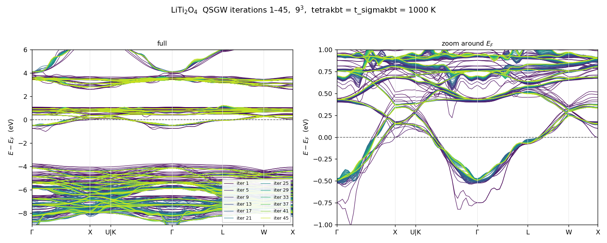

# kBT — 有限温度の自己エネルギー計算 (`tetrakbt` / `t_sigmakbt`)

ecalj branch `t_sigmakbt` / 2026-06

金属の QSGW が反復ごとに振動して収束しないことがある。原因は Fermi 面の
鋭い応答で、**電子温度を入れて Fermi 面を物理的に広げる**のがここで述べる方法である。

$W$ 側($\chi_0$)と $\Sigma$ 側($G$)にそれぞれ別のキーがあり、
**両方を同じ温度にして使う**のが本来の形である。

| キー | どこに効くか | 実装 |
|---|---|---|
| `tetrakbt` + `t_tetrakbt` | $\chi_0$ の占有数(→ $W$) | `main` |
| `t_sigmakbt` | $\Sigma_x=Gv$、$\Sigma_c=G(W-v)$ の占有数 | branch `t_sigmakbt` |

---

## 1. なぜ要るか

金属の QSGW は、k メッシュが Fermi 面の鋭い応答(ネスティング)を解像すると
反復ごとに振動しうる。テトラヘドロン法は Fermi 面を「厳密に」標本化するので
$W$ に鋭い小 $q$ 構造が立ち、$\Sigma$ が毎反復の Fermi 面のずれに強く反応する。

**電子温度で Fermi 面を広げるのが根本的な正則化**である。
$\mathrm{Im}\,\chi_0$ を $\omega$ 方向に平滑化する `SmearX0` は症状だけを扱う
対症療法で、こちらとは別物である。

実測では LiTi₂O₄(金属スピネル)で、**$6^3$ と $9^3$ のメッシュ依存が消え**、
QSGW が安定した(1000 K で $E_F$ の $\pm0.5$ eV 以内 rms 13.8 meV。
[§5.3](#_5-3-メッシュ依存が消えていること-1000-k) に図と数値、
[§5.2](#_5-2-パラパラマンガ-—-と-が反復で近づいていく) に反復ごとの PDF)。

---

## 2. $\chi_0$ 側 — `tetrakbt`

`ctrlg.<sname>.toml` の `[gw]`:

```toml
[gw]
tetrakbt   = true     # chi0 を有限温度テトラヘドロンで (method B')
t_tetrakbt = 2000.0   # 電子温度 (K)。kBT[eV] ~ T/11604
```

何が起きるか:

- $\chi_0$ の占有因子が温度 $T$ の Fermi 分布になる
  (`tetwt5` / `lindtet6_kbt`、エネルギー畳み込みの method B'。$T\to0$ で厳密に元へ戻る)
- `heftet`(GW フローの `imode=1`)が**有限温度の Fermi 準位を二分法で解き
  `EFERMI_kbt` に書く**。$\chi_0$ のテトラヘドロンがそれを読むので、
  占有数と $E_F$ が同じ温度を指す

出力での確認:

```
tetrakbt_init: T[K], kbt[Ry], kbt[eV]  2000  0.12667E-01 0.17234E+00
```

---

## 3. $\Sigma$ 側 — `t_sigmakbt`

`tetrakbt` だけでは **$\Sigma$ は $T=0$ のまま**である($G$ の極は Gaussian の
`esmr` で平滑化され、Fermi 準位も $T=0$ のもの)。`t_sigmakbt` はそこを揃える。

```toml
[gw]
tetrakbt   = true
t_tetrakbt = 2000.0
t_sigmakbt = 2000.0   # Sigma 側の電子温度 (K)。0 (既定) で従来どおり
```

**`t_sigmakbt == t_tetrakbt` にすること。** そうして初めて $\chi_0$($W$)と
$\Sigma$($G$)が一つの物理的な温度を共有する。

### 何が変わるか

`t_sigmakbt > 0` のとき、`sigmakbt_setup` が 2 つのことをする:

1. **自己エネルギーの Fermi 準位を `EFERMI_kbt` に切り替える**
   ($T=0$ の `EFERMI` ではなく、`tetrakbt` と同じ $\mu$)
2. **占有数の核を Gaussian から Fermi–Dirac に替える**
   — $\Sigma_x = Gv$ と $\Sigma_c = G(W-v)$ の両方

Gaussian 平滑化(幅 `esmr`)

$$
w(e_l,e_h;\varepsilon_k)=\int_{e_l}^{e_h}\frac{1}{\sqrt2\,\sigma}
\exp\Bigl[-\Bigl(\frac{x-\varepsilon_k}{\sigma}\Bigr)^2\Bigr]dx
\tag{1}
$$

が、Fermi–Dirac の累積分布

$$
\Phi(x)=\frac{1}{1+e^{-x/k_BT}},
\qquad
w(e_l,e_h;\varepsilon_k)=\Phi(e_h-\varepsilon_k)-\Phi(e_l-\varepsilon_k)
\tag{2}
$$

に置き換わる。$k_BT\to0$ で鋭い階段関数に戻り、既定(`t_sigmakbt = 0`)では
式 (1) の従来の挙動をそのまま再現する。

### 出力での確認

```
sigmakbt_setup: t_sigmakbt[K]=  2000.0 kbt[Ry]=  0.12667E-01 ef<-EFERMI_kbt=   0.123456
```

### `EFERMI_kbt` が無いとき

`t_sigmakbt > 0` でも `EFERMI_kbt` が無ければ、**警告を一行出して
$\Sigma$ 側の有限温度は適用されない**(従来どおり動く):

```
sigmakbt_setup: WARNING t_sigmakbt>0 but EFERMI_kbt missing (need tetrakbt/heftet).
                Sigma-side finite-T NOT applied.
```

`EFERMI_kbt` を書くのは `tetrakbt` を有効にした `heftet` なので、
**`t_sigmakbt` は単独では使えない。** 必ず `tetrakbt = true` と併せて設定すること。

::: warning esmr は既定のままにすること
`t_sigmakbt > 0` にしても、$\Sigma$ 側の**状態範囲**は依然 `esmr` で決まっている。
`esmr` を既定(0.01 Ry)より下げたり $T$ を 3000 K より上げたりすると、
警告なしに占有数が切り捨てられる。[§7.3](#_7-3-不整合-—-側の状態窓が-esmr-のまま) を見よ。
:::

---

## 4. 温度の選び方

$k_BT$ を、**k メッシュが Fermi 面領域で持つエネルギー間隔と同程度以上**に取る:

$$
k_BT \gtrsim \frac{v_F \cdot (\text{BZ の大きさ})}{N}
\tag{3}
$$

LiTi₂O₄ の $6^3$ / $9^3$ では $T = 1000$–$3000$ K($k_BT = 0.086$–$0.26$ eV)が
使える範囲だった。**求めたい量が $T$ について収束していること**、できれば
**同じ $T$ で 2 つの k メッシュが一致すること**を確認すること。

### 温度を上げると何が直るか

LiTi₂O₄ の QSGW 第 1 反復を $T$ だけ変えて重ねたもの
(いずれも $6^3$、`deltaq_scale = 0.3`。共通の静電ゼロで揃え、$T=0$ の
$E_F$ を原点に取った)。


*図をクリックすると拡大する。*

---

$T=0$($T=0$ テトラヘドロン `lindtet6`、黒)では Ti-3d $t_{2g}$ 帯が
Γ–L 上で **−3.9 eV まで落ち込む**。これは分散ではなく $q\to0$ head の破綻で、
温度を上げると単調に消える:

| $T$ | Γ–L 上 ($x\approx2.7$) の $t_{2g}$ 帯の底 |
|---|---|
| 0 (`lindtet6`) | −3.91 eV |
| 1000 K | −1.31 eV |
| 2000 K | −0.66 eV |
| 3000 K | −0.50 eV |

**これが有限温度を入れる理由である。** ただし $T\to0$ で method B′ が
`lindtet6` に厳密に戻ること自体は変わらない($T=0$ が壊れているのは
テトラヘドロン法ではなく、その上での金属の $q\to0$ の扱いのほうである)。

### 高温では `deltaq_scale` を小さく取ること

上の図の 3000 K(赤)は Γ–L では収まっているのに、**K–Γ の中央に
別のスパイクが残る**。これは `deltaq_scale`(offset-Gamma の $q_0$ head の
シフト量)が大きすぎるためで、**温度の問題ではない**。同じ 3000 K で
`deltaq_scale` を 0.3 から 0.1 に下げると消える:


赤 = `deltaq_scale = 0.3`(K–Γ 中央に −1.24 eV のスパイク)、
青 = `deltaq_scale = 0.1`(消える)。$6^3$、$T$ = 3000 K、QSGW 第 1 反復。

---

つまり **`tetrakbt` / method B′ 本体の問題ではなく、offset-Gamma の
$q\to0$ head が高温 × 大きい `deltaq` で破綻する**。
高い $T$ を使うときは `deltaq_scale` も併せて小さくすること。

---

## 5. サンプル — `Samples/kBT/`

`ecalj/Samples/kBT/` に**収束した計算一式**(入力と結果)がある。物質ごとに
`LiTi2O4/`(66 MB)と `Fe/`(0.8 MB)に分かれている。GW を何十回も反復するので
計算が重く、`testecalj` のターゲットにはしていない。
**手法が何を変えるかを、収束した結果そのもので見るためのもの。**

`LiTi2O4/` の 3 つの run:

| ディレクトリ | k メッシュ | $T$ | 反復 | 何のため |
|---|---|---|---|---|
| `n666_T2000/` | $6^3$ | 2000 K | 11 | 標準。反復が収束していく様子 |
| `n666_T1000/` | $6^3$ | 1000 K | 30 | ↓ とペアでメッシュ依存を見る |
| `n999_T1000/` | $9^3$ | 1000 K | 45 | ↑ とペア。**これが重い計算** |

いずれも `deltaq_scale = 0.1`、`tetrakbt = t_sigmakbt`。

### 5.1 反復の収束 ($6^3$, 2000 K)


QSGW 反復 1(紫)から 11(黄)まで。反復 3–4 以降は $E_F$ 近傍でも線が重なり、
金属にもかかわらず振動せずに収束している。

---

### 5.2 パラパラマンガ — $6^3$ と $9^3$ が反復で近づいていく

**[bands_iterations_T1000.pdf](/kBT/bands_iterations_T1000.pdf)**(45 ページ、4 MB)

1 ページ = 1 反復。青が $6^3$、赤破線が $9^3$。ページを送ると

- 反復 1 では $6^3$ と $9^3$ が**大きく食い違っている**(メッシュ依存が出ている)
- 反復が進むにつれて両者が近づき、最後には重なる
- $6^3$ は反復 30 で止めたので、それ以降は収束値を薄い青で参照として残してある

PDF ビューアでページを送れば動画として見える。

---

### 5.3 メッシュ依存が消えていること (1000 K)


収束した $6^3$(反復 30)と $9^3$(反復 45)の重ね描き。差は

| 範囲 | rms | 最大 |
|---|---|---|
| $\lvert E-E_F\rvert < 0.5$ eV | 13.8 meV | 54 meV |
| $\lvert E-E_F\rvert < 2$ eV | 23.3 meV | 265 meV |
| $\lvert E-E_F\rvert < 10$ eV | 75.4 meV | 940 meV |

静電ゼロから測った Fermi 準位 $E_F-V_\mathrm{esav}$ は $6^3$ が 6.76420 eV、
$9^3$ が 6.76424 eV で、**0.05 meV しか違わない**。

反復ごとの残差($6^3$ の 29→30 で $E_F$ 近傍 rms 1.4 meV、$9^3$ の 44→45 で
0.70 meV)より上の差のほうが大きいので、13.8 meV は反復ノイズではなく本当の
メッシュ差である。それでも d バンドの議論には十分小さい。

$9^3$ 単独の反復の重ね描きは以下。45 反復かかっているが、$E_F$ 近傍は
10 反復あたりでほぼ決まっている。



---

置いてあるもの:

| | |
|---|---|
| `LiTi2O4/input/` | 3 run 共通の `PB` / `syml` と LDA 収束済みの `rst` |
| `LiTi2O4/<run>/ctrlg.liti2o4.toml` | run ごとの入力 |
| `LiTi2O4/<run>/results/EFERMI`, `EFERMI_kbt` | $T=0$ と有限温度の Fermi 準位 |
| `LiTi2O4/<run>/results/finiteT_evidence.txt` | 実行ログからの抜粋(下記) |
| `LiTi2O4/<run>/results/QPU.<N>run` | QP エネルギー |
| `LiTi2O4/n666_T2000/results/sigm.liti2o4` | 収束した自己エネルギー(13 MB)。GW をやり直さずバンドが描ける |
| `LiTi2O4/n999_T1000/results/sigm.liti2o4` | 同 $9^3$(30 MB)。**45 反復かかっていて一番作り直しにくい** |
| `LiTi2O4/n666_T2000/results/bnd_iterations.tar.gz` | 全反復のバンド生データ |
| `LiTi2O4/plots/` | 上の PDF・メッシュ比較図・$T$ 依存図・`deltaq` 比較図 |
| `Fe/` | §5.4 の対照実験(入力 2 つと `QPU`/`QPD` だけ) |

1000 K の 2 run は全反復の生データを置いていない($6^3$ で 17 MB、$9^3$ で
26 MB になるため)。反復ごとの中身は 5.2 の PDF で見られる。

両側が実際に有効になっていることは、このログで確認できる:

```
 tetrakbt_init: T[K], kbt[Ry], kbt[eV] 2000  0.12667E-01  0.17234E+00
 sigmakbt_setup: t_sigmakbt[K]= 2000.0 kbt[Ry]= 0.12667E-01 ef<-EFERMI_kbt= 0.267452
  0.277063046836211D+00 ... ! efermi           (T=0)
  0.267452126929387D+00 ... ! efermi_kbt       (有限温度)
```

2 行目の `ef<-EFERMI_kbt` が、$\Sigma$ 側が $T=0$ の `EFERMI`(0.2771 Ry)ではなく
**有限温度の `EFERMI_kbt`(0.2675 Ry)を使っている**ことを示す。
ここが食い違ったままだと $\chi_0$ と $\Sigma$ が別の Fermi 準位を見ることになる。

---

### 5.4 Fe — $\Sigma$ 側が効くことの対照実験

`Samples/kBT/Fe/` は **`t_sigmakbt` の値以外まったく同じ入力**の 2 つの run である。

| | `t_sigmakbt0/` | `t_sigmakbt3000/` |
|---|---|---|
| `tetrakbt` / `t_tetrakbt` | `true` / 3000 K | `true` / 3000 K |
| **`t_sigmakbt`** | **0.0** | **3000.0** |

$\chi_0$(したがって $W$)は**両方とも 3000 K で同一**なので、差は $\Sigma$ 側
だけから来る。bcc Fe、`nspin=2`、GW メッシュ $5^3$、QSGW 1 反復。
(実用の設定ではない。実用では `t_sigmakbt == t_tetrakbt` にすること。)

まず、変わってはいけないものは変わっていない — `vxc`・`SExcore`・$Z$・LDA
固有値は**ビット単位で同一**である。対照実験として成立している。


QSGW が使う $\Sigma-v_{xc}$ の変化:

| $\lvert\varepsilon-E_F\rvert$ | rms $\Delta(\Sigma-v_{xc})$ | rms $\Delta\Sigma_x$ | rms $\Delta\Sigma_c$ |
|---|---|---|---|
| 0–1 eV | 0.788 eV | 0.680 eV | 1.180 eV |
| 1–3 eV | 0.648 eV | 0.199 eV | 0.784 eV |
| 3–10 eV | 0.428 eV | 0.123 eV | 0.442 eV |
| 10 eV 以上 | 0.094 eV | 0.025 eV | 0.093 eV |

---

**$\Sigma$ 側の有限温度は小さな補正ではない。** $E_F$ 近傍で rms 0.7 eV、
最大 1.93 eV 動く。$\chi_0$ だけ温めて $\Sigma$ を $T=0$ に置き去りにするのは、
つじつまが合わないだけでなく数値的にも大きい。これが `t_sigmakbt` を
作った理由である。

$\Sigma_x$ と $\Sigma_c$ は個別にはもっと大きく動く(最大 2.40 eV と 3.66 eV)が、
符号が逆で和は 1.93 eV に収まる。交換分裂はほぼ不変(−0.213 → −0.212 eV)で、
効果はほぼスピン共通のシフトである。Fermi 準位自体は
`EFERMI` 0.01496 Ry → `EFERMI_kbt` 0.03373 Ry と **0.26 eV** 動く。

### 5.5 結果を読むときの注意

**ここの結果はすべて 2026-06-15〜06-20 の実行である。**

#### 有限温度に固有の注意 — `tetrakbt` のペア選別

**`6b83b86e7`(2026-06-09、method B′ の導入)から `37e6fbc23`(2026-06-13)
までのコミットで `tetrakbt = true` を使った run は、高温で $\chi_0$ を
なめらかに過小評価している。**

`tetwt5` の上流のペア選別が sharp $\theta$ のままだったためで、落ちる殻の重みの
1000 K で ~1%、3000 K で ~18% にあたる。現在は `wocc = 12*kbt` で窓を広げ、
`fbound`/`tolpair` の厳密上界で刈っている([§7.1](#_7-1-恒等式は厳密-確認済み))。
これは `usetetrakbt` の分岐の中の話で、$T=0$ の経路では sharp $\theta$ が正しいので
影響しない。

#### 有限温度とは関係ない注意 — 実軸極項の OOB ガード

`m_sxcf_sc.f90` の実軸極項のビン詰めには、2026-06-13 の `2298e75e9` まで
**範囲外ガードが無かった**。`findloc` が 0 を返す(`we` が `freq_r(nw)` を超える)と
`nttp(-1)` / `wgtiw(:,-1)` へ書き込む。温度によらず全ての `gwsc` が通る経路である。

この修正を作る途中で `ixs < 2` という**きつすぎる**版が一時的に存在し、
それは正当な $\omega_\epsilon\approx0$ の実軸極項(静的 $W$ のビン)を全部捨てて
si_gwsc の QPU を 3.54 eV ずらした。**ただしこの版はコミットされていない** —
リポジトリの歴史は「ガード無し → 正しいガード」であって、`ixs < 2` は kt1 の
作業ツリーにだけ 2026-06-11〜06-13 の間存在した。したがってこれは
**kt1 の `runs/` にある当時の run についての注意**であって、ecalj の利用者には
関係しない。ここに置いた run はどちらの窓にも入っていない。

$T$ 依存図(§4)と `deltaq` 比較図(§4)は QSGW 第 1 反復の別 run 群からのもので、
`deltaq_scale` が 0.3 である。§5 の 3 つの run(`deltaq_scale = 0.1`)とは
直接比較できない。

---

## 6. 実装の場所

| ファイル | 役割 |
|---|---|
| `SRC/subroutines/wfacx.f90` | `m_wfac` の Fermi–Dirac 核(`fd_cdf` / `fd_iav`)と `sig_fd` ゲート |
| `SRC/subroutines/genallcf_mod.f90` | `sigmakbt_setup`(`EFERMI_kbt` の読み込みと FD の有効化) |
| `SRC/subroutines/m_GWinput.f90` | `t_sigmakbt` の読み取り |
| `SRC/subroutines/main_hsfp0.sc.f90` | `hs_ef` の一点で有効化(両バイナリ) |

`set_sigma_fd(.true., kbt)` は `sxcf` のループに入る前に一度だけ呼ばれ、
以後 `wfacx` / `wfacx2` / `weavx2` が FD 核を使う。

---

## 7. 実装の検証と既知の限界

2026-09-16 にコードを読み直して確認した結果。**骨格は正しいが、精度の限界が 1 つ、
整合性の穴が 1 つ、理論の範囲についての注意が 1 つある。**

### 7.1 恒等式は厳密 (確認済み)

`lindtet6_kbt` ([tetwt5.f90:629-673](https://github.com/tkotani/ecalj/blob/main/SRC/subroutines/tetwt5.f90#L629)) の method B′ は

$$
\int dE\,(-f'(E))\,\theta(E-e_a)\theta(e_b-E) = f(e_a)-f(e_b)
\tag{4}
$$

を **k 積分の内側**で使っている。$E$ 積分と $k$ 積分が交換するので厳密である。
得られる分子は Adler–Wiser の $f_a-f_b$ であって $f_a(1-f_b)$ ではない
— 応答関数として正しいのはこちら。

個別に確認したもの:

- **ゲート**(tetwt5.f90:651) — a/b が窓の外で平坦になる場合分けを全部たどったが、
  どれも $T=0$ の値と一致する
- **node zero-skip**(tetwt5.f90:667) — `lindtet6` が恒等的に 0 になる条件そのもの。
  `knorm` は全節点で正規化されるので、飛ばしても整合する
- `efermia` ≠ `efermib` でも (4) は成立する(それぞれの Fermi 準位での $f$ になる)
- **`EFERMI_kbt`**([main_heftet.f90:368](https://github.com/tkotani/ecalj/blob/main/SRC/subroutines/main_heftet.f90#L368))
  — NOS を熱核で畳み込んで二分法。$T\to0$ でテトラヘドロンの $E_F$ に厳密に戻る。
  χ0 側もこれを読んでいる(m_tetwt.f90:147)

### 7.2 限界 — $E$ 積分の Gauss-Legendre が $E_F$ 近傍を刻んでいない

`gausq(NE=20, -6, 6)` の**最内節点は $|t|=0.459$、すなわち $|E-E_F| = 0.92\,k_BT$**。
**$E_F$ の $\pm0.92\,k_BT$ の内側は一切標本化されない。**

テトラヘドロン内のバンド幅を $\Delta$ として、占有因子の最悪誤差を測ったもの:

| 求積 | 節点 | $\Delta=0.4k_BT$ | $1k_BT$ | $2k_BT$ | $4k_BT$ | $8k_BT$ |
|---|---|---|---|---|---|---|
| **現状** GL20 on $[-6,6]$ | 20 | 1.7e-1 | 9.7e-2 | 2.3e-2 | 1.3e-2 | 6.8e-3 |
| 4 区間 $[-6,-1,0,1,6]$ × GL5 | 20 | 2.9e-2 | 1.6e-2 | 4.8e-3 | 2.6e-3 | 1.3e-3 |
| 6 区間 × GL4 | 24 | 2.9e-2 | 1.1e-2 | 2.8e-3 | 1.7e-3 | 9.6e-4 |
| 2 区間 $[-6,0,6]$ × GL10 | 20 | 5.5e-2 | 1.9e-2 | 1.1e-2 | 3.8e-3 | 1.9e-3 |

---

分散の大きいバンドでは無害だが、**平坦バンド・バンド端・van Hove 領域が $E_F$ に
あると占有因子が 0.1 以上ずれる**。LiTi₂O₄ の Ti-3d $t_{2g}$ は $6^3$ で
テトラヘドロン内の幅が 0.2–0.5 eV ≈ 1–3 $k_BT$ なので、1e-2 程度は乗っている見込み。

節点を増やしても $1/N$ でしか落ちない(NE=40 → 9e-3、NE=80 → 3e-3)。
**同じ 20 点のまま 4 区間に切るだけで最悪誤差が 6 倍良くなり**、$E_F$ 近傍の
分解能も $0.459 \to 0.047$ と一桁上がる。節点数より区間の切り方が効く。
本筋は被積分関数の折れ点(= 8 個の角エネルギー)で区間を切ること。**未修正。**

### 7.3 不整合 — $\Sigma$ 側の状態窓が `esmr` のまま

`sig_fd` を on にすると重みの核は幅 `sig_kbt` の Fermi–Dirac になるが、
**状態範囲を決める窓は `ddw*esmr`(ddw=10)のまま**である
(m_sxcf_sc.f90:457-458、m_sxcf_sc_count.f90:158, 262-263)。
しかも `sxcf_scz_count` は `sigmakbt_setup` **より前**に呼ばれるので
(main_hsfp0.sc.f90:143 vs :164)、窓の中心は $T=0$ の `EFERMI`、
重みの中心は `EFERMI_kbt` になる(本サンプルで 0.0096 Ry ずれる)。

切り捨てられる占有は $f(10\,\texttt{esmr}/k_BT)$:

| | 窓の幅 | 切り捨て |
|---|---|---|
| 本サンプル (2000 K, `esmr`=0.01) | $\pm7.9\,k_BT$ | 3.7e-4 ✓ |
| 5000 K, `esmr`=0.01 | $\pm3.2\,k_BT$ | 4% |
| 2000 K, `esmr`=0.002 | $\pm1.6\,k_BT$ | 17% |

---

いまの既定値では無害だが、**警告なしに静かに悪化する**。
本頁が「有限温度は `t_sigmakbt` が担う」と書いている以上 `esmr` を下げる人は出るので、
**当面 `esmr` は既定(0.01 Ry)のままにし、`t_sigmakbt` を 3000 K より大きく
取らないこと。** 直すなら `sig_fd` のとき窓を `max(ddw*esmr, 12*sig_kbt)` にし、
`sigmakbt_setup` を count の前に移す(または count に `ef_kbt` を渡す)。**未修正。**

### 7.4 範囲 — $\Sigma$ が要るのは「差」ではなく「和」

$\chi_0$ を有限温度化しただけでは $\Sigma$ は揃わない。理由は一行で書ける。

中間状態の粒子‑正孔対を $(2,3)$、$\omega'=\varepsilon_2-\varepsilon_3>0$ として、

| | 重み |
|---|---|
| 対を**作る** | $f_3(1-f_2)$ |
| すでにある対を**壊す** | $f_2(1-f_3)$ |

$\mathrm{Im}\,\chi_0$ が持っているのはこの**差** $f_3(1-f_2)-f_2(1-f_3)=f_3-f_2$ だが、
$\Sigma$ の中間状態の重みは**和**である(どちらも同じ分母を持つ)。
いまの実装は $\mathrm{Im}W$ から差を取ってきて外側の $f_j$ を掛けるので、
**$f_2(1-f_3)$ の分が落ちる。** 詳細釣り合い $f_2(1-f_3)/f_3(1-f_2)=e^{-\beta\omega'}$ から

$$
f_2(1-f_3)=\bigl(f_3-f_2\bigr)\,n_B(\omega')
\tag{5}
$$

なので、これは普通 Bose 因子と呼ばれるものである。**ただし出どころは Fermi の
占有数**であって、ボソンの熱浴を外から入れたわけではない。導出は
[§8](#_8-付録-—-虚時間を使わない定式化) を見よ。物理は単純で、$T>0$ では
粒子‑正孔対がすでに熱励起されていて電子はそれを吸収できる、というだけのこと。

**大きさ。** $f_2(1-f_3)$ は $\omega'\gg k_BT$ で指数的に小さいので、効くのは
$\omega'\lesssim k_BT$ の粒子‑正孔連続体だけである。金属で
$\mathrm{Im}W_c\simeq c\,\omega'$ とすると

$$
\int_0^\infty\!\! d\omega'\,\mathrm{Im}W_c(\omega')\,n_B(\omega')
= c\,(k_BT)^2\frac{\pi^2}{6}
\tag{6}
$$

2000 K で $(k_BT)^2=0.029$ eV²、$\omega-\varepsilon_j\sim1$ eV なら数 meV–数十 meV。

**これは欠陥ではなく定義である。** ecalj のスキームは「温度 $T$ の占有数で作る
有効一体ハミルトニアン」であって、Mermin の有限温度 DFT が Fermi 占有数だけで
閉じているのと同じ立場である。QSGW は動的な $\Sigma$ ではなく**静的エルミートな**
一体ハミルトニアンを作るものなので、落ちているのが主に詳細釣り合い(= 寿命)側で
あることもあって、影響は一発 GW のスペクトル関数を出す場合よりずっと軽い。
平衡の多体摂動論の $\Sigma$ が欲しいなら (5) が要る、というだけのことである。

### 7.5 いまは踏まないが直すべき箇所

- **m_sxcf_sc.f90:237** の `sxs_ekc(is1+nctot)` は `sxs_ekc(is1)` のはず。
  2024-07-25 の `245ef9f3f`(nvfortran 24.1 回避の書き換え)でコメントアウトされた
  元コードは `ekc(it)` だった。現状 mode 1/2 は `nctot=0`(hgw のログで確認)、
  mode 3 は `ns2 ≤ nt0p = nctot` で else 分岐に入らないため実害なし。
  `nctot>0` で価電子交換を回すと壊れる。
- **main_hsfp0.sc.f90:166** の `if(sig_fd) ef = ef_kbt` が `ixc==3`(CoreEx)にも効き、
  直前に `LOWESTEVAL-1d-3` に設定した `ef` を上書きする。
  core ループが `wtff=1` 固定なのでいまは影響しない。

---

## 8. 付録 — 虚時間を使わない定式化

$n_B$ がどこから来るのかは、松原形式を経由しなくてもはっきりする。むしろ
そちらのほうが**すべてが Fermi の占有数から出る**ことが見えてよい。
教科書では閉時間径路と平衡の話が分かれて書かれていることが多いので、
ここで通して書いておく。

以下 $\hbar=1$、エネルギーは $\mu$ から測る。
$f(\varepsilon)=1/(e^{\beta\varepsilon}+1)$、$n_B(\omega)=1/(e^{\beta\omega}-1)$。

### 8.1 $T=0$ の議論がなぜそのまま使えないか

$T=0$ の実時間摂動論は Gell-Mann–Low に依っている。断熱的に相互作用を入れると
$U(\infty,-\infty)|\Phi_0\rangle = e^{i\theta}|\Phi_0\rangle$、つまり
**基底状態は位相を除いて自分自身に戻る**ので、$+\infty$ 側を $-\infty$ 側と
取り替えられて

$$
\langle\Psi_0|T\{\cdots\}|\Psi_0\rangle
=\frac{\langle\Phi_0|T\{S\cdots\}|\Phi_0\rangle}{\langle\Phi_0|S|\Phi_0\rangle}
\tag{7}
$$

と片道の時間順序積で書ける。

$T>0$ ではこれが使えない。$\rho_0=e^{-\beta(H_0-\mu N)}/Z_0$ は固有状態ではなく、
断熱的に発展させても**重みが非相互作用系のまま**($e^{-\beta E_n^{(0)}}$ であって
$e^{-\beta E_n}$ ではない)なので、$+\infty$ 側を $-\infty$ 側と同一視できない。
(7) の分母に相当するものが書けない、というのが問題の本質である。

### 8.2 閉時間径路 — 行って戻る

そこで **$+\infty$ の状態を一切使わない**。$-\infty\to+\infty\to-\infty$ と
往復する径路 $C$ を取れば、演算子を挟まない限り

$$
\mathrm{Tr}\bigl[\rho_0\,U(-\infty,+\infty)\,U(+\infty,-\infty)\bigr]
=\mathrm{Tr}\,\rho_0 = 1
\tag{8}
$$

が**恒等的に**成り立つ。分母が要らない。これが閉時間径路(Keldysh)の全部である。

径路順序積 $T_C$(往路の後に復路が来る順序)を使って

$$
G(1,2)=-i\,\mathrm{Tr}\Bigl[\rho_0\,T_C\Bigl\{
e^{-i\int_C dt\,H_1(t)}\;\psi(1)\psi^\dagger(2)\Bigr\}\Bigr]
\tag{9}
$$

場は $H_0$ の相互作用表示。$\tau$ ではなく実時間で、$T$ 積が $T_C$ 積になっただけ
である。$1,2$ をどちらの枝に置くかで 4 つの成分が出るが、独立なのは 2 つで、
以下では

$$
G^<(1,2)=+i\langle\psi^\dagger(2)\psi(1)\rangle,\qquad
G^>(1,2)=-i\langle\psi(1)\psi^\dagger(2)\rangle
\tag{10}
$$

を使う。

### 8.3 Wick の定理 — 入力は $f$ だけ

$\rho_0$ は $H_0$ について Gauss 的なので Wick の定理がそのまま成立し、
縮約は自由な径路伝播関数になる。エネルギー $\varepsilon_j$ の準位について

$$
g_j^<(\omega)=2\pi i\,f_j\,\delta(\omega-\varepsilon_j),\qquad
g_j^>(\omega)=-2\pi i\,(1-f_j)\,\delta(\omega-\varepsilon_j)
\tag{11}
$$

**温度が入るのはここだけで、入るのは Fermi 分布だけである。**
Bose 分布はこの段階でどこにも無い。

### 8.4 GW を径路上で書く

径路引数のまま、形は $T=0$ と同じ:

$$
\chi_0(1,2)=-i\,G(1,2)G(2,1),\qquad
W=v+v\chi_0 W,\qquad
\Sigma(1,2)=i\,G(1,2)W(2,1)
\tag{12}
$$

実時間成分に落とすには Langreth 則を使う。同じ引数の積
$C(1,2)=A(1,2)B(2,1)$ に対して

$$
C^{\gtrless}(1,2)=A^{\gtrless}(1,2)\,B^{\lessgtr}(2,1)
\tag{13}
$$

**$\gtrless$ がひっくり返る**のが要点である。

### 8.5 $\chi_0$ の $\gtrless$ 成分 — ここで $n_B$ が出る

(12)(13) と (11) から、時間並進対称性を使って

$$
\chi_0^>(\omega)=-2\pi i\sum_{23} f_3(1-f_2)\,\delta(\omega-\varepsilon_2+\varepsilon_3)
$$
$$
\chi_0^<(\omega)=-2\pi i\sum_{23} f_2(1-f_3)\,\delta(\omega-\varepsilon_2+\varepsilon_3)
\tag{14}
$$

$\chi_0^>$ が**対を作る**過程、$\chi_0^<$ が**すでにある対を壊す**過程である。
$\omega>0$ では $\varepsilon_2>\varepsilon_3$。

スペクトル関数は差のほうで、

$$
\chi_0^>-\chi_0^< \;\propto\; f_3(1-f_2)-f_2(1-f_3)=f_3-f_2
\;=\;2i\,\mathrm{Im}\chi_0^R
\tag{15}
$$

これが $T=0$ のコードが計算している量である。一方 (14) の比は
$f_j=1/(e^{\beta\varepsilon_j}+1)$ を代入するだけで

$$
\frac{\chi_0^<(\omega)}{\chi_0^>(\omega)}
=\frac{f_2(1-f_3)}{f_3(1-f_2)}=e^{-\beta\omega}
\tag{16}
$$

となり、$1/(1-e^{-\beta\omega})=1+n_B(\omega)$ を使えば

$$
\chi_0^>=\bigl(1+n_B\bigr)\bigl(\chi_0^>-\chi_0^<\bigr),\qquad
\chi_0^<=n_B\,\bigl(\chi_0^>-\chi_0^<\bigr)
\tag{17}
$$

**$n_B$ はここで初めて現れる。仮定ではなく (11) の Fermi 分布からの帰結**である。
ボソンの熱浴を外から入れた覚えはないのに Bose 分布が出るのは、
$\chi_0$ がボソン的な相関関数だから((16) がボソンの KMS 条件そのもの)。

RPA の衣を着せても比は変わらない。$W^{\gtrless}=\epsilon^{-1,R}\,v\chi_0^{\gtrless}v\,
\epsilon^{-1,A}$ で $\epsilon^{-1,A}=(\epsilon^{-1,R})^\dagger$ だから、
(16) はそのまま $W^{\gtrless}$ に受け継がれる。

### 8.6 $\Sigma$ の $\gtrless$ 成分

(12)(13) より $\Sigma^{\gtrless}(t)=i\,G^{\gtrless}(t)\,W^{\lessgtr}(-t)$、
振動数では

$$
\Sigma^{\gtrless}(\omega)=i\sum_j\int\!\frac{d\nu}{2\pi}\,
g_j^{\gtrless}(\nu)\,W^{\lessgtr}(\nu-\omega)
\tag{18}
$$

(11) を入れ、$B(\Omega)\equiv W^>(\Omega)-W^<(\Omega)=2i\,\mathrm{Im}W^R(\Omega)$、
$W^>=(1+n_B)B$、$W^<=n_B B$ とすると、
$2i\,\mathrm{Im}\Sigma^R=\Sigma^>-\Sigma^<$ から

$$
\mathrm{Im}\,\Sigma^R(\omega)=\sum_j
\mathrm{Im}W^R(\varepsilon_j-\omega)\;
\bigl[\,n_B(\varepsilon_j-\omega)+f_j\,\bigr]
\tag{19}
$$

$\varepsilon_j-\omega$ の符号で分けて $n_B(-\Omega)=-(1+n_B(\Omega))$ を使えば、
見慣れた放出因子 $1-f_j+n_B$ と吸収因子 $f_j+n_B$ になる。実部は
Kramers–Kronig で決まる。

$T\to0$ の確認: $n_B(\Omega>0)\to0$、$n_B(\Omega<0)\to-1$、$f_j\to\theta(-\varepsilon_j)$。
$\omega>0$ の準粒子について、$j$ が占有だと $[-1+1]=0$(Pauli 阻止)、
$j$ が空だと $[-1+0]=-1$ で寄与する。従来の $T=0$ GW に戻る。

### 8.7 いまの実装が保っているもの・落としているもの

ecalj が計算しているのは $\mathrm{Im}W^R$、すなわち (15) の**差**である。
$\Sigma$ を組むときに外側の $f_j$ だけを有限温度にし、(19) の $n_B$ は入れていない。
つまり

$$
\Sigma^{\text{ecalj}}:\quad n_B\to 0,\qquad f_j\to f_j(T)
$$

これは $\Sigma$ の詳細釣り合い

$$
\Sigma^<(\omega)=-e^{-\beta\omega}\,\Sigma^>(\omega)
\tag{20}
$$

を破る((18) と (16) から (20) は**両方**を残したときにのみ成り立つ)。
したがって得られる $\Sigma$ は、厳密にはどんな温度 $T$ の平衡状態のものでもない。

一方でこれは QSGW では軽い。QSGW が作るのは**静的エルミートな**一体
ハミルトニアンで、$\mathrm{Im}\Sigma$ は最初から捨てているからである。
(20) が壊れているというのは主に寿命側の話で、QSGW が使う
$\mathrm{Re}\,\Sigma(\varepsilon_j)$ への影響は (6) の $O((k_BT)^2)$ にとどまる。

### 8.8 初期相関についての注意

8.2 では $\rho_0$(非相互作用の熱平衡)から断熱的に相互作用を入れると書いたが、
これは**初期相関を落としている**。厳密には径路に虚時間の縦枝
$[t_0,\,t_0-i\beta]$ を足した Kadanoff–Baym 径路を使い、そこに初期相関を
持たせる(Danielewicz)。平衡かつ断熱的な場合には縦枝が実時間部分から
分離し、結果は松原形式と一致する。

ここで $\tau$ が顔を出すのは**初期条件を指定するため**であって、
摂動展開そのものは実時間のままである。$n_B$ が出るかどうかとは関係がない —
それは 8.5 で見たとおり (11) の Fermi 分布だけから出る。

---

## 9. ブランチの状況

| ブランチ | 状態 |
|---|---|
| `main` | `tetrakbt`($\chi_0$ 側)まで。検証済み |
| **`t_sigmakbt`** | **`t_sigmakbt`($\Sigma$ 側)を追加。Fe 金属で検証、LiTi₂O₄ の QSGW を安定化し $6^3$/$9^3$ のメッシュ依存を除去。既定 0 なので従来の挙動は不変** |
| `gwkbt-dev` | 別系統の有限温度 $\Sigma$(gwkbt Stage A/B)。**production 非対応。** Stage B の entry2 静的ビン登録が死んでいた件はブランチ上で修正済みだが、設計レビューと `gwkbt_test_plasmonpole.py` での再検証が要る |

---

## 関連

- [QSGW の計算 (gwsc)](./gwsc)
- サンプル `ecalj/Samples/kBT/`(上記 §5)
- [`ctrlg.<sname>.toml` の `[gw]` セクション](./lmf#file-structure-sections)
- 一発 GW の QP エネルギー、任意 k 線上の評価、$W$ と実軸積分の診断は
  `ecalj/FiniteT_and_QPE_HOWTO.md` を見よ(本頁はその §1 を発展させたもの)
