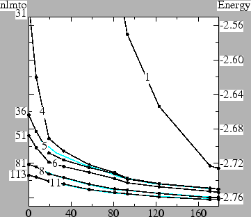

# ctrl  

ctrl is the basic input file. See [Tutorial](../manual/README_tutorial.md).
ctrl contains inputs to control calculations by lmf,lmfa, and lmchk. 
Check self-documented ctrl generated by ctrlgenM1.py.

Note:
 1. ctrl has `Category_Token` structures. 
 2. A line beginning with `#' is treated as a comment and is ignored.
 3. A line beginning with a `%const' is to define variables used in ctrl file.

> <small>When we run fortran programs (lmf, lmfa, and lmchk),
we perform ecalj/SRC/exec/ctrl2ctrlp.py (at your BINDIR) called from the fortran program for
converting ctrl.foobar to ctrlp.foobar. See ~/ecalj/SRC/main/lmf.f90 for example.
Then we read ctrlp.foobar by SRC/subroutines/m_lmfinit.f90.</small>

<!-- ```
INFO: Ubuntu 20.04.4 LTS \n \l
INFO: GNU Fortran (Ubuntu 9.4.0-1ubuntu1~20.04.1) 9.4.0
INFO: -O2 -g -fimplicit-none -finit-integer=NaN -finit-real=NaN -JOBJ.gfortran -IOBJ.gfortran
INFO: MATH: -lmkl_rt
INFO: git: commit 6993fd7f7ec072432c0aadda58f622017f0063fb
INFO:    : Date:   Thu Feb 9 19:31:40 2023 +0900
INFO:    linked at Fri Feb 10 08:16:46 JST 2023
``` -->

Here is the list of Categoy_Token. 
Those with `.` at top is only for developers/specialits.
The code `ecalj/SRC/exec/m_lmfinit.f90` reads ctrlp converged from ctrl.

## verbose
```
 Categoy_Token    Input   cast  (size,min) --------------------------
```
```
 IO_VERBOS         opt    i4       1,  1          default= 30
    Verbosity for printout. Set from the command-line with --pr=xxx
 
 IO_TIM            opt    i4v      2,  1          default= 1 1
    Turns CPU timing log. Value sets tree depth.
    Optional 2nd arg prints CPU times as routines execute.
    intead of setting IO_TIM, set through command-line: --time=#1,#2  --time=5,3 for example.

 . OPTIONS_HF        opt    lg       1,  1      default= F   T for non-self-consistent Harris
```

## Lattice
```
 STRUC_ALAT        reqd   r8       1,  1      Units of length (atomic unit, a.u.) used in PLAT and SITE_POS.
 STRUC_PLAT        reqd   r8v      9,  9      Primitive lattice vectors
```

## SITE
The following tokens are input for each site. See examples.
```
  SITE_ATOM         reqd   chr      1,  0
    Species label defined in SPEC_ATOM
  SITE_ATOM_POS     reqd   r8v      3,  1
    Atom coordinates, cartesian in ALAT
    * If token is not parsed, attempt to read the following:
    SITE_ATOM_XPOS    reqd   r8v      3,  1
      Atom POS. fractional (POSCAR direct) coordinates
  SITE_ATOM_AF      opt    i4       1,  1          default= 0
    AF=1 and AF=-1 should be AF-pairs, we look for space-group operation with spin-flip
  SITE_ATOM_RELAX   opt    i4v      3,  1          default= 1 1 1
    relax site positions (lattice dynamics). 
    This is only for DYN mode (atomic position relax). 
    If RELAX=0 0 1, only z direction relaxiation.
```

## Hamiltonian related
```
 HAM_REL           opt    i4       1,  1      default= 1       
   relativistic switch
   0 for nonrelativistic Schrodinger equation
   1 for scalar relativistic Schrodinger equation

 HAM_NSPIN         opt    i4       1,  1      default= 1   Set to 2 for spin polarized calculations
 
 HAM_SO            opt    i4       1,  1          default= 0 
   Spin-orbit coupling (for REL=1)
   For SO=1 or 2, HAM_NSPIN must be 2
   0 : no SO coupling
   1 : Add L.S to hamiltonian
   2 : Add Lz.Sz only to hamiltonian
 HAM_SOCAXIS       opt    r8v      3,  3          default= 0 0 1
    SOC axis! Currently 0,0,1 (default) or 1,1,0 are effective for HAM_SO=1
    I think this works but not fully tested.
 . HAM_GMAX          reqd   r8       r1,  1
   An energy cutoff used to create mesh for the interstitial density. A uniform mesh is created that best `fits into' cutoff gmax.
    * If HAM_GMAX is not parsed, attempt to read HAM_FTMESH:
    HAM_FTMESH        reqd   i4v      3,  1
       Tthe number of divisions specifying the uniform mesh density along the three reciprocal lattice vectors. The second and third arguments default to the value of the first one, if they are not specified.
       Supply one number for all vectors or a separate number for each vector.
 . HAM_TOL           opt    r8       1,  1          default= 0.100D-05 
    wave function tolerance for FT mesh
    specifies the precision to which the wave functions are expanded in a Fourier expansion.
 . HAM_FRZWF         opt    lg       1,  1          default= F
    Set to freeze augmentation wave functions for all species
    specifies whether the augmented part of the wave functions be frozen. Normally they are updated as the potential changes, but with FRZWF=T the potential used to make augmentation wave functions is frozen at what is read from the restart file (or free-atom potential if starting from superposing free atoms).
 HAM_FORCES        opt    i4       1,  1          default= 0
    Calculate force or not.
    0 no force
    1 force calculated.  free-atom shift  
    See examples of LaGaO3_relax
 HAM_XCFUN         opt    i4       1,  1          default= 2
   Specifies local exchange correlation functional:
   1 for Ceperly-Alder (VWN)
   2 for Barth-Hedin   (ASW fit)
   103 for PBE-GGA     (use xcpbe.f90 taken from ABINIT)
 HAM_ScaledSigma   opt    r8       1,  1          default= 1
    =\alpha_Q for QSGW-LDA hybrid. \alpha \times (\Sigma-Vxc^LDA) is added to LDA/GGA Hamiltonian.
   ctrlgenM1.py set ScaledSigma={ssig}, where we set ssig=0.8 at %const section for QSGW80.
 HAM_OVEPS         opt    r8       1,  1          default= 0.100D-06
    Diagonalize hamiltonian in reduced hilbert space,
    discarding part with evals of overlap < OVEPS
 HAM_PWMODE        opt    i4       1,  1          default= 0
    Controls APW addition to LMTO basis. Use 11 usually.
   1s digit:
     LMTO basis only
     Mixed LMTO+PW
     PW basis only
   10s digit:
     PW basis G is given at q=0
     PW basis q-dependent. |q+G| cutoff
   (for jobgw=1, lmf automatically set PWMODE=11)
 HAM_PWEMAX        opt    r8       1,  1          default= 0
    Include APWs with energy E < PWEMAX (Ry) ctrlgenM1.py set pwemax=3

 . HAM_READP         opt    lg       1,  1          default= F !but =T in ctrlgenM1.py
    Read Pnu and PZ (b.c. of radial func) from atmpnu.*(by lmfa) when we have no rst file
 . HAM_V0FIX         opt    lg       1,  1          default= F
    Fix potential of radial functions-->Fix radial func. if READP=T together
 . HAM_PNUFIX        opt    lg       1,  1          default= F
    Fix b.c. of radial functions
 . HAM_EWALD         opt    lg       1,  1          default= F
    Make strux by Ewald summation
```    
  <!-- HAM_PMIN          opt    r8v     10,  1
    Global minimum in fractional part of P-functions.
   Enter values for l=0..:
   0: no minimum constraint
   #: with #<1, floor of fractional P is #
   1: use free-electron value as minimum
  HAM_PMAX          opt    r8v     10,  1
    Global maximum in fractional part of P-functions.
   Enter values for l=0..:
   0: no maximum constraint
   #: with #<1, ceiling of fractional P is # -->
 <!-- HAM_PWEMIN        opt    r8       1,  1          default= 0
    Include APWs with energy E > PWEMIN (Ry) -->

## space group
See [SYMGRP](#symgrp) about how to set SYMGRP.
```    
 SYMGRP            opt    chr      1,  0
    Generators for symmetry group
 SYMGRPAF          opt    chr      1,  0
    One (or multiple) Extra Generator for adding anti ferro symmetry
```    
  <!-- --- Parameters for species data ---
  * The next four tokens apply to the automatic sphere resizer
 SPEC_SCLWSR       opt    r8       1,  1          default= 0
    Scales sphere radii, trying to reach volume = SCLWSR * cell volume
   SCLWSR=0 turns off this option.
   Add  10  to initially scale non-ES first;
    or  20  to scale ES independently.
 SPEC_OMAX1        opt    r8v      3,  1          default= 0 0 0
    Limits max sphere overlaps when adjusting MT radii
 SPEC_OMAX2        opt    r8v      3,  1          default= 0 0 0
    Sphere overlap constraints of second type
 SPEC_WSRMAX       opt    r8       1,  1          default= 0
    If WSRMAX is nonzero, no sphere radius may exceed its value -->


## SPEC_ATOM
   The following tokens are input for each species. See examples.

```
  SPEC_ATOM         reqd   chr      1,  0
    Species label
  SPEC_ATOM_Z       reqd   r8       1,  1
    Atomic number
.  SPEC_ATOM_R       reqd   r8       1,  1
    Augmentation sphere radius rmax
   * If token is not parsed, attempt to read the following:
    SPEC_ATOM_R/W     reqd   r8       1,  1
    rmax relative to average WS radius
   * If token is not parsed, attempt to read the following:
    SPEC_ATOM_R/A     reqd   r8       1,  1
    rmax ratio to alat
.  SPEC_ATOM_A       opt    r8       1,  1          default depends on other input
    Radial mesh point spacing parameter
.  SPEC_ATOM_NR      opt    i4       1,  1          default= 51
    Number of radial mesh points
.  SPEC_ATOM_RSMH    reqd   r8v     10,  1
    Smoothing radii for basis. Gives l-cut max for base. We set =1/2*R in ctrlgenM1.py
.  SPEC_ATOM_EH      reqd   r8v     10,  0
    Kinetic energies for basis            We set EH=-1 in ctrlgenM1.py
.  SPEC_ATOM_RSMH2   opt    r8v     10,  1
    Basis smoothing radii, second group 
.  SPEC_ATOM_EH2     opt    r8v     10,  0 
    Basis kinetic energies, second group  We set EH=-2in ctrlgenM1.py

.  SPEC_ATOM_LMX     opt    i4       1,  1          default= 10
    optional l-cutoff for basis. Convenient for debugging or tests.
    
 SPEC_ATOM_LMXA    opt    i4       1,  1          default depends on other input l-cutoff for augmentation
    angular momentum l-cutoff for projection of wave functions tails centered at other sites in this sphere. 
    Must be at least the basis l-cutoff (specified by LMX=).     
    We use lmxa=4 mainly but lmax=6 for 4f,5f atoms.

 SPEC_ATOM_MMOM    opt    r8v      1,  1          default= 0
    Starting mag. moms for each l channel.
   For a chanel with PZ, this is enforced to be zero.
   See explanation for SPEC_ATOM_Q.
 SPEC_ATOM_PZ      opt    r8v      1,  1          default= 0
    Starting semicore log der. parameters
     Add 10 to attach Hankel tail

. SPEC_ATOM_LMXL    opt    i4       1,  1          default = LMXA
    angular momentum l-cutoff for explicit representation of local charge on a radial mesh, rho and V  
. SPEC_ATOM_P       opt    r8v      1,  1          default= 0
   Starting log der. parameters for each l
   The principal quantum number and the logarithmic derivative D_nu at MT boundaries. P is defined as

         P = .5 - arc tan(D_nu)/pi + (princ.quant.number).

   Its integer part is the principal quantum number; its fractional part varies smoothly from 0 (for the bottom extreme of the band for that principal quantum number) to 1 (the top extreme of the band), and can be thought of in some sense as a "continuously variable" principal quantum number.


. SPEC_ATOM_Q       opt    r8v      1,  1          default= 0
   Starting valence charges for each l channel.
   Initial charge configuration set by Q is shown by lmfa|grep conf
   Q do not include semicore(PZ) electrons. 
   WARN: This version cannot treat two valence channels per l (Q for a l-channl is zero if the l is with PZ).
   This causes a problem typically in Li; then we can not treat both of PZ=1.9 and P=2.2 as valence.
   To avoid this, use Q=0,1 together. This trick supply an electron to 2p channel; this trick works fine.
. SPEC_ATOM_NMCORE  opt    i4       1,  1          default= 0
    spin-averaged core: jun2012takao
   0(default): spin-polarized core
   1         : spin-averaged core density is from spin-averaged potential  
. SPEC_ATOM_LFOCA   opt    i4       1,  1          default depends on other input
    FOCA switch 0(within MT):=1(frozenCore). 
      Default: 1 for z>8; 0 for z<=8
    0 confines core to within RMT. Usually the least accurate. 
    1 treats the core as frozen but lets it spill into the interstitial 

. SPEC_ATOM_KMXA    opt    i4       1,  1          default= 3
    k-cutoff for projection of wave functions in sphere. 
    polynomial cutoff for projection of wave functions in sphere. 
    Smoothed Hankels are expanded in polynomials around other sites instead of Bessel functions as in the case of normal Hankels. 
. SPEC_ATOM_RSMA    opt    r8       1,  1          default depends on other input
    Smoothing for projection of wave functions in sphere.
   input<0 => choose default * -input
smoothing radius for projection of smoothed Hankel tails into augmentation spheres. sm-Hankels are expanded in polynomials by integrating with Gaussians at that site. Thus RSMA=0 => sm-Hankels Taylor series expansion about the origin. For large KMXA the choice is irrelevant, but RSMA is best chosen that maximizes the convergence of sm-Hankels with KMXA.
Default: R*0.4, with R=augmentation (muffin-tin) radius. 

. SPEC_ATOM_IDMOD   opt    i4v      1,  1          default= 0
    idmod=0 floats P to band CG, 1 freezes P, 2 freezes enu
. SPEC_ATOM_CSTRMX  opt    lg       1,  1          default= F
    Set to exclude this species when automatically resizing sphere radii (SCLWSR>0)
. SPEC_ATOM_FRZWF   opt    lg       1,  1          default= F
    Set to freeze augmentation wave functions for this species
```

## LDA+U
 * The next three tokens are for LDA+U
```
 SPEC_ATOM_IDU     opt    i4v      4,  1          default= 0 0 0 0
    LDA+U mode:  0 nothing, 1 AMF, 2 FLL, 3 mixed; +10: no LDA+U if sigm.* exist
 SPEC_ATOM_UH      opt    r8v      4,  1          default= 0 0 0 0
    Hubbard U for LDA+U
 SPEC_ATOM_JH      opt    r8v      4,  1          default= 0 0 0 0
    Exchange parameter J for LDA+U
``` 

To get started, LDA+U needs in addition to the LDA input two modifications:

    Parameters U and J
    Density-matrix, stored in file dmats.ext. (In the course of self-consistency, it is made by lmf.) 

For the first, a line must be added to the input file for each species that contains U and J. Consider the example taken from the ErAs test case:

        IDU= 0 0 2 2 UH= 0 0 0.1 0.632 JH= 0 0 0 0.055

The IDU token tells lmf that no U is to be added to the s or p channels, but that a U is to be added to the d and f channels. IDU=2 specifies LDA+U functional style 2; this is the "Fully Localized Limit" described in Liechtenstein, PRB 52, R5467 (1995)). IDU=1 specifies the "Around Mean Field" functional (Petukhov, PRB 67, 153106 (2003)). U=0.1 Ry is included on the d orbital, and U=0.632 is included on the f orbital. Additionally J=0.055 is put on the f orbital.

The density-matrix is read from and written to a file dmats.ext. Two density-matrices (1 for each spin) are written to this file in a (2l+1) by (2l+1) block for each l block for which a U is defined. dmats.ext is an ASCII file which you can read, and it's quite useful to interpret what's going on. The diagonal parts are the occupation numbers and are the most important.
 <!-- Note that the file may be stored in either spherical harmonics or real harmonics, depending on how SHARM= is set in the OPTIONS category. -->

Initial dmats.ext is automatically generated from the 1st-shot LDA calculation without U.
But you can supply a file occnum.ext, which is a starting guess for the density-matrix (its diagonal part). occnum.ext has one line of (2l+1) numbers for the occupation numbers of the first spin, following by a line with the occupation numbers for the second spin. In this test:

   fp/test/test.fp eras

the script assumes a particular starting spin configuration through the occupation number file occnum.eras it uses. Er has 11 f electrons, 7 of which go into the majority channel and 4 into the minority channel. There is some choice in which m states to fill and which to keep empty. A key point is that the self-consistent solution you end up with will depend on this choice. The ErAs test uses the following input file for occnum.eras :

  0 0 0 0 0
  0 0 0 0 0
  1 1 1 1 1 1 1
  0 1 1 1 1 0 0

The first and second lines are occupation numbers for the majority and minority d channel; the third corresponds to the majority f channel where all states are taken to be filled. The last line corresponds to the minority f channel. In this case, m=-2,-1,0,1 are filled and m=-3,2,3 are empty. As the script notes, different choices of starting occupation numbers lead to different self-consistent solutions. The one with the lowest energy is that which satisfies Hund's rule (m=0,1,2,3 filled and m=-3,-2,-1 empty).

The occupation numbers are by default correpond to spherical harmonic representations of Ylm. If you want to define the occupation numbers in real harmonics, put

% real

on the first line of occnum.ext. (xxx T.Kotani needs to check)

Note that in the LDA case, complete information is contained in the density, stored in file rst.ext. In the LDA+U case, complete information is contained in the combination of rst.ext and dmats.ext.

The density-matrix is at present mixed independently of the charge, with linear mixing. (This will likely change in future) To do the mixing there is a special-purpose parameter in the MIX category
```
  UMIX=# 
```
is a parameter between 0 and 1. It plays the same role for the density-matrix as the mixing beta plays for the mixing of the regular density.

There is additionally a tolerance parameter
```
  TOLU=#    
```
that tells lmf to stops mixing dmats when its rms change falls below TOLU. Usually it's not necessary, and setting TOLU=0 (or leaving it out) means it plays no role. 

## Core hole options 
(need check)
 Partially occupied core holes. Calculations involving partial core hole occupancy are useful in the context of Slater transition-state theory, which undoes most of the error in the LDA description of the core hole eigenvalue (see example J. Phys. Cond. Mat. 12, 729 (2000)). You specify which orbital in which species is to be treated as a partially occupied by core by adding a token C-HOLE= to the SPEC category. You also have to specify what the partial occupation is, which you do with token C-HOLE= . An example is the N 1s core. A core hole of 1 electron can be put in by

     C-HOLE=1s C-HQ=-1

Note the sign of the charge. The number refers to the excess electron charge. to put in a hole, use a negative charge. As an illustration in CrN, you can run the test case

     fp/test/test.fp crn

Core holes are also useful as an approximate workaround in the LDA context to deal with (almost) nonbonding f electrons. In most 4f systems, the f states get shifted away from the Fermi level, even though the LDA typically is unable to do this (except for Gd), because it lacks a nonlocal exchange as in LDA+U. An approximate workaround is to treat the 4f electrons as core. For Gd in particular, the 7 majority states should be filled, while the 7 minority states empty. Thus a core hole of -7 is required, but it is necessary to further specify the spin polarization of the core. This is accomplished with a second argument. For the Gd case (4f core, -7 excess electrons, with the core magnetic moment +7), use

    C-HOLE=4f C-HQ=-7,7 


```
 SPEC_ATOM_C-HOLE  opt    chr      1,  0
    Channel for core hole
 SPEC_ATOM_C-HQ    opt    r8v      2,  2          default= -1 0
    Charge in core hole.  Optional 2nd entry is moment of core hole:
   Q(spin1) = full + C-HQ(1)/2 + C-HQ(2)/2
   Q(spin2) = full + C-HQ(1)/2 - C-HQ(2)/2

C-HOLE and C-HQ= enable partial occupation of a particular core channel.
           See Partially occupied core holes for description and examples.

. SPEC_ATOM_EREF    opt    r8       1,  1          default= 0
    Reference energy subtracted from total energy (we use little)
```


## Parameters for Brillouin zone integration ---
```
  BZ_NKABC          reqd   i4v      3,  1
    No. qp along each of 3 lattice vectors.
   Supply one number for all vectors or a separate number for each vector.

. BZ_BZJOB          opt    i4v      3,  1          default= 0
    0 centers BZ mesh at origin, 1 centers off origin
   Supply one number for all vectors or a separate number for each vector.
   QSGW requires the default setting.
. BZ_METAL          opt    i4       1,  1          default= 3
    0 insulator only; 3 for metal (2 is for maintenance)

. BZ_TETRA          opt    lg       1,  1          default= T
    Tetrahedron integration
    0: Methfessel-Paxton sampling integration
      Tokens NPTS, N, W, EF0, DELEF described below are
      relevant to this integration scheme.
    1: tetrahedron integration

. BZ_N              opt    i4       1,  1          default= 0
    N>0: Polynomial order for Methfessel-Paxton sampling
    N=0: Conventional Gaussian sampling
    N<0: Broadening by Fermi-Dirac distribution
    To be used in conjunction with W= ; see next
    If N=#, #>0: integration uses generalized gaussian
          functions, i.e. polynomial of order N * gaussian to
          generate integration weights
          (see Methfessel & Paxton, Phys. Rev. B, 40, 3616 (1989))

          If N=#, #<0: integration uses the Fermi function to
          generate integration weights .

          By default, if a gap is found separating occupied and
          occupied states, the program will treat the system as
          and insulator, even when MET>0.  To suppress this,
          add 100(-100 for Fermi distribution) to N.


 . BZ_W              opt    r8       1,  1          default= 0.500D-02
    If BZ_N>=0, Line broadening for sampling integratio
    If BZ_N<0,  Temperature for Fermi distribution (Ry)W=      
    Line broadening for Gaussian sampling integration (Ry).
          Used only if TETRA=0 and MET>0.
          NB: if N=-1 below, the sampling weights are computed
          from the Fermi function instead of the error function.
          In that case, token W= corresponds to temperature, in Ry.


 BZ_ZBAK           opt    r8       1,  1          default= 0
    Homogeneous background charge
 . BZ_SAVDOS         opt    i4       1,  1          default= 0
    Choose 0(F) or 1(T): Write dos.tot.* file (settings are NPTS and DOS)
 BZ_NPTS           opt    i4       1,  1          default= 2001
    No. DOS points (sampling integration) in the density-of-states mesh used in
          conjunction with sampling integration.  Needed for
          sampling or if SAVDOS>0.
 BZ_DOSMAX         opt    r8       1,  1          default= 2.940
    Maximum energy to which DOS accumulated, relative to Efermi
 . BZ_EFMAX          opt    r8       1,  1          default= 5
    Find evecs up to efmax

 . BZ_NEVMX          opt    i4       1,  1          default= 0
    Find at most nevmx eigenvectors
   If NEVMX=0, program uses internal default
   If NEVMX<0, no eigenvectors are generated


 BZ_FSMOMMETHOD    opt    i4       1,  1          default= 0
    Method of Fixed-spin moment 0:original 1:discrete

 BZ_FSMOM          opt    r8       1,  1          default 0
    Size of Fixed-spin moment (fixed-spin moment method) set the global magnetic moment (collinear magnetic case).
    In the fixed-spin moment method, a spin-dependent potential
    shift is added to constrain the total magnetic moment to
    value assigned by FSMOM=.  No constraint is imposed if this
    value is zero (the default).

```

 <!-- EWALD_AS          opt    r8       1,  1          default= 2
    Ewald smoothing parameter 
 EWALD_NKDMX       opt    i4       1,  1          default= 3000
    Ewald tolerance
    -->

## Parameters for Ewald sums ---
```
. EWALD_TOL         opt    r8       1,  1          default= 0.100D-07
    Ewald tolerance
```    

## Mixing parameters for iterations 
Here is memo, but our current strategy is using default as
`ITER MIX=B3 b=.2 CONV=1e-5 CONVC=1e-5 NIT={nit} UMIX=0.2`
(generated by ctrlgenM1.py). 
If failed, trial and error with changing b as b=0.15,0.01,0.05.

You may not need to read followings.
```    
  ITER_NIT          opt    i4       1,  1          default= 30
    maximum number of iterations in self-consistency cycle
. ITER_NRMIX        opt    i4       1,  1          default= 80
    lmfa rseq max iter
  ITER_MIX          opt    chr      1,  0
   Mixing rules for charge mixing.  Syntax:
   A[nmix][,b=beta][,bv=betv][,n=nit][,w=w1,w2][,nam=fn][,k=nkill][;...] or
   B[nmix][,b=beta][,bv=betv][,wc=wc][,n=#][,w=w1,w2][,nam=fn][,k=nkill]
   nmix: maximum number of prior iterations to include in the mix
         (the mixing file may contain more than nmix prior
         iterations.)  NB: nmix=0 implies linear mixing.
   beta: the mixing beta <==== important
  --- not need to care following options ---
   nit:  the number of iterations to use mix with this set of
         parameters before passing on to the next set. After the
         last set is exhausted, it starts over with the first set.
   nkill:kill mixing file after nkill iterations.  This is
         occasionally helpful when the mixing runs out of steam,
         or when the mixing parameters change.
   wc:   (Broyden only) that controls how much weight is given to
         prior iterations in estimating the Jacobian.  wc=1 is
         fairly conservative.  Choosing wc<0 assigns a floating
         value to wc, equal to -wc-input/rms-err.  This increases
         wc as the error becomes small.
   w1,w2 (spin-polarized calculations only) pqmix mixes the sum
         (up+down) and difference (up-down) of the two spin
         channels.  They are weighted by w1 and w2 in the mixing,
         more heavily emphasizing the more heavily weighted.  As
         special cases, w1=0 freezes the charge and mixes the
         magnetic moments only w2=0 freezes the moments and mixes
         the charge only
 ITER_CONV         opt    r8       1,  1          default= 0.100D-03
    Tolerance in energy change from prior iteration for self-consistency
 ITER_CONVC        opt    r8       1,  1          default= 0.100D-03
    Tolerance in output-input charge for self-consistency
 ITER_UMIX         opt    r8       1,  1          default= 0.500
    Mixing parameter for densmat in LDA+U
 ITER_TOLU         opt    r8       1,  1          default= 0
    Tolerance for densmat in LDA+U
 mmmixing parameters: A/B nmix wt: 0 -1 1.000000  1.000000 -9.000000 beta elin wc killj=  1.000000 -1.000000 0
```    

* There is a choice between the Broyden and Anderson mixing schemes.  
Both schemes mix in linear combinations of the input and output density
both from the present iteration and prior iterations to accelerate convergence to self-consistency (output = input).  For Anderson mixing, the mixing beta controls how much output and how much input moment is used in the next estimate for the moments: Q* = beta*Qout + (1-beta)*Qin.  Here Qout and Qin are charges (that is, moments or densities), and the "charges" generated by the input "charge" for a sequence of prior iterations.  For small systems, you can take beta close to
one; for large systems charge sloshing becomes a problem and you have to do something different.  Possible choices need to take beta much smaller.  See subroutines/mixrho.f90 
The syntax for Anderson mixing is `MIX=A3 b=.2` for example. You can use 'A5' or something instead.

   Broyden mixing uses a more sophisticated procedure, in which it tries to build up the Hessian matrix.  It usually works better but has more pitfalls than Anderson.  As with Anderson, it uses linear mixing in the absence of prior iterations, Q* = beta*Qout  + (1-beta)*Qin.  Broyden has an additional parameter, wc, that controls how much weight is given to prior iterations in the mix.  The syntax for Broyden mixing is `MIX=B3 b=.2` for example.
* T.Kotani think  Broyden or Anderson is not superior to the other. Problem is when we are a little away from convergence. Then we may have exponentially-growing mode during iteration. No definite way to avoid this except 'stating over'.


## Parameters for relaxiation of atomic positions
Try Samples/LaGaO3_relax
```    
 DYN_MODE          opt    i4       1,  1          default= 0
    0: no relaxation  
    4: relaxation: conjugate gradients  
    5: relaxation: Fletcher-Powell  
    6: relaxation: Broyden
 DYN_NIT           opt    i4       1,  1          default= 1
    maximum number of relaxation steps (statics) or time steps (dynamics)
. DYN_HESS          opt    lg       1,  1          default= T
    Read hessian matrix
. DYN_XTOL          opt    r8       1,  1          default= 0.100D-02
    Convergence criterion in displacements
   XTOL>0: use length; <0: use max val; =0: do not use
. DYN_GTOL          opt    r8       1,  1          default= 0
    Convergence criterion in gradients
   GTOL>0: use length;  <0: use max val;  =0: do not use
. DYN_STEP          opt    r8       1,  1          default= 0.015
    Initial (and maximum) step length
. DYN_NKILL         opt    i4       1,  1          default= 0
    Remove hessian after NKILL iter
```    

### lmf console input
ecalj made from band structure part (lmf), and GW part (plus some additional functionalities such as Wannier). 

lmfa (spherical atom for initial condition) and lmchk (crystal structure check) are by single core.

usage:  lmf [--OPTION] [-var-assign] [extension] 
```
  usage:  lmfgwd [--OPTION] [-var-assign] [extension]

 --help         List categories, tokens, and data program expects, and quit
 --show         Print control file after parsing by preprocessor,
                and echo input data as read from the control file
 --pr=#1        Set the verbosity (stack) to values #1
 --time=#1[,#2] Print timing info to # levels (#1=summary; #2=on-the-fly)

 -vnam=expr     Define numerical variable "nam"; set to result of 'expr'
  --jobgw=1 or 2       lmf-MPIK works as the GW driver (previous lmfgw-MPIK)
  --quit=band, 
    Quit after band 
  --quit=dmatu 
    Quit after initial setup. Convenient for check.
  --quit=band 
     Quit after band calculation.
  --quit=mkpot or --quit=dmat: Stop points. Surpress writing rst

  --cls[options]   tells lmf to generate weights to compute matrix
                   elements and weights for core-level-spectroscopy.  
                   See m_clsmode.f90

  NOTE: Read rst.* prior to atm.* file (No --rs options: 2022-6-20)
  NOTE: Other command-line-options => Search "call cmdopt" in SRC/*/*.f90
```
Search --quit option in ```SRC/*/*.f90```

## SYMGRP

Category SYMGRP provides space-group symmetry information; it helps in two
ways.  First it is the relevant information to find which sites
are equivalent, which makes for simpler and more accurate band
calculations, and second, it reduces the number of k-points
needed in Brillouin zone integrations.

Unless you are doing something special, set `SYMGRP find`; then the program finds maximum symmetry
operations from the given lattice. However, if you want to restrict space-group operations, 
use SYMGRP to explicitly declare a set of
generators from which the entire group can be created.  
For example, the three operations R4X, MX and R3D are sufficient to
generate all 48 elements of cubic symmetry. 

* The inversion is assumed in the DFT case when potential is local.
(pay attention to the information in console output)

A symbol describing a generator for a point group operation has
the form O(nx,ny,nz) where O is one of M, I or Rj for mirror,
inversion and j-fold rotation; and nx,ny,nz are a triplet of
indices specifying the axis of operation.  You may use X, Y, Z or
D as shorthand for (1,0,0), (0,1,0), (0,0,1), (1,1,1).  You may
also enter products, such as I*R4X.  Example:
  SYMGRP  R4X MX R3D
specifies three generators (4-fold rotation around x, mirror in
x, 3-fold rotation around (1,1,1)) and will result in 48 symmetry
operations.

To suppress all symmetry operations, use
``` 
SYMGRP e
```

You can also specify a mix of generators you supply, and
tell the program to find any others that might exist.
For example,
  SYMGRP r4x find
specifies that 4-fold symop be included, and `find' tells
the program to look for any other symops that might exist.

To add translation, append a string as
`form :(x1,x2,x3)` to the point group operation form, or an alternate
`form ::(p1,p2,p3)` with the double `::'.  The first defines the
translation in Cartesian coordinates; the second is Frational (as multiples of
plat).  These two lines taken from testing/ctrl.cr3si6 are
equivalent specifications
```
  SYMGRP   r6z:(0,0,0.4778973) r2(1/2,sqrt(3)/2,0)
  SYMGRP   r6z::(0,0,1/3)      r2(1/2,sqrt(3)/2,0)
```

We can check the space group is correcly recognized or not, with lmchk and/or shown at the begining of lmf.

---

### Q: Should the Harris-Foulkes and Hohenberg-Kohn Sham functionals agree at self-consistency?

A: Yes. If they do not, either you have not reached self-consistency, or a tolerance is set too loosely in the evaluation of the matrix elements. A likely culprit is that the mesh of points for the interstitial integrals is not fine enough. Here is part of an output where mesh of 14x14x14 divisions were used for the interstitial density.

```
 GVLIST: gmax = 4.702 a.u. created 973 vectors of 2744 (35%)
         mesh has 14 x 14 x 14 divisions; length 0.588, 0.588, 0.668
 SGVSYM: 170 symmetry stars found for 973 reciprocal lattice vectors
...

 sugcut:  make orbital-dependent reciprocal vector cutoffs for tol= 1.00E-05
 spec      l    rsm    eh     gmax    last term    cutoff
  Te       0*   1.30  -0.10   5.220    9.30E-05     973*
  Te       1*   1.30  -0.10   5.597    4.36E-04     973*
  Te       2    1.30  -0.10   5.976    2.04E-03     973*
  Te       0*   1.40  -1.00   4.847    2.11E-05     973*
  Te       1    1.40  -1.00   5.182    9.90E-05     973*
  E        0*   1.50  -0.30   4.524    1.06E-05     847 
  E        1    1.50  -0.30   4.823    2.01E-05     973*
```

The table reflects how well each of the basis orbitals is converged in a PW expansion, which is used to make matrix elements of the interstitial potential. Only the E s orbital is converged below the specified tolerance (10-5 ). Convergence in the Te d orbital is particularly poor; however, the Te d is only minimally part of the bonding, and its poor convergence doesn't affect the energy much. In this case (3 Te atoms), the HF and HK total energies differ by ~10-4 Ry. Below is a table showing the convergence in HF energy as a function of the number of divisions, and also the difference between HK and HF energies.
```
  n       ehf         ehf-ehk
  14 -14561.140624    0.000089
  15 -14561.133966    0.000017
  16 -14561.132309    0.000005
  20 -14561.131170    0.000000
```


### old note for APW test (at 2010 around)
 APWs. It is very simple to add augmented plane waves to the basis. Add these tokens to category HAM:

        PWMODE=1 PWEMIN=# PWEMAX=#

PWMODE=1 tells lmf to include APWs in the basis (The default is PWMODE=0 which means no APWs will be included). PWEMAX is an energy cutoff (in Rydbergs): G-vectors whose energy fall below PWEMAX will be included. Because MTOs can also be included, and they already rather accurately describe low-energy states, it makes sense to include a minimum-energy cutoff as well, i.e. include APWs that satisfy PWEMIN < E < PWEMAX .

There are two further considerations the user should take note of. First, when many APWs are used, the overlap matrix can become nearly singular. When this happens the secular matrix becomes unstable, which can lead to somewhat wrong or even nonsensical results. To protect against this, add to HAM the following:

 OVEPS=#

If # is a positive number, lmf will diagonalize the overlap matrix, and eliminate the subspace which has eigenvalues smaller than #. This procedure will largely eliminate these instabilities. A reasonable choice is OVEPS=1E-7.

Second, high-energy APWs oscillate much more rapidly than MTOs do. That means polynomials of higher order may be needed to augment the envelope functions. The order of polynomial cutoff is set by (species-specific) token KMXA in the SPEC category. When using PWEMAX larger than 3 or 4, take care that the results are converged wrt KMXA. As a rough guide, the dimensionless integer KMXA should be approximately as large as PWEMAX is (in Rydbergs).

You can see the interplay between MTOs and APWs in the Figure, which shows the total energy E in SrTiO3 as a function of the number of APWs included in the basis. (The upper cutoff corresponds to PWEMAX=10.) 


Curve "1" includes just s and p MT orbitals on the O sites, sufficient for a crude representation of the valence bands (no orbitals are available for conduction bands). Also included are local orbitals to represent Sr 4p and Ti 3p semicore states, as they are too extended to be appoximated as core states. A large number of APWs is need to get a good total energy: something like 150 APWs are needed to converge E to within about 50 mRy of the converged result. (Had the O s and p not been present, many more APWs would have been required.)

Curve "4" corresponds to an extreme tight-binding basis, consisting of sp orbitals on Sr, spd orbitals on Ti (the conduction band is mainly Ti d), and sp orbitals on O. The total energy of the MTO basis alone (no APWs) is rather crude --- more than 200 mRy underbound. However, only 25 orbitals (plus 6 for the local orbitals) are included in this basis. The energy drops rapidly as low-energy APWs are included: adding about 40 APWs is suffcient to converge E to about 50 mRy. As more APWs are added, as more APWs are added, the gain in energy becomes more gradual; indeed convergence is very slow for large E.

Curve "5" differs from curve "4" only in that a Sr d orbital was added. With the addition of these 5 orbitals, the MTO-only basis is already rather reasonable. This would be the smallest acceptable MTO-basis. As in the Curve "4" basis, there is initially a rapid gain in energy as the first few APWs are added, followed by a progessively slower gain in energy as more APWs are added. The blue curve close to Curve "5" uses the same MTO basis, but PWEMIN=1. Interestingly, the blue and black curves almost superimpose on each other. It means the gain in energy seems to depend on the number of APWs, but not details of their shape.

Curve "6" is a standard LMTO minimum basis: spd orbitals on all atoms. Comparing Curve "5" or Curve "6" to Curve "1" shows that the MTO basis is vastly more efficient than the APW basis in converging the total energy. This is true until a minimum basis is reached. Beyond this point, the gain APWs and more MTOs improve the total energy with approximately the same efficiency, as the next tests show.

Curve "8" is a standard LMTO larger basis: spdspd orbitals on Sr and Ti, and spdsp on O. Comparing curves "6" and '8" shows that the efficacy of any one orbital added to to the standard MTO minimum basis is rather similar in the APW and MTO cases. Thus, increasing the MTO basis from 51 to 81 orbitals in the MTO basis lowers the energy by 33 mRy; adding 33 APWs to the minimum basis (curve "6") lowers the energy by 36 mRy. APWs, however, have the advantage that they are simpler to include.

Curve "11" enlarges the MTO basis still more, with Sr: spdspd, Ti: spdspd, O: spdspd. Also local orbitals are used to represent the high-lying Ti 4d and O 3s and 3p states. For occupied states, these orbitals have little effect, but they are important for unoccupied states higher than about 2 Ry. Comparing the last curves, it appears that finally E is at last converging to an absolute minimum at around -2.760 Ry. The instabilities in the overlap matrix mentioned above are largely controlled, but there is a small uncertainty in the absolute energy on the order of 1 mRy. It is clear even from inspection of Curve "1", that a pure APW basis would require an extremely large number of PWs to reach this level of convergence. 

## old note for local orbitals
 Local orbitals. The local orbital is specified with the PZ= token, which is its analog of the continuously variable principal quantum number P. Conventional local orbitals may be used either for semicore or high-lying states. In this case, specify the integer part of PZ must either as one less than the integer part of P for a semicore state or one greater for a high-lying state. As for the fractional part, it is recommended that you specify 0.9 or so for the semicore case; while for high-lying states 0.3 or so is reasonable (a larger number specifies a higher linearization energy).

Extended local orbitals:. Extended local orbitals have a smooth Hankel envelope attached to the radial wave function which spills out into the interstitial. The tail is matched value and slope to the radial function, but lmf will try to vary both RSMH and EH to match the kinetic energy as well. To specify that a semicore local orbital is of the extended type, simply add 10 to token PZ=.

Hazard for conventional local orbitals:. Conventional local orbitals applied to semicore states must rely on the valence envelope functions for representation of these deep states in the interstitial. Therefore be advised to choose the smoothing radius for at least one envelope function rather small (typically around 1 or so), with a corresponding energy rather negative (typically around -1 or so).

Hazard for extended local orbitals:. It may happen that lmf cannot find any reasonable combination of RSMH and EH that matches the envelope's value and slope to the radial wave functions. Since this matching condition is required, lmf stops with a message like

    Fit local orbitals to sm hankels, species Sr, rmt=3.1
     l  type    Pnu      Eval        K.E.       Rsm       Eh      Q(r>rmt)    Fit K.E.
    Exit -1 : mtchre : failed to match phi'/phi=-5.127 to envelope, l=1

This usually happens when the fractional part of PZ is too large (it was set to 0.98 in this case). The solution is to change the fractional part of PZ.

lmf will try to vary both RSMH and EH to match (value,slope,kinetic energy), and it may happen that lmf can match the first two but not the kinetic energy of the envelope to the radial wave function. This doesn't cause an error but it can reduce the accuracy of the orbital. It is seen in the following output:

     l  type    Pnu      Eval        K.E.       Rsm       Eh      Q(r>rmt)    Fit K.E.
     1  low    4.900   -1.708558   -0.923699   1.00000  -0.30708   0.07250   -0.289954*

The true and fit K.E. differ. The solution is again to alter PZ (4.90 in this case). It is not essential, however. If PZ floats in the course of a self-consistent cycle, lmf usually picks a good value for PZ.

At present, the P with the higher principal quantum number is automatically frozen to its input value (that is, P is frozen when PZ is a semicore orbital, and PZ is frozen when it is a high-lying orbital). Thus, only the P corresponding to the deepest state is allowed to float (see IDMOD description).


## old memo for SPEC 
(TK: We now detour this difficulty to set RSMH and EH thanks to the PMT method)

First, the muffin-tin radii should be taken somewhat smaller than in the ASA. There is no volume-filling condition as found in the ASA. Strictly speaking, there should be no sphere overlaps, though in practice overlaps up to about 10% seem to engender minimal error, because of the way the augmented potential is constructed. See section on "Selection of Sphere Radii" for a discussion of choosing sphere radii and a way to automatically find good choices for them.

The most important, and also the most difficult new feature of this method has to do with specification of basis functions. An envelope function takes the form of a sm-Hankel, which is specified by a smoothing radius RSMH and an energy EH. Each of these may be l-dependent. lmfa finds the optimum choice for each l and appends the results to the `atm' file, albeit for the free atom case.) For example, in the copt test case something like the following lines are appended to file `atm'

    BASIS:
        Co RSMH= 2.425 2.717 1.017 EH= -0.360 -0.200 -0.222
        Pt RSMH= 2.461 3.042 1.085 EH= -0.441 -0.200 -0.200 

In this case the basis on the Co site consists of an s orbital with (rsmh,eh)=(2.425,-0.36); a p orbital with (rsmh,eh)=(2.717,-0.2); and a d orbital with (rsmh,eh)=(1.0717,-0.222). lmf requires a basis specification of that style in the input file, for each species in the SPEC (or CLASS) category. Often you can just "cut and paste" the lines from the bottom of the atm file, and pluck them straightaway in the input file. But of course what is optimum for the free atom may be very different from the solid case, and the user is strongly recommended to optimize the basis set before doing any systematic calculations, as described below. You may specify a single sm-H per l-channel or two sm-H. Here is an a segment of an input file with a two sm-H declaration:

    SPEC ATOM=A
        RSMH= 2,2,2 EH=-.1,-.1,-.1
        RSMH2=1.5,1.5,1.5 EH2=-1,-1,-1 


You are strongly encouraged not to just take what lmfa supplies, but to spend a little time tinkering with these parameters to minimize the energy. A quick way to do that is to use the HF=t option, which always used overlapped free-atomic densities and makes only one band pass. Some rules of thumb:

    The total energy is more sensitive to the choice of smoothing radii than the energies; usually there is little benefit in optimizing the energies. The main exception to this rule occurs for deep orbitals, such as the s orbital on a semiconductor anion.
    For sp orbitals, a good rule of thumb is to use RSMH=2/3 muffin-tin radius. Sometimes (particularly in cases with d electrons) a somewhat better choice is RSMH slightly greater than RMT. lmfa usually produces such an RSMH for sp orbitals in transition metals. For example, rsmh for the d orbital in the copt example above are pretty close to optimum for the solid.
    Occupied d orbitals are atomic-like and require a small RSMH. Usually the value produced by lmfa is pretty close to the optimum one.
    Assembling the hamiltonian is more efficient when you use the same rsmh,eh for consecutive l channels, because it can better vectorize loops. However, there is a tradeoff in that the basis set may be poorer when it is not tailored. If only a mRy or so is gained by splitting rsmh,eh, for consecutive l's, it is preferable to keep them the same. 

## old Memo for tetrahedron output

 BZWTS : --- Tetrahedron Integration ---
         Est E_f           Window        Tolerance  n(E_f)
        -0.148571  -0.150937  -0.148426   0.002511  14.958994
        -0.148573  -0.148577  -0.148552   0.000025  14.819478
        -0.148573  -0.148573  -0.148573   0.000000  14.820559
 BZINTS: Fermi energy:     -0.148573;  41.000000 electrons
         Sum occ. bands:  -24.813178, incl. Bloechl correction: -0.006528

Tetrahedron is almost always more accurate (Using Bloechl weights it converges as h^3 with h proportional to the k-point spacing), but sometimes band crossings occur which messes up the integration. (There is a telltale sign of a band crossing, namely the integrated number of electrons doesn't come out to an exact integer). For M/P integration you must choose N and W by trial and error---but you get a good idea by looking at the bands at the Fermi surface. For steep bands use W about .05 - .08 and for flat bands, use W .01 - .05 and then adjust N between 1 and 4 or 5 for best convergence.

Also printed is the sum of occupied bands, which is needed together with the potential to compute the total energy. The Bloechl correction is of interest because it shows how much the energy changes from straight tetrahedron (converges as h^2) and the Bloechl-corrected tetrahedron (which converges as h^3) 


## MT radius determined by lmchk
The ideal choice of sphere radii best approximates a potential that is spherical within the MT spheres and flat outside. Program lmchk has implemented one algorithm that makes a reasonable initial choice for MT radii. The algorithm works by computing the (electrostatic) potential obtained from overlapping free-atom densities along all connecting vectors between a given site and its relatively near neighbors. The MT radius is taken as the first potential maximum along any ray. This choice is a pretty reasonable estimate for the potential being approximately spherical inside. Also, note that for a completely symmetric bond, the potential maximum will fall exactly midway between the bond, so for that case the two sphere radii will exactly touch and have equal potentials. To tell lmchk to find these radii, invoke lmchk as
`lmchk --getwsr`. This is performed in `ctrlgenM1.py`. 
* In addition, `ctrlgenM1.py` do give limitaiton of maximum radius for alkali atoms. This is to avoid linear-dependency problem between APWs and MTOs.

* When we treat molecules (especially dimers), we have to use very small size of MT radius. T.Kotani checked PMT works well even for such systems. However, we need examination a little more.
