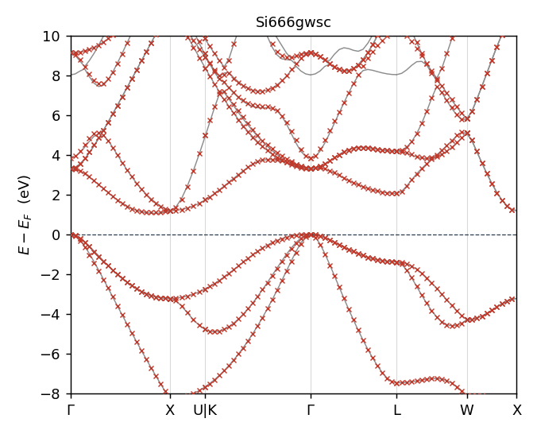
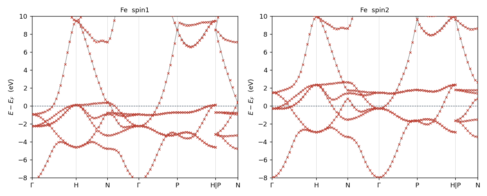
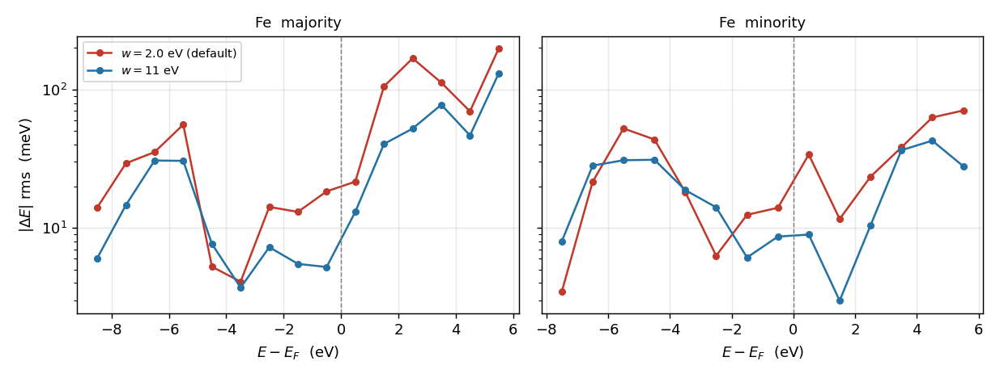
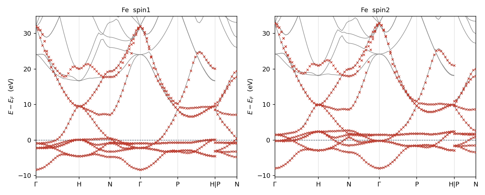
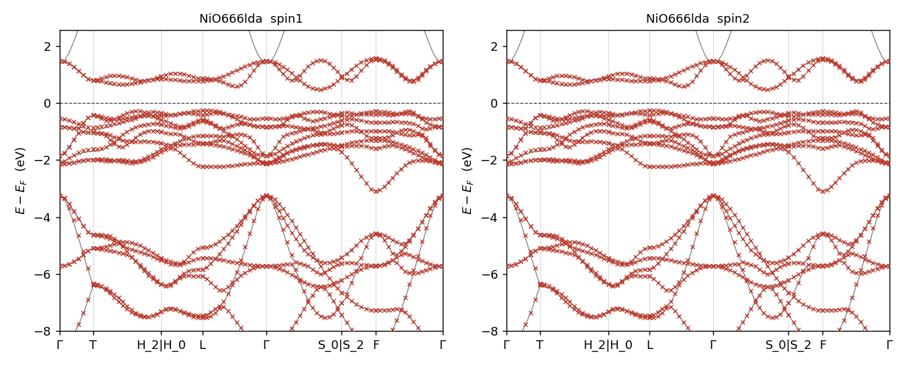
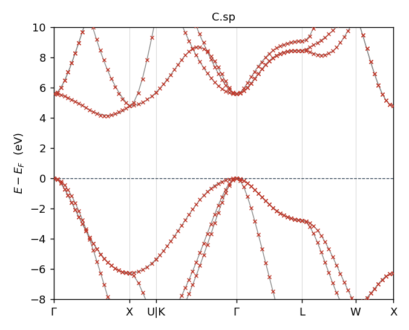
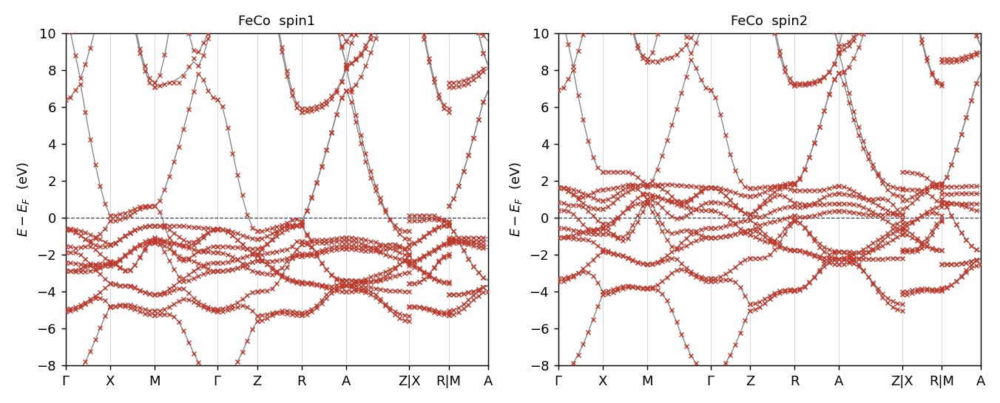
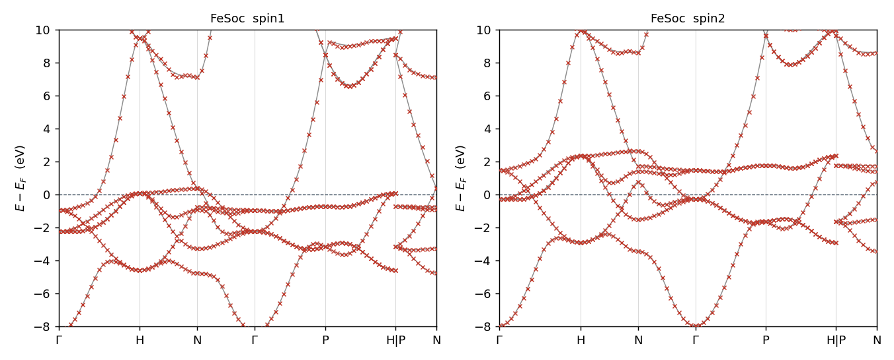
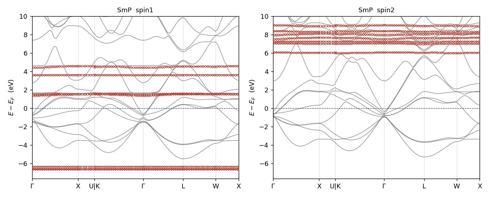
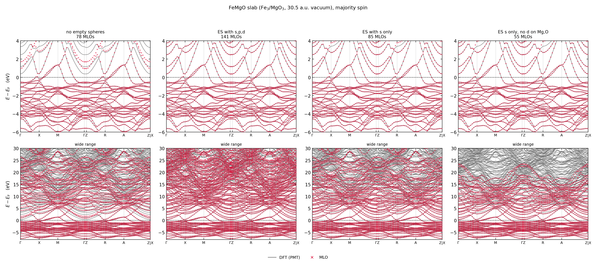

# MLO — 最大局在化などに代わる自動モデル化法

ecalj branch `mlo3` / 2026-09-16 17:02 JST

**MLO (MTO-based Localized Orbitals) は、最大局在化 Wannier 関数
(MLWF) の代わりに使う局在基底である。**

MLWF は「広がりを最小にする」という条件でユニタリ変換を非線形最適化して求める。
強力だが、初期推定 (projection) を人が与える必要があり、収束が初期値に依存し、
エンタングルした帯では disentanglement の窓をさらに手で決めることになる。
**うまくいくかどうかが人の手加減に掛かっている**のが難点である。

MLO は最適化をしない。PMT 基底の恒等分解を出発点に、
**どの $lm$ チャネルで模型を作るか (`Worb`) を与えれば、重み $\theta$ が
式一本で決まる**(§1)。反復も初期推定も無く、結果は一意で、物質ごとの調整
パラメータはゼロである。局在性は最適化の結果ではなく、MTO を種にしている
ことから自然に出る。

その `Worb` も**原理的には自動化できる**。規則は「目的の窓にバンドを出して
いるチャネルだけ取る」の一つで、どの原子のどの $lm$ が窓に重みを持つかは
計算から出る量だからである(§1)。現状は手で書いているが、調整ではなく
**読み取れば決まる**類のものである。

使い方は大きく 2 つに分かれ、**測り方も違う**:

1. **ミニマム模型** — $E_F$ を含む領域の第一原理バンドを**全部**再現する。
   半導体・金属・Al₂O₃:Cr(ギャップ中の Cr d + バンド端)はすべてこれ(§2)。
2. **部分バンドを取る模型** — d だけ、4f だけを取り出す。MLWF で言えば
   projection で狙い撃ちしていた使い方に当たる(§3)。

FeMgO は真空層を持つスラブで空格子球が要る。**§4 に独立の節**を立てた。

**本書の数値はすべて `Samples/MLOsamples/` の 18 サンプルの実測値**で、
全サンプルが `mlo_method = 4` の既定値に統一してある(2026-09-16)。
図は `ecalj/Samples/MLOsamples/plots/` にあり、
`SRC/exec/mlo_bandplot.py <サンプルdir>` で再生成できる(本頁の図はその写し)。
損失の数値は `SRC/exec/mlo_losscheck.py <サンプルdir>`。

| | |
|---|---|
| §1 | **最終形** — 式と既定値。読むならここだけでよい |
| §2 | **ミニマム模型** — 窓の中のバンドを全部取る。11 系の実測とバンドプロット |
| §3 | **部分バンドを取る模型** — d だけ / 4f だけ。窓型の損失は使えない |
| §4 | **FeMgO** — 真空スラブに空格子球を置く |
| §5 | 誤差の測り方 — 一方向では決まらない |
| §6 | 残る問題 |
| [別頁](./mlo_backup) | 経緯と作業記録(backup) |

---

## 1. 最終形

MLO は PMT 基底の恒等分解から、選んだ MTO 部分空間の固有状態
$\Psi^{\mathrm{MTO}}$ を介して作る:

$$
|F^{\mathrm{MLO}}_{\mathbf{k}n}\rangle
=\sum_{n'n''}|\Psi^{\mathrm{PMT}}_{\mathbf{k}n'}\rangle\;
A^{\mathbf{k}}_{n'n''}\;
\langle\Psi^{\mathrm{MTO}}_{\mathbf{k}n''}|F^{\mathrm{MTO}}_{\mathbf{k}n}\rangle
\tag{1}
$$

ここで $S$ を PMT 固有状態と MTO 固有状態の重なりとする:

$$
S^{\mathbf{k}}_{n'n''}=\langle\Psi^{\mathrm{PMT}}_{\mathbf{k}n'}|\Psi^{\mathrm{MTO}}_{\mathbf{k}n''}\rangle
\tag{2}
$$

$A=S$ とすると式 (1) の和は MTO 部分空間への射影演算子そのものになり、
$F^{\mathrm{MLO}}=F^{\mathrm{MTO}}$ に戻ってしまう。そこで重み $\theta$ を掛ける:

$$
A^{\mathbf{k}}_{n'n''}=S^{\mathbf{k}}_{n'n''}\,\theta^{\mathbf{k}}_{n'n''}
\tag{3}
$$

**この $\theta$ をどう決めるかが問題のすべてで**、課題 1 の答えは式 (4) である。

$$
\boxed{\;
\begin{aligned}
\theta^{\mathbf{k}}_{n'n''}&=\sigma\Bigl(\frac{\varepsilon_{n'}-e^{\mathrm{cut}}_{n''}}{w}\Bigr),
\qquad \sigma(x)=\frac{1}{1+e^{x}}\\[2pt]
e^{\mathrm{cut}}_{n''}&=\max\bigl(\varepsilon_{\mathrm{CBM}}+\Delta,\;\varepsilon^{\mathrm{MTO}}_{n''}\bigr)
\end{aligned}
\;}
\tag{4}
$$

$\varepsilon_{\mathrm{CBM}}$ は**大域の**伝導帯下端(金属では $E_F$)。
パラメータは $\Delta$ と $w$ の 2 つだけ(**単位はすべて eV**)で、物質ごとに変える調整は無い。

$$
\boxed{\;\Delta = 2.0\ {\rm eV},\qquad w = 2.0\ {\rm eV}\;}
\tag{5}
$$

役割がはっきり違う。**$\Delta$ は「どこまで合わせたいか」の宣言**であって
フィッティングパラメータではない。バンド端から上に $\Delta$ だけの範囲を要求する、
という意味なので、**評価する窓の上端と同じ値にする**(既定はどちらも 2 eV)。
**$w$ が唯一の調整ノブ**で、残差が大きいときに動かすのはこちらである(§3)。

**`mlo_method = 4` として実装済み。** 大域の伝導帯端は新しく計算する必要はなく、
lmf が SCF の BZ 積分で既に求めて `efermi.lmf` に書いている
(`evtop` = VBM、`ecbot` = CBM。金属では $E_F$ のすぐ上の準位になるので、
**一つの量で金属と絶縁体の両方を覆う**)。
`m_readqplist` がこれを読み、原点のずれに強いよう差分
$(\varepsilon_{\mathrm{ecbot}}-E_F)$ として `eferm` に足している
(`qplist.dat` は零点に `estaticav` を使うことがあるため)。
`efermi.lmf` が無ければ $E_F$ に落ちる。

物質ごとに書く**調整パラメータはゼロ**になった。`mlo_emax` を 0 / 5 / 7 / auto と
使い分ける必要が消えている。**`mlo_method = 4` は既定なので、書く必要すらない。**

### `Worb` — 原理的には自動化できる

`Worb`(`[blocks]` 内、どの lm チャネルで MTO 部分空間を作るか)は物質ごとに
書く。**調整ノブではなく模型の定義そのもの**であり、method に関係なく MLO には
常に必要なものである。

`gwinit` は全原子 × s,p,d の行を雛形として書き出すが、
**`!` を外せばよいというものではない。** 実際のサンプルはこうなっている:

| 系 | `Worb` |
|---|---|
| Si, GaAs | 全原子 1–9(sp³d⁵) |
| NiO | Ni は **5–9 (d のみ)**、O は **2–4 (p のみ)** |
| SrTiO₃ | **Sr は空**、Ti は 5–9、O は 2–4 |
| RuO₂ | Ru は 5–9、O は 2–4 |
| Al₂O₃:Cr | Al は 1–9、Cr は 5–9、O は 2–4 |

規則は一つで、**目的の窓にバンドを出しているチャネルだけ取る**。酸化物なら
O 2p と遷移金属 3d がそれで、陽イオンの s,p や O の s,d は窓の外にあるから
取らない。SrTiO₃ の Sr が空なのはそのためである。sp 半導体では価電子帯も
伝導帯も sp³d⁵ が担うので全部取る。

**この判断は原理的には自動化できる。** 「窓の中のバンドに、どの原子の
どの $lm$ チャネルが重みを持っているか」は計算から出る量で、`lmf --mkprocar`
が出す射影重み(fat band に使うもの)がまさにそれだからである。閾値を一つ
決めて拾えばよい。**ただし現状そこは実装されておらず、手で書いている。**

手で書かざるを得ないのは、そこから更に**狙って絞るとき**である:

- d だけ、4f だけを取り出す(§3)。窓に他のバンドがあっても敢えて捨てる
- 真空層を持つスラブに空格子球を足す(§4)。原子の無い場所に基底を置くので
  構造からは出てこない

### 入力キー

`gwinit` が生成する `ctrlg.<sname>.toml` の `[gw]` に、既定値が陽に書き出される:

```toml
mlo_method = 4      # theta = sigma((eps - ecut_j)/mlo_w),
                    #   ecut_j = max(CBM + mlo_delta, eps^MTO_j)
mlo_delta  = 2.0    # (eV) how far above the band edge (EF in metals) the
                    #   model must be accurate. A statement of what you want,
                    #   not a fitting parameter: match it to your target window.
mlo_w      = 2.0    # (eV) width of the fall-off above that floor. THIS is the
                    #   knob to turn if the residual is too large. Measured
                    #   optima: semiconductors ~2, Fe/Cu-like metals ~11.
```

$\Delta$ が `mlo_delta`、$w$ が `mlo_w` で、**単位はすべて eV**
(`mlo_emax` が元から eV なので `mlo_*` が揃う)。

**通常はこのまま使える。** `Samples/MLOsamples` の 18 サンプルは全部この既定値
($\Delta=w=2.0$ eV)で、物質ごとに変えていない(§2)。3 つとも既定値なので、
そもそも書かなくてよい。

ただし **$w$ には系による調整の余地がある。** 残差が大きいときに動かすのは
こちらで、実測した最適値は半導体で $\sim2$ eV、Fe・Cu のような単原子遷移金属で
$\sim11$ eV と 6 倍違う(§5)。Fe では $w$ を 11 eV にすると窓内誤差が
19.8 → 9.7 meV と半減する(§2)。**$\Delta$ は動かさない** — あれは
「バンド端から上にどこまで合わせたいか」の宣言であって、合わせ込む対象ではない。

---

## 2. ミニマム模型 — $E_F$ を含む領域を再現する

MLO の使い方は大きく 2 つに分かれ、**測り方も評価の仕方も違う**。

| | 何を取るか | 例 | 測り方 |
|---|---|---|---|
| **ミニマム模型**(本節) | 窓の中の第一原理バンドを**全部** | Si, GaAs, Fe, NiO, Al₂O₃:Cr, FeMgO … | 窓型の損失(§5) |
| **部分バンド模型**(§3) | 特定のチャネル**だけ** | Cu の d のみ、4f のみ | 準位の重なり |

本節は前者。窓の中に第一原理バンドが $N$ 本あれば模型も $N$ 本持ち、
両者がどれだけ重なるかを測る。**物質ごとの調整は無い** — `Worb` は要るが、
これは調整ではなく模型の定義で、窓に重みを持つチャネルを取るだけである(§1)。

### 実測 — 既定値のまま

`mlo_method = 4` の既定値($\Delta=2.0$ eV、$w=2.0$ eV)での実測。
**MLOsamples の 18 サンプル全部がこの設定に統一してある**(2026-09-16)。
物質ごとの入力は `Worb` だけで、`mlo_emax` はどのサンプルからも消えた。

表の見出しは次の 5 つ(定義は §5)。**窓・占有・ギャップは meV**、分散と m\*比 は無次元。

| 見出し | 量 | 範囲 |
|---|---|---|
| 窓 | ΔE rms | VBM−2 〜 CBM+2 eV(金属は E_F±2 eV) |
| 占有 | ΔE rms | E_F−12 〜 E_F−2 eV |
| 分散 | 経路方向の勾配の相対誤差 | 窓と同じ |
| ギャップ | バンドギャップ誤差(符号付き) | 絶縁体のみ |
| m\*比 | m\*(MLO) / m\*(DFT)。**1.00 が一致**(誤差ではなく比) | 絶縁体のみ |

#### 誤差の一覧

| 系 | 窓 | 占有 | 分散 | ギャップ | m\*比 |
|---|---:|---:|---:|---:|---:|
| FeMgO (55) | **3.1** | **0.6** | **0.008** | — | — |
| Al₂O₃:Cr (50) | 7.2 | 2.2 | 0.004 | +1 | 1.04 |
| FeCo (18) | 8.3 | 4.7 | 0.021 | — | — |
| GaAs (18) | 8.5 | 1.9 | 0.008 | +6 | 0.82 |
| SrTiO₃ (14) | 8.9 | 5.5 | 0.009 | +9 | 1.03 |
| RuO₂ (22) | 9.9 | 9.4 | 0.048 | — | — |
| NiO (16) | 15.4 | 18.5 | 0.071 | +8 | 1.10 |
| C (spd, 18) | 16.6 | 4.8 | 0.013 | −1 | 1.05 |
| Fe (spd, 9) | 19.8 | 12.9 | 0.057 | — | — |
| Si $6^3$ (18) | 20.0 | 9.7 | 0.019 | +38 | 1.41 |
| C.sp (sp のみ, 8) | 26.7 | 8.0 | 0.021 | −39 | 0.65 |
| **中央値** | **9.9** | **5.5** | **0.020** | | |

**最良は FeMgO の 3.1 meV** で、真空層に空格子球を入れた 55 軌道模型。
最悪は C.sp の 26.7 meV(sp だけ 8 軌道)と Si の $6^3$。
どちらも $w$ を動かせば下がる(§5)。

- **Si は $6^3$ と $8^3$ で別物**(窓 20.0 → 7.1 meV、ギャップ +38 → +3 meV、
  $m^*$ 1.41 → 1.03)。$6^3$ の値は補間の雑音を含む。サンプルは $6^3$ のまま。
- **NiO の占有側 18.5 meV** は窓内 15.4 meV より大きい。窓だけ見ていたら
  見落とす種類の誤差である。

#### SOC 版 — 非 SOC と同程度

| 系 | 窓 | 占有 | 分散 |
|---|---:|---:|---:|
| FeMgOSoc (55) | 4.1 | 2.8 | 0.007 |
| FeSoc (9) | 21.9 | 15.4 | 0.057 |

`job_mlo_soc` は SOC を摂動として入れる 3 段の手順で、母体の模型は
非 SOC 版と同じ。数値もそれぞれ FeMgO 3.1、Fe 19.8 とほぼ同じで、
**SOC を入れても劣化しない**。
(`GaAsSoc` の窓 105.9 meV は指標側の産物 — (c) 参照。)

### 代表図 — Si と Fe

灰線が第一原理 PMT バンド、赤 × が MLO 模型。どちらも $E_F$ 基準。
全 38 枚(18 系 × 窓/全域 + Fe の $w$ 比較 2 枚)は
`ecalj/Samples/MLOsamples/plots/` にあり、`SRC/exec/mlo_bandplot.py <サンプルdir>` で再生成できる。



Si(**QSGW**、18 MTO = 2 原子 × sp³d⁵)。価電子帯から伝導帯 +5 eV まで
赤 × が灰線に完全に乗る。

---

図に「目的窓」の帯は描いていない。$\Delta$ が決めるのは
$e^{\rm cut}_{n''}=\max(\varepsilon_{\rm CBM}+\Delta,\ \varepsilon^{\rm MTO}_{n''})$ の
**上側の床だけ**で、下限は評価の都合にすぎない。しかも第 2 引数の
$\varepsilon^{\rm MTO}_{n''}$ が軌道ごとに違うので、**一本の水平線では描けない**。



Fe(DFT、9 MTO = sp³d⁵)。majority と minority を並べた。**両スピンとも同等に乗る**。
FeCo も同様、NiO は両スピン同値で、**磁性系でスピンによる偏りは出ていない。**

---

### $w$ は効く — Fe の実例

Fe は既定の $w=2.0$ eV では合わせきれない。$w$ だけを 11 eV に上げると:

| Fe | 窓 | 占有 | 分散 |
|---|---:|---:|---:|
| $w=2.0$(既定) | 19.8 meV | 12.9 meV | 0.057 |
| **$w=11$** | **9.7 meV** | **9.0 meV** | **0.024** |

窓内の誤差が半分以下になる。ただし**バンド図を並べても違いは見えない** —
差は meV の桁で、図の縦軸では潰れてしまう。どこで効いているかは
準位ごとの誤差を第一原理側のエネルギーで分けて見る必要がある:



**効いているのは $E_F$ より上だけ**である。$0$〜$+5$ eV で 2〜3 倍改善する一方、
$E_F$ より下は勝ったり負けたりで、minority の $-7.5$ eV や $-2.5$ eV では
$w=2.0$ のほうが良い。これは床 $\varepsilon_{\rm CBM}+\Delta$ が $E_F$ の上にあり、
$w$ がその上での落ち方を決めているのだから当然である。
**「$w$ を上げれば良くなる」ではなく「$w$ は床より上の当たり方を決める」**
と読むべきで、$\delta E_{\rm occ}$ を別に立てているのもこのためである(§5)。

---

#### オンサイト $W$ も $w$ で動く

`job_mloW` で測った d 軌道の遮蔽相互作用 $W=V+(W-V)$ の平均(eV):

| | $W_{\rm UP}$ | $W_{\rm DN}$ |
|---|---:|---:|
| method 0(旧サンプル) | 1.6684 | 1.5972 |
| method 4、$w=2.0$(既定) | 1.5815 | 1.4248 |
| method 4、$w=11$ | 1.6308 | 1.5546 |

$V$ と $W-V$ は個別には大きく動く($V$ の d 成分は method 0 → 4 で
UP $-0.9$ eV、DN $-1.7$〜$-2.1$ eV)が、$V\approx23$、$W-V\approx-22$、$W\approx1.6$ という
**巨大な打ち消しのため 90% は相殺する**。それでも残る $W$ の変化は
UP $-5.2$%、DN $-10.8$% ある。minority の d は $E_F$ の上にあって床に近いので、
majority の倍ほど動く。

> **どの $W$ が正しいかは、ここでは決まっていない。**
> 分かっているのは「$W$ は $w$ に 10% の桁で依存する」ことだけである。
> $w=11$ のほうがバンドの当たりは良いが、それは床より上の領域での話で、
> $W$ を直接検証したわけではない。method 0 の値が $w=11$ に近いことも、
> method 0 を基準と見なす理由にはならない。
>
> したがって実用上は、**$W$ を使うなら $w$ 依存を自分の系で確かめること**。
> 既定値をそのまま使って 10% を気にしないで済むかどうかは、用途次第である。
> サンプルは 18 系すべて既定値で統一してある。

### 高エネルギー側 — トランケーションは滑らか

MLO 模型は MTO 部分空間の次元しかバンドを持たないので、どこかで第一原理バンドから離れる。
その離れ方がリンギングになっていないかを見るため、**MLO が伸びきるところまで**描いた
(`<系>_full.png`)。実測した上限:

| 系 (MTO 数) | MLO が伸びる上限 | 第一原理の上限 |
|---|---:|---:|
| NiO (16) | 1.6 eV | 141.8 eV |
| RuO₂ (22) | 5.5 eV | 146.9 eV |
| SrTiO₃ (14) | 8.4 eV | 153.6 eV |
| C.sp (sp のみ, 8) | 16.8 eV | 124.5 eV |
| FeMgO (55) | 24.4 eV | 152.0 eV |
| Si (18) | 28.8 eV | 108.3 eV |
| GaAs (18) | 31.6 eV | 116.5 eV |
| FeCo (18) | 31.8 eV | 142.6 eV |
| Al₂O₃:Cr (50) | 32.0 eV | 141.1 eV |
| Fe (spd, 9) | 32.8 eV | 124.6 eV |
| C (spd, 18) | 86.1 eV | 151.4 eV |

**軌道数と上限は比例しない。** NiO は 16 軌道で 1.6 eV までしか伸びず、
Fe は 9 軌道で 32.8 eV まで伸びる。どのチャネルを取るかで決まる
(NiO は Ni d と O p だけ、Fe は分散の大きい sp を含む)。
**目的の窓($E_F$ 近傍)に影響する話ではない。**

床の上でも MLO バンドは連続な曲線で、折れや振動は見えない。数値でも確かめた
— バンドに沿った $|d^2E/dx^2|$ の中央値(eV、括弧内は第一原理の同じ量):

| 系 | −10..0 | 0..3 | 3..8 | 8..15 | 15..25 | 25..40 |
|---|---|---|---|---|---|---|
| Si | 7.9 (8.1) | 12.5 (9.2) | 15.9 (14.2) | 24.2 (21.8) | 30.3 (45.1) | 20.4 (45.9) |
| Fe | 12.4 (10.2) | 45.8 (20.4) | 37.8 (24.5) | 41.3 (36.3) | 94.2 (54.8) | **216.3 (79.4)** |
| GaAs | 7.6 (6.5) | 15.7 (11.4) | 13.8 (13.4) | 24.4 (20.7) | 46.2 (37.4) | 36.4 (59.5) |
| Al₂O₃:Cr | 207.6 (138.2) | — | 62.8 (42.1) | 367.2 (216.7) | 307.7 (240.6) | 338.5 (586.1) |

Si・GaAs・Al₂O₃:Cr は**高エネルギー側で MLO の曲率が第一原理を下回る**
(Si は 20 対 46)。リンギングどころか元のバンドより滑らかである。
**Fe だけが 25 eV 超で 216 対 79 と 2.7 倍**になる。spd 9 軌道しかない模型が
33 eV まで引き伸ばされている領域で、模型の容量を超えている。


Si(QSGW)— 床(+3 eV)まで完全に一致し、その上は離れつつ 29 eV まで滑らかに伸びる。

---



Fe — $E_F$ を横切る sp バンドをゾーン境界の 33 eV まで追えている。

---

### 参照バンドについて

比較相手はどの系も **PMT 基底で解いた第一原理バンド**で、実験値ではない。
そのうち **Si・Al₂O₃:Cr・RuO₂・GdION は QSGW**(`sigm.<sname>` を持つ)、
残りは DFT である。本書で「$\Delta E$」と書いているのは MLO 模型と
この第一原理バンドの差で、$m^*$比 の分母も同じ。

### 全サンプルのバンドプロット(灰線: 第一原理 PMT、赤 ×: MLO)

**課題 (1) — $E_F$ 近傍の模型**


Al₂O₃:Cr(50 軌道)— **この系が最終形の要点**。O 2p 価電子帯(−2〜−4 eV)、
ギャップ中の Cr d 準位($E_F$ 近傍)、CBM(+6.5 eV)、さらに上の帯まですべて乗る。
床を $E_F+\Delta$ に置くと CBM が拘束されずギャップが 128 meV 縮む。
手調整 `mlo_emax = 7 eV` を置いていたのはこの CBM を掴むためで、
method 4 の $\varepsilon_{\rm CBM}+\Delta$ はそれを自動で当てる。窓 7.2 meV。

---


FeMgO(55 軌道)— **本表の最良、窓 3.1 meV**。真空層 30.5 a.u. に空格子球 7 個を
入れた Fe/MgO スラブ。空格子球なしの旧 78 軌道模型は 113.3 meV だった。

---


GaAs(18 軌道)— Γ 点の分散の大きい伝導帯を含めて一致。窓 8.5 meV、ギャップ +6 meV。

---


SrTiO₃(14 軌道、窓 8.9 meV)と RuO₂(22 軌道、窓 9.9 meV)。

---



NiO(LDA、16 軌道)— sp と局在 d が共存する系。窓 15.4 meV に対し**占有側 18.5 meV** と
逆転しており、窓だけ見ていたら見落とす。

---




ダイヤモンド C — spd 18 軌道(窓 16.6 meV)と sp のみ 8 軌道(窓 26.7 meV)。
後者は伝導帯の一部が MTO 部分空間の外にあり、$m^*$比 0.65、ギャップ −39 meV。

---



FeCo(18 軌道、窓 8.3 meV)— 磁性金属で両スピンとも良く乗る。

---

**SOC 版**





`job_mlo_soc` は SOC を摂動として入れる。母体は非 SOC 版と同じ模型で、
FeMgOSoc 4.1 meV / FeSoc 21.9 meV と非 SOC(3.1 / 19.8)とほぼ同じ。

---

---

## 3. 部分バンドを取る模型 — d だけ / 4f だけ

こちらは**はじめから一部のバンドしか取らない**模型である。Cu の d 5 本、
4f 7 本といった具合で、窓の中の第一原理バンドの大半は模型に無い。
**§5 の窓型の損失はここには使えない** — 無いものを「再現できていない」と
数えてしまうからである。

| 系 | `Worb` | 窓型損失 | これは失敗か |
|---|---|---:|---|
| Cu | Cu の lm 5–9(d のみ) | 147.8 meV | **否**。sp バンドを模型が持たないだけ |
| SmP | Sm の 10–16(4f のみ)、P は空 | 121.3 meV | **否**。価電子帯を持たない |
| GdION | Gd の 10–16(4f のみ) | 0.2 meV | 窓に 4f しか無く、逆に測れてしまう |
| GdCo5 | Gd の 10–16 のみ、Co 5 サイトは空 | (データ不足) | 同上 |

(`GaAsSoc` の窓 105.9 meV も同種の産物 — 比較対象が 2N スピノルで本数が合わない。)

### 4f 模型 — 準位の重なりで測る

4f だけを取り出す模型は「模型の 7 本が第一原理の 4f 準位に乗っているか」で
測る。各 k 点で MLO の各準位から最も近い第一原理準位までの距離(meV):

| 系 | spin | method 0(旧) | **method 4** |
|---|---|---|---|
| GdION | 1 | rms 0.19 / max 0.49 | **rms 0.19 / max 0.49** |
| | 2 | rms 1.76 / max 8.62 | **rms 1.85 / max 9.30** |
| GdCo5 | 1 | rms 10.99 / max 44.79 | **rms 12.46 / max 52.67** |
| | 2 | rms 13.78 / max 106.25 | **rms 14.43 / max 104.21** |
| SmP | 1 | rms 71.57 / max 265 | **rms 76.30 / max 278** |
| | 2 | rms 76.29 / max 273 | **rms 75.04 / max 275** |

**3 系とも method 4 は method 0 と同等**で、4f バンドは乗っている。

ただし **$\Delta$ はここでは効いていない。** 4f 準位 $\varepsilon^{\rm MTO}_{n''}$ は
床 $\varepsilon_{\rm CBM}+\Delta$ より遥かに下なので $e^{\rm cut}_{n''}$ は常に床側が選ばれ、
しかも GdION では床が $E_F+23.9$ eV(Gd イオンの巨大ギャップ)と全部より上に来るため
$\theta\approx1$、すなわち $A\approx S$(素の射影)に戻る。
**4f 模型にはバンド端の要求自体が無いので、$\Delta$ の「どこまで合わせたいか」
という意味が消える** — method 4 でも壊れないが、効いてもいない。

**SmP の rms 70–76 meV は元から。** 中央値は 6–13 meV なので大半の準位は合っており、
一部(max 275 meV)が外れる。Sm 4f は P 3p と混成するのに `Worb` で P のチャネルを
一つも取っていないためと思われる。method の問題ではない。

**部分バンドだけを取る模型**(§3)


Cu — **d 5 軌道だけ**の模型。$E_F$ を貫く sp バンドを模型が持たないので、
窓型の損失は 147.8 meV になるが、**d バンド自身は乗っている**(図を見よ)。

---




4f 7 軌道だけの模型 3 種。GdION は Gd 単イオン、GdCo5 は Co 5 サイトを空にして
Gd 4f だけ、SmP は P を空にして Sm 4f だけ。準位の重なりで測った結果は上の表。

---

---

---

## 4. FeMgO — 真空スラブに空格子球を置く

長らく「$\theta$ をどう変えても合わない外れ値」だった系である。原因は
$\theta$ でも method でもなく、**模型が置かれていない領域があったこと**だった。
同じ落とし穴は真空層を持つスラブなら何にでもあるので、独立の節にする。

### 何が起きていたか

まず構造の理解が誤っていた。Fe/MgO の**界面**ではなく、**真空層 30.5 a.u. を持つ
スラブ**(Fe 3 層 + MgO 3 層、$c=47.8$ a.u.)である。$E_F+0.7$〜$1.0$ eV に集中して
いた残差は界面状態ではなく**表面/真空状態**で、真空領域に基底関数が一つも無いので
**サイト中心の MTO では原理的に表現できなかった**。$\theta$ をどう作っても
無いものは作れない。

### 空格子球の置き方

真空に空格子球($Z=0$)を 7 層置いた。**半径は自分で決める**:

- $R=1.9$ a.u. なら表面の O ($R=1.75$) と Fe ($R=2.28$) のどちらにも当たらず、
  `lmchk` の報告する重なりは 0%
- 層は表面からの逃げを確保して等間隔に並べる
- 面内は $(0,0)$ と $(\tfrac12,\tfrac12)$ を交互(スラブの積層を継続)

```toml
[[site]]
atom = "E"          # 空格子球
xpos = [0.0, 0.0, 0.3]
[[spec]]
atom = "E"
z    = 0
r    = 1.9          # 自分で決める。lmchk で重なりを確認すること
lmx  = 2            # DFT 側は s,p,d を持たせる (下記)
lmxa = 2
```

**`r = 0.0` は MT 球なしの浮遊軌道**を意味するので、球を置きたいなら明示すること。

### 効果 — 7 本足すだけで 1 桁

majority / minority の窓内誤差(meV):

| 模型 | MLO 本数 | 窓 |
|---|---:|---:|
| 空格子球なし | 78 | 126.9 / 73.5 |
| **ES に s のみ + Mg,O の d 削除(採用)** | **55** | **3.1 / 1.6** |
| ES に s のみ | 85 | 2.2 / 1.1 |
| ES に s,p | 106 | 1.8 / 1.1 |
| ES に s,p,d | 141 | 1.6 / 0.9 |

**空格子球 1 個あたり s を 1 本、合計 7 本足すだけで 126.9 → 2.2 meV**(58 分の 1)。
MLO は 78 → 85 本で 9% しか増えない。p を足して 106 本にしても 2.2 → 1.8 meV、
d まで足して 141 本にしても 1.6 meV で、**足す価値があるのは s だけ**である。



4 列が模型、上段が $E_F$ 近傍、下段が広域。**左上(空格子球なし)を見よ** —
$E_F$ の上 $+0.5$〜$4$ eV に**赤 × の乗っていない灰線**が残っている。これが
真空側にしみ出す表面状態である。価電子帯($-6$〜$0$ eV、Fe 3d と O 2p)は
空格子球が無くても合っており、**欠けていたのは真空側の状態だけ**だった。

---

右の 3 枚($141$ / $85$ / $55$ 本)は**上段ではほとんど区別がつかない**。
本数を 2.6 分の 1 にしても目的領域の絵は変わらない。

下段の広域では話が違う。**一番小さい 55 本(右下)だけは $+20$ eV 以上が空く** —
削った Mg,O の d と空格子球の p,d がそこを担っていた。$E_F$ 近傍しか要らないなら
関係ないが、高エネルギーまで欲しいなら本数が要る、という当たり前のことが出ている。

### なぜ 55 本を採ったか

用途は磁気ゆらぎの計算で、必要なのは $E_F$ 近傍だけ。そこは 55 本でも 141 本と
区別がつかず、広域の欠けはこの用途では問題にならない。**元の 78 本より小さい模型で、
窓内誤差が 126.9 → 3.1 meV(41 分の 1)**になる。

`Samples/MLOsamples/FeMgO` と `FeMgOSoc` はこの 55 本の模型で、入力一式を共有する。

### 落とし穴 2 つ

**(a) `Worb` だけを絞る。`[[spec]]` の `lmx` は 2 のままにする。**
DFT 計算側で $Z=0$ の球から $l$ チャネルを削ると動径方程式が発散し `lmf` が落ちる:

| `[[spec]]` の E | 結果 |
|---|---|
| `lmx=2, lmxa=2` | **収束** |
| `lmx=1, lmxa=1` | `lmf` rc=11。動径解が $-20$ Ry へ発散 |
| `lmx=1, lmxa=2` | 同上 |
| `lmx=1, lmxa=2` + `p` 明示 | 同上。$e=+20$ Ry で `q` が桁あふれ |

動作する場合の空格子球の pnu は 1.509 / 2.256 / 3.150 (s/p/d) で、これを `p` として
与えても直らない。既知の `yh3fcc_gwsc666` の暴走と同じ症状である。
**DFT には s,p,d を持たせ、MLO の選択は `Worb` で行う**のが筋の通ったやり方。

**(b) 真空スラブには ESM が要る。`[esm]` を書き忘れないこと。**
真空層があると Coulomb の $G=0$ 成分の扱いでエネルギーのゼロ点が決まる。
`[esm]` が無いと `lmf` は通常の周期境界で解き、**警告一行を出すだけで止まらない**。
FeMgO では $E_F$ が **4.4155 eV** ずれた。全エネルギー・`Vesav`・磁気モーメントは
8〜13 桁一致するので、Fermi エネルギーを比べるまで何も異常に見えない。
詳細は [ESM](./lmf#esm-effective-screening-medium)。

> この件で長く回り道をした。同じ `rst` から別の機械で別の $E_F$ が出るのを見て
> コンパイラや MPI を疑い、rst のバイナリ互換性・`atmpnu`・負の電荷密度・非決定性を
> 順に潰したが、真相は新サンプルを組み立てたときに `esm_input.dat` を
> コピーし忘れていただけだった。`Vesav` が 13 桁一致していた時点で密度側は無実と
> 分かるので、**SCF のログを先に diff すべきだった。**

---

---

## 5. 誤差の測り方 — 一方向では決まらない

### 定義 — 生の量をベクトルで持つ

用途によって重んじる方向が変わるので、**スカラーに潰さずベクトルで持つ**。
規格化も 2 乗もしない。どれくらいずれているかが直接読めるほうがよい。
実装は `SRC/exec/mlo_losscheck.py`。

| 量 | 意味 | 単位 |
|---|---|---|
| $\delta E_{\rm win}$ | 窓 $\mathrm{VBM}-2$ 〜 $\mathrm{CBM}+2$ eV(金属 $E_F\pm2$ eV)の $\Delta E$ rms | meV |
| $\delta E_{\rm occ}$ | 占有側 $E_F-12$ 〜 $E_F-2$ eV の $\Delta E$ rms | meV |
| $\delta v/v$ | 分散(経路方向の勾配)の相対誤差 | 無次元 |
| $\delta E_{\rm gap}$ | バンドギャップ誤差(符号付き、絶縁体のみ) | meV |
| $m^*$比 | $m^*_{\rm MLO}/m^*_{\rm DFT}$(絶縁体のみ) | 無次元 |

$m^*$比 は**比であって誤差ではない**。1.00 が一致、1.18 なら MLO の質量が 18% 重い。
$v=\partial\varepsilon/\partial x$ は対称線経路座標 $x$ についての勾配で、
$\delta v/v$ の分母は窓内の第一原理側の勾配の rms。
準位の対応づけは順序を保つ最適割当(動的計画法)で、縮退・交差・バンド数の差に耐える。

$\delta E_{\rm occ}$ を別に立てるのは、**窓だけ見ていると深い価電子帯の劣化を
見落とす**ためである(Si は $w$ を上げると窓内はほぼ不変なのに
$-12..-9$ eV が 2.5 → 10.7 meV と悪化する)。

### 既定値での各量

既定 $\Delta=w=2.0$ eV での実測は §2 の表のとおり。特徴的なのは
**Si の $6^3$ と $8^3$ の差**($\delta E_{\rm win}$ 20.0 → 7.1 meV、
$\delta E_{\rm gap}$ +38 → +3 meV、$m^*$比 1.41 → 1.03)で、
$6^3$ の値は補間の雑音を含む。**Si は $8^3$ を基準に取ること。**

### 方向ごとの最適 $w$

$\Delta$ 固定で $w$ を振り、**各量を最小にする $w$**(eV)。括弧内はそこでの値
(ΔE は meV、$\delta v/v$ と $m^*$比 は無次元):

| 系 | 窓 | 占有 | 分散 | ギャップ | m\*比 |
|---|---|---|---|---|---|
| Fe (9) 金属 | 10.9 (5.2) | 10.9 (4.5) | 10.9 (0.012) | — | — |
| Cu (9) 金属 | 10.9 (8.5) | 10.9 (2.7) | 10.9 (0.027) | — | — |
| RuO₂ (22) 金属 | 1.8 (8.1) | 2.7 (9.5) | 1.8 (0.030) | — | — |
| Si $8^3$ (18) 絶縁 | 1.8 (5.7) | 2.7 (2.8) | 2.0 (0.005) | 2.0 (+2) | 2.7 (1.00) |
| GaAs (18) 絶縁 | 1.8 (7.4) | 2.0 (1.5) | 2.0 (0.008) | 1.4 (+1) | 2.0 (1.02) |
| Al₂O₃:Cr (50) 絶縁 | 2.0 (6.7) | 2.0 (2.2) | 2.0 (0.003) | 1.8 (+1) | 1.8 (1.03) |
| C.sp (8) 絶縁 | 2.7 (14.9) | 3.4 (2.7) | 3.4 (0.005) | 3.4 (−4) | 4.1 (0.83) |

**系の中では各量がよく揃う**($\pm0.7$ eV 以内)。割れるのは**系をまたいだとき**で、
Fe・Cu の 10.9 eV と半導体の 1.8–2.7 eV は 6 倍違う。したがって系ごとの $w$ 最適化は
well-posed であり、固定値一つで全系を満たすことはできない。

### $w$ を大きくする極限は誤差自身が罰する

$\theta=\sigma((\varepsilon-e^{\rm cut})/w)$ は $w\to\infty$ で $\sigma\to1/2$、
すなわち $A\propto S$ となり $F^{\rm MLO}\to F^{\rm MTO}$、つまり
**MTO 部分空間だけで対角化した限界**に達する。その極限は実際に悪い:

| $w$ (eV) | 10.9 | 27 | 68 | 272 |
|---|---:|---:|---:|---:|
| Fe | **7.8** | 39.8 | 151 | 309 |
| Cu | **7.8** | 44.7 | 148 | 367 |
| Si $8^3$ | 546 | 1230 | 2704 | 2854 |

(広窓 $E_F-12$〜$+5$ eV の $\Delta E$ rms、meV)

**MTO だけの限界は Fe でも 309 meV ずれる。** よって「MTO に戻ってはいけない」という
制約を外から課す必要はなく、誤差が自分で上限を与える。Fe・Cu の最適 $w=10.9$ eV は
自明極限に近いからではなく、そこが有限の最適点だからである。

### $E_F$ 以下の振る舞いは系で逆を向く

第一原理バンドのエネルギーでビン分けした $\Delta E$ rms (meV):

| Fe | $-9..-6$ | $-6..-4$ | $-4..-2$ | $-2..0$ | $0..+2$ |
|---|---:|---:|---:|---:|---:|
| $w=1.8$ eV | 37.2 | 20.2 | 14.6 | 21.2 | 53.2 |
| $w=10.9$ eV | **6.6** | **4.5** | **4.1** | **3.2** | **9.9** |

| Si $8^3$ | $-12..-9$ | $-6..-4$ | $-4..-2$ | $-2..0$ | $0..+2$ |
|---|---:|---:|---:|---:|---:|
| $w=1.8$ eV | **2.5** | **3.6** | **4.4** | 5.2 | **4.2** |
| $w=4.1$ eV | 10.7 | 7.2 | 6.8 | **3.3** | 57.8 |

Fe は $w$ を上げると**全ビンが改善**するが、Si は逆で、$E_F$ 直下だけが少し良くなり
**深い価電子帯と伝導帯が悪化**する。$E_F$ 近傍だけを見ていると $w$ を上げたくなるが、
広く見ると損をする — $\delta E_{\rm occ}$ を別に立てているのはこのためである。

### メッシュ — $m^*$比 とギャップは粗いメッシュで決めてはいけない

$\Delta=2.45$ eV 固定、Si。各セルは $\delta E_{\rm win}$ (meV) / $\delta E_{\rm gap}$ (meV) / $m^*$比:

| $w$ (eV) | $6^3$ | $8^3$ | $10^3$ |
|---|---|---|---|
| 1.8 | 20.7 / +50 / 1.64 | **5.6 / +3 / 1.05** | **3.7 / −5 / 0.93** |
| 2.0 | 18.3 / +39 / 1.42 | 6.8 / +2 / 1.02 | 5.8 / −3 / 0.95 |
| 2.7 | 19.4 / +25 / 1.18 | 14.8 / +5 / 1.00 | 14.3 / +3 / 0.96 |
| 4.1 | 45.3 / +50 / 1.02 | 44.6 / +40 / 0.96 | 44.4 / +38 / 0.93 |

$6^3$ は $w=3.4$ eV を最良と言うが $8^3$/$10^3$ は $2.0$ eV と言う。
**$6^3$ は系統的に大きい $w$ を良く見せる。**
$8^3$ と $10^3$ でギャップ誤差の符号が逆($w=1.8$ eV で $+3$ / $-5$ meV)なのは
$H(\mathbf{R})$ 打ち切りの超格子依存性なので、**2 つのメッシュで一致する範囲**を採る。

### 使い方 — 単純規則

1. **$\Delta$ は宣言であって調整ノブではない。** 「バンド端から上に何 eV まで
   合わせたいか」を書く。評価する窓の上端と同じ値にする。既定 **2.0 eV**。
2. **既定 $w=2.0$ eV でまず計算する。**
3. **残差が大きければ $w$ だけを動かす。** 1 次元で足りる。実測の最適値は
   半導体 2.0 eV 前後、Fe・Cu のような単原子遷移金属 11 eV、RuO₂ 1.8 eV。
4. **半導体は $8^3$ 以上のメッシュで判断する。** $6^3$ は $m^*$比 とギャップに
   補間の雑音が乗り、系統的に大きい $w$ を良く見せる。Si の $8^3$ が基準になる。

> `mlo_w` の既定は **method 依存**にしてある。`mlo_method = 4` では 2.0 eV、
> 旧 method 0/1/2/3 では 2.72 eV(= 0.2 Ry の従来値)。旧 method を使う
> 既存サンプルの結果とその参照ファイルを変えないためで、`mlo_w` を明示すれば
> どの method でもその値が使われる。

$\Delta$ の効きは $w$ よりはるかに弱い。$\Delta$ を 1→4 eV と振っても誤差の変化は
数割だが、$w$ は Si $8^3$ で 1.8 eV → 4.1 eV とするだけで窓の誤差が
5.6 → 44.6 meV と 8 倍になる。**動かすのは $w$ でよい。**

既定を $\Delta=2.45$ / $w=2.72$ eV から $2.0$ / $2.0$ eV に変えた根拠
(全 12 系の平均、生の誤差):

| 既定 | $\delta E_{\rm win}$ | $\delta E_{\rm occ}$ | \|$\delta E_{\rm gap}$\| |
|---|---:|---:|---:|
| 旧 $\Delta=2.45$, $w=2.72$ eV | 16.9 meV | 11.6 meV | 16 meV |
| **新 $\Delta=w=2.0$ eV** | **15.0 meV** | **7.4 meV** | **13 meV** |

効いたのは SrTiO₃ の占有側 52.9 → 5.5 meV と Al₂O₃:Cr の窓 17.5 → 7.2 meV。
悪化したのは C.sp(14.9 → 26.7 meV)で、これは $w$ を上げたい側の系である(§4)。

---

## 6. 残る問題

以下はすべて `mlo_method = 4`(§1 の最終形)で測り直したもの。

### 解決済み

- **Al₂O₃:Cr のギャップ** — 付録 D (c) の実装で **−128 → +7 meV**($m^*$ 比 0.58 → 1.08)。- ~~**FeMgO をサンプルに入れるのは保留** — 機械依存が残っているため。~~
  **解決した(2026-09-15)。機械依存ではなく、私が `esm_input.dat` を
  新サンプル `FeMgO_ES` にコピーし忘れていただけだった。**

  FeMgO は真空層 30.5 a.u. を持つスラブなので、既存の `Samples/MLOsamples/FeMgO/` には
  2 月から **`esm_input.dat`**(ESM = Effective Screening Medium)が入っている。
  そこから `FeMgO_ES` を組み立てたときにこれを落とした。
  ファイルが無いと `lmf` は静電ポテンシャルを通常の周期境界で解き、
  ログに一行出すだけで**停止しない**:

  ```
  ローカル: esmsmves: ESM is not turned on, you need esm_input.dat for ESM mode
  kt1     : effective screening medium method jesm=  1
            system : vaccum(-z)/slab/vaccum(+z)
  ```

  真空を含むスラブでは Coulomb の $G=0$ 成分の扱いがエネルギーのゼロ点を決めるので、
  ESM の有無で固有値が丸ごとずれる。実測:

  | 量 | ローカル(ESM なし) | ローカル(ESM あり) | kt1 |
  |---|---|---|---|
  | $E_F$ (Ry) | $-0.05833040$ | $-0.3828614963792108$ | $-0.3828614963782127$ |
  | mmom | 8.419083 | 8.4130803741493 | 8.4130803741352 |
  | sev (eV) | $-1241.428$ | $-1544.360816089$ | $-1544.360816089$ |
  | `val*vef` (Ry) | $-253.66$ | $-257.64$ | $-257.64$ |

  `esm_input.dat` を置くだけで **$E_F$ は 12 桁一致**する。
  バンドそのものも kt1 と一致する(`bnd001`、4563 点):

  | | 最大差 | rms |
  |---|---|---|
  | spin1 | $4.8\times10^{-8}$ eV | $2.5\times10^{-9}$ eV |
  | spin2 | $5.1\times10^{-8}$ eV | $2.6\times10^{-9}$ eV |

  `testecalj` の許容値 0.001 eV に対して 5 桁の余裕がある。**機械依存は無い。**
  失敗の仕方が悪い: [`esmsmves.f90:44`](SRC/subroutines/esmsmves.f90#L44) の
  `open(...,status='old',err=201)` はファイルが無いと `jesm=0` のまま一行書いて `return` し、
  **異常終了しない**。真空スラブの計算が黙って別物になる。

  ずれ幅は $0.3245311$ Ry $=4.4155$ eV で、これは以前
  「$H$ が $c\,O$ に比例して $c=0.342$ Ry ずれる」と測っていた量そのものである。

  **その後の措置(2026-09-16)**

  1. `esm_input.dat` を廃止し、`ctrlg.<sname>.toml` の **`[esm]` セクション**へ移した。
     後方互換のため、ファイルが残っていても止めずにその場で移行する
     — `[esm]` が既に有ればそちらを使い、無ければ変換して ctrlg 末尾に
     説明付きで追記し、その実行でも変換値を使う。原本はどちらの場合も
     `esm_input.dat.bk` へ移し、冒頭に移送先(または「TOML 側が使われた」)を書く。
     $c/a>3$ なのに `[esm]` が無ければ警告も出す。
  2. **`FeMgOSoc` も同じ病気だった。** `FeMgO` と `ctrlg` も `rst.femgo` も
     バイト一致の同じスラブなのに `esm_input.dat` が置かれておらず、
     $E_F$ が $+0.07203343$ Ry(ESM 無し)対 $-0.25231238$ Ry(ESM 有り)、
     差 $4.4129$ eV。ESM で収束させた `rst` を ESM 無しで展開した参照になっていた。
  3. **サンプルを空格子球ありの 55 軌道模型に一本化した。**
     空格子球なしの旧 78 軌道模型(`mlo_method=0`, `mlo_emax=5`)は削除し、
     `FeMgO` も `FeMgOSoc` も入力一式を共有する形にした。ローカルで実測:

     | | 軌道数 | dE_win | dE_occ | dv/v |
     |---|---|---|---|---|
     | 旧(空格子球なし) | 78 | 113.3 meV | 7.7 meV | 0.270 |
     | **新(空格子球あり)** | **55** | **3.1 meV** | **0.6 meV** | **0.008** |

     旧模型は全サンプル中で最悪だった。テストが通っていたのは自分の参照を
     再現していただけで、模型の精度とは別である。
     空格子球ありでも `job_mlo_soc` の 3 段は問題なく通り、
     SOC の $E_F$ は $-0.3826348900$ Ry(非 SOC から 3.1 meV シフト)。
  4. その過程で **`readbandedge` の黙ったフォールバック**が見つかった。
     `efermi.lmf` が無いと `ecbot` が $E_F$ に落ちるので、method 4 の床が
     $\varepsilon_\mathrm{CBM}+\Delta$ ではなく $E_F+\Delta$ になる。
     FeMgO では $\varepsilon_\mathrm{CBM}-E_F=0.0148$ eV の差が θ を通って
     MLO バンドを $2.2$ meV 動かし、許容値 $7.4\times10^{-5}$ Ry を超えた。
     警告を出すようにし、サンプルに `efermi.lmf` を同梱した。
     絶縁体ならギャップ幅ぶん丸ごと外すので、これは実害のある穴だった。

  > **切り分けに時間をかけすぎた。** rst のバイナリ互換性、`atmpnu`/`__atm`、
  > 負の密度の警告、非決定性 — どれも潰したが、どれも無実だった。
  > `Vesav` が 13 桁一致していた時点で密度側は無実と分かるので、
  > **`llmf_ef`(SCF/band 1 段目の出力)を先に diff すべきだった。**
  > 一行で `ESM is not turned on` と書いてある。
  > 「空格子球が引き金」という見立ても誤りで、引き金は `esm_input.dat` の有無だけ。

- **Cu (spd) の残差** — 実体は無く、**評価側の産物が 2 つ重なっていた**。
  1. $E_F\pm1.5$ eV の窓に入るのは 92 k 点中 **21 点だけ**。Cu の d バンドは全て
     $-1.5$ eV より下にあり、窓に居るのは急峻な sp バンドだけである。
     誤差は局所傾き 10–14 eV/x の点に集中し、**傾き $<5$ eV/x に限ると
     rms は 0.051 → 0.017 eV** と他系並みになる。傾き 13 eV/x のバンドでの
     0.05 eV は経路座標で 0.004 のずれにすぎない。
  2. 「ギャップ誤差 $-76$ meV」は、第一原理側の最大占有 $-0.077$ eV と最小非占有 $+0.122$ eV の
     差 0.1995 eV が判定閾値 0.15 eV を超え、**Cu を絶縁体と誤判定**したもの。Cu は金属。
     判定を「占有本数が $\mathbf{k}$ によらず一定か」に変えて修正済み
     (Cu 5/6、Fe 5–9、RuO₂ 18–21 に対し Si/GaAs/Al₂O₃/NiO は一定)。

### 生きている

- **固定 $w$ では半導体と金属を同時に満たせない。** §3 のとおり最適 $w$ は
  半導体 0.13–0.20、Fe・Cu 0.80 と 6 倍違い、どちらも有限の最適点である。
  系ごとの最適化は well-posed だが、**固定値一つで全系は満たせない**。
  既定を $0.20$ から半導体寄りの $0.15$ に下げる余地はある(未変更。
  変更すると testecalj の MLO 参照ファイルの再生成が要る)。

- **Si の $6^3$ の $m^*$ は信用できない。** $6^3$ でギャップ +25 meV・$m^*$ 1.18、
  $8^3$ で +5 meV・1.00(§2)。振れは補間の雑音であり模型の欠陥ではない。
  **パラメータ調整を $6^3$ の $m^*$ で行ってはいけない**(§3 のメッシュの項)。

### 使ってはいけない指標(記録)

検討の途中で $E_F\pm1.5$ eV の rms を使っていたが、**ワイドギャップ系では無効**だった。
バンドファイルの零点が VBM に取られるため $E_F$ が価電子帯上端付近に来て、
価電子側しか見ない。C.sp で $w$ を 0.20 → 0.80 と広げると
$E_F\pm1.5$ は 0.0064 → 0.0170 と鈍い一方、ギャップ誤差は $-18$ → $+822$ meV と暴走する。
現在の測り方(§3)はこの指標を使っていない。

---

---

## 経緯(記録)

この方法に至るまでの経緯 — 5 つの `mlo_method` が実は同じ一本の式だったこと、
原本サンプルが何をしていたか、床を $E_F+\Delta$ に置いた中間段階、
最終形に至る 3 つの設計判断の実測根拠、および途中で見つかった評価器と
`m_hreduction.f90` のバグ — は別頁にまとめてある:

**[MLO — 経緯と作業記録(backup)](./mlo_backup)**

本文の結論を読むだけなら不要だが、なぜこの式なのかを疑うときはそちらを見よ。

