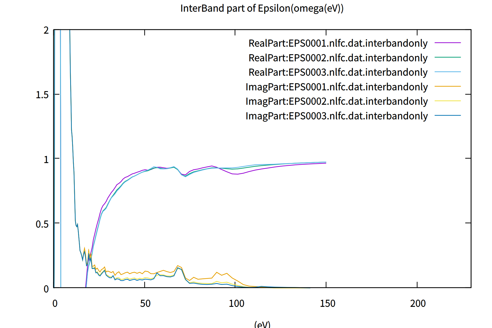

# Dielectric function: epsPP0 

epsPP0(2025-5-8 version)

During QSGW, we calculate $\epsilon_{IJ}(q, \omega)$ for $W$ in the GW calculation.

However, we need to calculate $\epsilon(q, \omega)$ with larger number of k points
to compare experiments.
<!-- ecaljでは乱雑位相差近似にもとづいて誘電関数を計算し、光学特性を調べることができます。
ここでは、具体的な計算の流れを説明します。 -->

Based on the no local-field correction equation $\epsilon({\bf q},\omega)=1-v({\bf q}) \chi_0({{\bf q},\omega})$, we can calculate interband and intraband contributions separately.
The intraband contribution is the Drude weight at the limit ${\bf q} \to 0$.
We use the command `epsPP0` now.

We can include local-field corrections (in fact, we do include the local-field correction is QSGW iteration), but computationally expensive and not open to users currently.

## Computational steps

### Examples of `epsPP0`
It is instructive to learn things from samples as 
* ecalj/Samples/EPS/GaAsEps
* ecalj/Samples/EPS/CuEpsPP0

Follow `job` files in these directories(`bash job` should work). 
We explain the steps in `job` in the following steps.

You can start from only ctrl, GWinput. Then
```
gnuplot -p epsinter.glt 
gnuplot -p epsintra.glt 
gnuplot -p epsall.glt 
```
Note that we usually need many k points if you like to have 0.1 level of error for 
dielectric constants (at the limit of ${\bf q}=\omega =0$)
(e.g, reasonable results for GaAs may require `n1n2n3 20 20 20` in GWinput.)

### step1: `lmf`収束計算行う。
`sigm`ファイルがある場合は, QSGW計算による固有値固有関数からの誘電関数を計算することができる。


### step2: **GWinput**のパラメータを設定
    
- GWinput内で`QforEPS`で囲まれた箇所を探してください。
    // defaultではこのように書かれている
    ```
    QforEPSau on
    <QforEPS>
    0 0 0.00050
    0 0 0.00100
    0 0 0.00200
    </QforEPS>
    ```
    * この部分は誘電関数を計算するときの**q**ベクトルを設定しています。
    この値を変えることで誘電関数の**q**方向の依存性を調べることができます。

    * QforEPSau onがあるので、単位はa.u.になっています。すなわち、0 0 0.001であれば
    ${\bf q}$ = (0,0,0.001) bohr^{-1}です

    * もしQforEPSau onがない場合、**q**の単位は $\frac{2 \pi }{a}$ です。$a$は=`alat`でctrlで定義したものです。あるいはSiteInfo.chkに表示されています。


    光学応答の場合は**q**=**0**としたいですが、そうすると今のコードでは数値的に不安定です。
    なので適宜小さくとってください。この不安定性は以下の図、ecalj/Samples/EPS/GaAsEpsでgnuplot -p epsinter.gltで100eVs弱のところに現れています。なのでたとえばGaAsEpsだと0,0,0.00050(EPS0001に対応）だとすこしにおおきくなっておりよろしくない、ということになります。gnuplotファイルepsinter.gltを見てください。
<!--  -->
<!-- また後述のバンド内・間遷移を分けて計算を行う場合は、2つ以上の座標を書く必要があります。 -->


- エネルギーメッシュの取り方  
誘電関数を計算する際のメッシュは対数メッシュでとられており、GWinput内で
```
    HistBin_dw    2d-3 
    HistBin_ratio 1.08
```
の値を変えることで、誘電関数のエネルギーメッシュを増やす(減らす)ことができます。メッシュを細かくとれば、誘電関数の構造がより現れるようになります。ただし、細かすぎると計算コストがすこし増えます。計算法はまずは虚部のウエイトをヒストグラム的に蓄積したあと、実部はヒルベルト変換の方法で求めています。なので数値的にはまあまあ安定です。


* 計算メモリ量をへらしたい場合はGWinputに
```
KeepEigen False
KeepPbp False
```
等のコマンドを適宜書き込んで下さい。（we have to explain details...）


* QforEPSau on
これはQforEPSのqをa.u.ではかるという意味になります。
たとえば`<QforEPS>に0d0 0d0 0.00005`とあれば、これは
q=(0d0 0d0 0.00005)/bohrと読んでください。
（過去のQforEPSunita on と同じ意味）。
確認するには,2pi/alatをEPSファイル最初の3つの数字に乗じて
`<QforEPS>`にかかれているqになるのをみます。

* 以前の--zmel0のオプションは2025-5-8で廃止しました。
これはGramSchmidt2をsugw.f90に挿入して
すこし正確な直行化が可能になったためです。

* epsPP0では最後にreadeps.pyを読んでて答えをまとめ上げてます。


* Cuの場合だと、qがあまりにゼロに近いと計算が不安定です。たとえば
```
QforEPSau on
<QforEPS>
 0d0 0d0 0.00005
 0d0 0d0 0.0001
 0d0 0d0 0.0002
 0d0 0d0 0.0004
 0d0 0d0 0.0008
 0d0 0d0 0.0016
 0d0 0d0 0.0032
</QforEPS>
```
などとすると、 0d0 0d0 0.00005のグラフがおかしいです。
それ以外のグラフはほぼ重なります。だた、0.0032ぐらいになるとomega=0での実部がいくらかずれてきます。

* CuepsPP0ではフェルミ面の寄与もあり、
```
gnuplot -p epsintra.glt
```
を実行してフェルミ面の寄与が見れます。This is Drude weight、q分解でみれています。
omega=0近傍でのふるまいはFetter-Waleckaにあるようにふるまっています。
```
gnuplot -p epsintra.glt
gnuplot -p epsall.glt
```


* epsPP0の計算が終わると`EPS000*.nlfc.dat`というファイルがGWinputで設定したq点の数分作られます。この中は

```
    // example EPS0001.nlfc.dat
    q(1:3)   w(Ry)   eps    epsi  --- NO LFC
  0.01000000  0.00000000  0.00000000    0.0000E+00  0.276888086703565E+02  0.211273167660642E-17    0.361156744555281E-01 -0.275572453667495E-20
  0.01000000  0.00000000  0.00000000    0.1015E-04  0.276873286605807E+02  0.424191214559347E-01    0.361175202203266E-01 -0.553348246663633E-04
  0.01000000  0.00000000  0.00000000    0.3076E-04  0.276716446748960E+02  0.128515093142673E+00    0.361372966009293E-01 -0.167832020581202E-03
  0.01000000  0.00000000  0.00000000    0.5200E-04  0.276450859807482E+02  0.197440420455938E+00    0.361709489903162E-01 -0.258331892398948E-03
  0.01000000  0.00000000  0.00000000    0.7389E-04  0.276274571460234E+02  0.249411594405801E+00    0.361929258459201E-01 -0.326737828014011E-03
```
1~3行目にq点座標、4行目にエネルギー(Ry単位)、5・6行目が誘電関数の実部・虚部、7・8行目が誘電関数の逆数の実部・虚部
が書かれています。

---

** （改良計画）誘電関数計算にはバンド吸収端で(E-E0)**.5でキレイに立ち上がらない(GaAsなどの場合）、
という数値計算上の問題があります。メッシュを細かく取るときれいにできることは示したことがあります。
変な内挿法よりも必要なことだけ細かく取るという技法が有効だと思います。汎用化しないといけないです。

**（改良計画）q=0でのinterbandの寄与は<u|u>行列を使えば先に1/q^2の割り算ができるので
もっと直接的にできるはずです。

---


(Here we keep old documents, but commented out...)
<!-- ### step:3 epsPP_lmfh , eps_lmfh

eps計算を行うときは、epsPP_lmfh(局所場補正なし)とeps_lmfh(局所場補正あり)のどちらかを使います。

使い方は

```   
 // example 
 mpirun epsPP_lmfh -np 4 si
```


---

## バンド内・間寄与の誘電関数

通常の誘電関数計算のほかに、バンド内遷移の寄与とバンド間遷移の寄与とを分けて誘電関数を計算することも可能です。
この計算は、金属系などで誘電関数の構造や複合プラズモンを解析するときに有用です。

具体的な方法は、まずGWinputで小さなq座標とそこから少しだけずれたq座標を書いてください。
 ```
    // example
    <QforEPS>
     0 0 0.0001   
     0 0 0.001      
     0 0 0.01
      ・・・
    </QforEPS>
  ```
  他は通常計算と同じように計算したい方向のq座標を入れてください。  
  あとは、epsPP_lmfhの代わりにepsPP_lmfh_intraを用いると計算されます。
```   
 // example 
 mpirun epsPP_lmfh_intra -np 4 si
```
計算が終わると`EPS000*.nlfc.dat.intrabandonly`、`EPS000*.nlfc.dat.interbandonly`
というファイルが作られます。中身のデータは通常計算のときと同じです。
 -->


<!-- 
=======================================================
* OLD document before 2025-5-7

誘電関数ｑ＝０を計算するには、最近のバージョンの（２０２３−１０−２３以後）の
収束したところからスクリプトepsPP0を使ってください。
ecalj/MATERIALS/Cueps
にサンプルがあるので、Cuを収束させた後、
epsPP0 cu -np 4
などとすると、epsinter.glt, epsintra.glt, epsall.glt
ができます。epsintraはフェルミ面の寄与になります。


いくつかのｑ点で計算してｑ＝＞０を取るのです。そのためにctrlには
ーーーーーーーーーーーーーーーーーー
QforEPSunita on
<QforEPS>
 0d0 0d0 0.00001
 0d0 0d0 0.001
 0d0 0d0 0.0014142
 0d0 0d0 0.002
 0d0 0d0 0.0028284
 0d0 0d0 0.004
</QforEPS>
ーーーーーーーーーーーーーーーーーー
などと書いておく必要があります。


最低でも、2行入ります。
QforEPSunita on
<QforEPS>
 0d0 0d0 0.00001
 0d0 0d0 0.001
</QforEPS>
ーーーーーーーーーーーーーーーーーー
が、いります.できれば後何行かあったほうがいいです。

QforEPSunita onは単位を2pi/alat　とする指定です。
最初の行の0d0 0d0 0.00001　は数値誤差を計算するためにいるんです。

 0d0 0d0 0.001での誘電関数計算にも 0d0 0d0 0.00001で計算した行列要素（誤差の大きさを計算）を使うんです。なので、EPS0002以後が意味のある答えになります。
epsinter.gltなどではqを複数計算して重ねてみています。
Cuだとキレイにかさなっているのが見て取れます。

epsPP0では最後にreadeps.pyを読んでて答えをまとめ上げてます。
（readeps.py汚いです。試行錯誤の結果が残っていて関数fd0はいまは使っていません）。
いぜんよりはだいぶとキレイに求まると思います。

Ag、結果がこれでも変なら教えてください。

================================================================================
 -->
