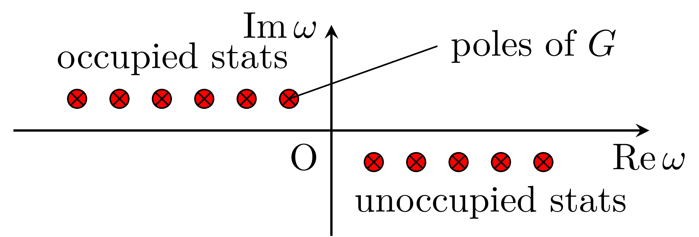

# 基本表式

絶対零度でのGreen関数について

## 参考文献
- Fetter Walecka

## (1粒子) Green関数の定義

$$
\begin{align}
iG(𝒓_1t_1, 𝒓_2t_2) &= \braket{\Psi_0|T[\hat 𝜓_\mathrm{H}(𝒓_1,t_1)\hat 𝜓^†_\mathrm{H}(𝒓_2,t_2)]|\Psi_0} \\
&=\braket{\Psi_0|\hat 𝜓_\mathrm{H}(𝒓_1,t_1)\hat 𝜓^†_\mathrm{H}(𝒓_2,t_2)|\Psi_0} 𝜃(t_1-t_2) -\braket{\Psi_0|\hat 𝜓^†_\mathrm{H}(𝒓_2,t_2)\hat 𝜓_\mathrm{H}(𝒓_1,t_1)|\Psi_0} 𝜃(t_2-t_1)
\end{align}
$$

- $\hat 𝜓_\mathrm{H}(𝒓,t)$ :ハイゼンベルグ表示での場の演算子であり, $\hat 𝜓_\mathrm{H}(𝒓,t) = e^{i\hat Ht/\hbar}\hat 𝜓(𝒓)e^{-i\hat Ht/\hbar}$．
- $\hat 𝜓^†_\mathrm{H}(𝒓,t) = e^{i\hat Ht/\hbar}\hat 𝜓^†(𝒓)e^{-i\hat Ht/\hbar}$である．
- フェルミ粒子の場の演算子には反交換関係があり$\{𝜓_\mathrm{H}(𝒓_1,t),𝜓_\mathrm{H}^†(𝒓_2,t)\} = 𝛿(𝒓_1-𝒓_2)$. 同時刻の反交換関係であることに注意。
- $T$は時間順序積であり, 時間$t$の順序を左側に未来の時間, 右側に過去の時間となるように並べ変える．
- $𝜃(t)$: ステップ関数 $t>0$なら1, $t<0$なら0である．
- $\Psi_0$:ハイゼンベルグ表示の$N$粒子での基底状態 $\hat H\ket{\Psi_0} = E \ket{\Psi_0}$

## 相互作用のない系でのGreen関数

### ハミルトニアン
ハミルトニアンを$\hat H -μ\hat N$ として, 基底状態のエネルギーを0としておく．$𝜇$:フェルミエネルギー, $\hat N = \int d𝒓 𝜓^†(𝒓)𝜓(𝒓)$: 粒子数演算子であり, 基底状態の粒子数を$N$とすると$\hat N \ket{\Psi_0} = N \ket{\Psi_0}$.
また, 相互作用がない場合は1粒子状態の和であるので
$$
\hat H - \mu \hat N =  \sum_n 𝜀_n \hat c^†_{n}\hat c_{n}
$$
である．

> [!WARNING]
>  エネルギーの基準(ゼロ点)をフェルミ準位にしていることに注意．

ここで, 1粒子ハルミトニアンの固有関数を$𝜙_{n}(𝒓)$(これは完全系をつくる)として, 場の演算子を展開した係数を$\hat c_n$としている．
$$
\hat 𝜓(𝒓) = \sum_n \hat c_n 𝜙_{n}(𝒓)
$$
相互作用のない場合の基底状態は, エネルギー$𝜀_n$をもつ占有軌道がフェルミ準位までフェルミ分布に従い占有している．

### 実時間表示
$\hat 𝜓^\dagger \ket{\Psi_0}$によって電子が非占有状態に生成されるもしくは, $\hat 𝜓 \ket{\Psi_0}$によって正孔が占有状態に生成される(占有状態電子を消滅する)という2通りが, それぞれGreen関数の1項目と2項目に対応する．
$$
\begin{align}
\braket{\Psi_0|\hat 𝜓_\mathrm{H}(𝒓_1,t_1)\hat 𝜓^†_\mathrm{H}(𝒓_2,t_2)|\Psi_0} &= 
\braket{\Psi_0|\hat 𝜓(𝒓_1)e^{-i(\hat H- 𝜇 \hat N)(t_1-t_2)/\hbar}  \hat 𝜓^†(𝒓_2)|\Psi_0} \\
&= \sum_{n'}^{\mathrm{unocc}} 𝜙_{n'}(𝒓_1)𝜙^*_{n'}(𝒓_2)e^{-i𝜀_{n'}(t_1-t_2)/\hbar} : 電子の生成から消滅のプロパゲータ \\
\braket{\Psi_0|\hat 𝜓^†_\mathrm{H}(𝒓_2,t_2)\hat 𝜓_\mathrm{H}(𝒓_1,t_1)|\Psi_0} &= 
\braket{\Psi_0|\hat 𝜓^†(𝒓_2)e^{-i(\hat H- 𝜇 \hat N)(t_2-t_1)/\hbar} \hat 𝜓(𝒓_1)|\Psi_0} \\
&= \sum_{n}^{\mathrm{occ}} 𝜙_{n}(𝒓_1)𝜙^*_{n}(𝒓_2)e^{i𝜀_{n}(t_2-t_1)/\hbar}: 正孔の生成から消滅のプロパゲータ
\end{align}
$$
- 生成と消滅は同じ1粒子状態$n$に対して行なわれる．そうでない場合はゼロになる．
- 正孔の生成状態も励起状態であり基底状態からの，励起エネルギーは$-𝜀_n>0$である．

::: details 導出

:::

よって, 
$$
\begin{align}
iG(𝒓_1t_1,𝒓_2t_2) =& \sum_{n'}^{\mathrm{unocc}} 𝜙_{n'}(𝒓_1)𝜙^*_{n'}(𝒓_2)e^{-i𝜀_{n'}(t_1-t_2)/\hbar} 𝜃(t_1-t_2) \\
  &- \sum_{n}^{\mathrm{occ}} 𝜙_{n}(𝒓_1)𝜙^*_{n}(𝒓_2)e^{i𝜀_{n}(t_2-t_1)/\hbar}𝜃(t_2-t_1) \\
  & \equiv iG_\mathrm{ele}(𝒓_1t_1,𝒓_2t_2)+ iG_\mathrm{hole}(𝒓_1t_1,𝒓_2t_2)
\end{align}
$$
となる。最後の行では, 電子と正孔の寄与を分けて定義しておく。これはグリーン関数の積を考える際に理解の助けになる。
> [!INFO]
> グリーン関数は実空間, 実時間表示で見る方がイメージしやすい．

### 振動数表示
Green関数は$t_1-t_2$の関数なので,それについてフーリエ変換した表式も用いられる．レーマン表示とかスペクトル表示と呼ばれている．
ステップ関数をフーリエ表示として
$$
𝜃(t) = - \int \frac{d𝜔'}{2𝜋i} \frac{e^{-i𝜔't}}{𝜔'+i𝛿}
$$
がある．ここで$𝛿$は正の微少量．$𝜔'$面の下反面の留数を拾う拾わないかでステップ関数を表現している．

::: info
フーリエ変換は，規格化因子の不定性があるので，この文章では以下のようにしておきます．
$$
\begin{align}
f(𝜔) &= \int dt f(t) e^{i𝜔t} \\
f(t) &= \frac{1}{2\pi}\int d𝜔 f(𝜔) e^{-i𝜔t} \\
𝛿(𝜔) &= \frac{1}{2\pi} \int dt e^{i𝜔t}
\end{align}
$$
:::

$𝜃(\pm t)e^{-iEt/\hbar}$のフーリエ変換を考えると, ($𝜃(-t)$は$𝜃(t)$の中の$e^{-i𝜔't}$ を$e^{i𝜔't}$とすればよい)
$$
\begin{align}
\int dt 𝜃(\pm t)e^{-iEt/\hbar}e^{i𝜔t} = - \int \frac{d𝜔'}{2𝜋i} \int dt \frac{e^{-i(\pm 𝜔'+ E/\hbar-𝜔)t}}{𝜔'+ i𝛿} \\
= - \int \frac{d𝜔'}{i}\frac{1}{𝜔'+ i𝛿}𝛿(\pm 𝜔'-𝜔+ E/\hbar) = i\frac{1}{\pm (𝜔 - E/\hbar) + i𝛿}
\end{align}
$$
となっているので,

$$
\begin{align}
G(𝒓_1,𝒓_2;𝜔) &= \int d(t_1-t_2) G(𝒓_1t_1,𝒓_2t_2) e^{i𝜔(t_1-t_2)} \\
&=  \sum_{n'}^{\mathrm{unocc}} \frac{𝜙_{n'}(𝒓_1)𝜙^*_{n'}(𝒓_2)}{𝜔-𝜀_{n'}/\hbar + i𝛿} +
    \sum_{n}^{\mathrm{occ}} \frac{𝜙_{n}(𝒓_1)𝜙^*_{n}(𝒓_2)}{𝜔 - 𝜀_{n}/\hbar -i𝛿}
\end{align}
$$
を得る．複素数に拡張した$𝜔$面では,非占有状態(電子励起)の極が$\Re 𝜔 >0$の下反面，占有状態(正孔励起)の極が上反面に$\Re 𝜔 <0$にある．

> [!INFO]
> 実時間表示の定義についていた$i$は, 振動数表示での表式がキレイになるようにつけられていた．

### 状態密度

$$
\lim_{𝛿 →0}\frac{1}{x \pm i 𝛿} = \mathcal{P} \frac{1}{x} \mp i𝜋𝛿(x)
$$
の関係式を用いると,
$$
\begin{align}
\int d𝒓 G(𝒓,𝒓;𝜔) =  \sum_{n} \frac{1}{𝜔-𝜀_{n}/\hbar \mp i𝛿} = \sum_n \left( \mathcal{P} \frac{1}{𝜔-𝜀_n/\hbar} \pm i 𝜋 𝛿(𝜔-𝜀_n/\hbar)\right)
\end{align}
$$
となるので形式的には状態密度$D(𝜀) = \sum_n 𝛿(𝜀-𝜀_n)$は
$$
\begin{align}
D(𝜀) = \pm \frac{1}{𝜋}\Im \text{Tr}G(𝜀/\hbar)  ただし (+:𝜀<0, -:𝜀>0)
\end{align}
$$
のように書ける($\hbar$や符号があっている??)

## 時間秩序分極関数

ハイゼンベルグ表示の密度演算子を$\hat 𝜌_\mathrm{H}(𝒓,t)$とすると $\hat 𝜌_\mathrm{H}(𝒓,t) = e^{i\hat Ht/\hbar}\hat 𝜓^†(𝒓)\hat 𝜓^(𝒓)e^{-i\hat Ht/\hbar}$ である．
密度の期待値からの変位を表す演算子として$\hat {𝛿\rho} = \hat \rho - \braket{\hat \rho}$を導入する．
このとき時間秩序分極関数$D(𝒓_1t_1,𝒓_2t_2)$は以下のような時間順序積による密度の積(密度相関)と定義する．
$$
\begin{align}
iD(𝒓_1t_1,𝒓_2t_2) = 
\braket{T[\hat {𝛿𝜌}(𝒓_1,t_1)\hat {𝛿𝜌}(𝒓_2,t_2)]} = 
\braket{\hat   {𝛿𝜌}(𝒓_1,t_1)\hat {𝛿𝜌}(𝒓_2,t_2)}𝜃(t_1-t_2)  \\
+\braket{\hat  {𝛿𝜌}(𝒓_2,t_2)\hat {𝛿𝜌}(𝒓_1,t_1)}𝜃(t_2-t_1)
\end{align}
$$

## 相互作用がない系での時間秩序分極関数
相互作用がない系では、N積項は消えるためWickの定理により
$$
\begin{align}
iD(𝒓_1t_1,𝒓_2t_2) = 
\braket{T[\hat {𝛿𝜌}(𝒓_1,t_1)\hat {𝛿𝜌}(𝒓_2,t_2)]} = G(𝒓_1t_1,𝒓_2t_2)G(𝒓_2t_2,𝒓_1t_1)
\end{align}
$$
となる。$G(𝒓_1t_1,𝒓_2t_2) = G_\mathrm{ele}(𝒓_1t_1,𝒓_2t_2) + G_\mathrm{hole}(𝒓_1t_1,𝒓_2t_2)$のように分離でき、$t_1 > t_2$では $G_\mathrm{ele}$が残り$t_1 < t_2$では $G_\mathrm{hole}$が残ることを思い出すと
$$
\begin{align}
iD(𝒓_1t_1,𝒓_2t_2) =& G_\mathrm{ele}(𝒓_1t_1,𝒓_2t_2)G_\mathrm{hole}(𝒓_2t_2,𝒓_1t_1) \\
                  &+ G_\mathrm{hole}(𝒓_1t_1,𝒓_2t_2)G_\mathrm{ele}(𝒓_2t_2,𝒓_1t_1) \\
               =& \sum_{n'}^\mathrm{unocc} \sum_{n}^\mathrm{occ} 𝜙_{n'}(𝒓_1) 𝜙^*_{n'}(𝒓_2) 𝜙_{n}(𝒓_2) 𝜙^*_{n}(𝒓_1)e^{-i(𝜀_{n'}-𝜀_{n})(t_1-t_2)/\hbar} \theta(t_1-t_2) \\
                & +\sum_{n}^\mathrm{occ} \sum_{n'}^\mathrm{unocc} 𝜙_{n}(𝒓_1) 𝜙^*_{n}(𝒓_2) 𝜙_{n'}(𝒓_2) 𝜙^*_{n'}(𝒓_1)e^{-i(𝜀_{n'}-𝜀_{n})(t_2-t_1)/\hbar} \theta(t_2-t_1)
\end{align}
$$
となる。このフーリエ変換は上記と同様に
$$
\begin{align}
D(𝒓_1,𝒓_2;𝜔) =& \sum_{n'}^\mathrm{unocc} \sum_{n}^\mathrm{occ} 
                   \frac{𝜙_{n'}(𝒓_1) 𝜙^*_{n'}(𝒓_2) 𝜙_{n}(𝒓_2) 𝜙^*_{n}(𝒓_1)}{  𝜔-(𝜀_{n'}-𝜀_n)/\hbar + i𝛿} \\
              & +\sum_{n}^\mathrm{occ} \sum_{n'}^\mathrm{unocc} 
                   \frac{𝜙_{n}(𝒓_1) 𝜙^*_{n}(𝒓_2) 𝜙_{n'}(𝒓_2) 𝜙^*_{n'}(𝒓_1)}{-(𝜔-(𝜀_{n}-𝜀_{n'})/\hbar) + i𝛿} \\
            =& \sum_{n'}^\mathrm{unocc} \sum_{n}^\mathrm{occ} \left[
                   \frac{𝜙_{n'}(𝒓_1) 𝜙^*_{n'}(𝒓_2) 𝜙_{n}(𝒓_2) 𝜙^*_{n}(𝒓_1)}{  𝜔-(𝜀_{n'}-𝜀_n)/\hbar + i𝛿}
                  -\frac{𝜙_{n}(𝒓_1) 𝜙^*_{n}(𝒓_2) 𝜙_{n'}(𝒓_2) 𝜙^*_{n'}(𝒓_1)}{  𝜔+(𝜀_{n'}-𝜀_{n})/\hbar - i𝛿} \right]
\end{align}
$$
を得る。
$𝜙^*_n(𝒓)𝜙_m(𝒓) = \sum_{𝜇} Z_{nm𝜇}E_𝜇(𝒓)$ のように波動関数の積を展開する規格直交化する基底を$E_\mu(𝒓)$とし, 展開係数を$Z_{nm𝜇}$とする。
($\braket{E_𝜇|E_𝜈} = 𝛿_{𝜇𝜈}$を満たす)。 このとき$D(𝜔)$を$E_{𝜇}$での展開係数は以下のようになる。
$$
\begin{align}
D_{𝜇𝜈}(𝜔) &= \int d𝒓_1 d𝒓_2 E_{𝜇}^*(𝒓_1) D(𝒓_1,𝒓_2;𝜔)  E_{𝜈}(𝒓_2) \\
         &= \sum_{n'}^\mathrm{unocc} \sum_{n}^\mathrm{occ} \left[
               \frac{Z_{nn'𝜇} Z^*_{nn'𝜈}}{  𝜔-(𝜀_{n'}-𝜀_n)/\hbar + i𝛿}
              -\frac{Z_{n'n𝜇} Z^*_{n'n𝜈}}{  𝜔+(𝜀_{n'}-𝜀_{n})/\hbar - i𝛿} \right]
\end{align}
$$

<!-- ::: details 導出 -->
<!-- $$ -->
<!-- \begin{align} -->
<!-- \braket{T[\hat {𝛿𝜌}(𝒓_1,t_1)\hat {𝛿𝜌}(𝒓_2,t_2)]} &=  -->
<!--    \braket{T[\hat 𝜌_\mathrm{H}(𝒓_1,t_1) \hat 𝜌_\mathrm{H}(𝒓_2,t_2)]} -->
<!--  - \braket{T[\hat 𝜌_\mathrm{H}(𝒓_1,t_1) \braket{\hat \rho_\mathrm{H}(𝒓_2,t_2)}]}  \\ -->
<!-- &- \braket{T[\hat 𝜌_\mathrm{H}(𝒓_2,t_2) \braket{\hat \rho_\mathrm{H}(𝒓_1,t_1)}]}  -->
<!-- + \braket{T[\braket{\hat \rho_\mathrm{H}(𝒓_1,t_1)} \braket{\hat \rho_\mathrm{H}(𝒓_2,t_2)}]} \\ -->
<!-- &= \braket{T[\hat 𝜌_\mathrm{H}(𝒓_1,t_1) \hat 𝜌_\mathrm{H}(𝒓_2,t_2)]}+{\braket{\hat \rho_\mathrm{H}(𝒓_1,t_1)} \braket{\hat \rho_\mathrm{H}(𝒓_2,t_2)}} \\ -->
<!-- \end{align} -->
<!-- $$ -->
<!---->
<!-- ここで $\hat \rho_\mathrm{H}(𝒓,t) = \hat 𝜓^\dagger_\mathrm{H}(𝒓,t) \hat 𝜓_\mathrm{H}(𝒓,t)$ であるため,  -->
<!-- \braket{T[\hat 𝜓^†_\mathrm{H}(𝒓_1,t_1)𝜓_\mathrm{H}(𝒓_1,t_1)𝜓^†_\mathrm{H}(𝒓_1,t_1)𝜓_\mathrm{H}(𝒓_2,t_2)]} =  -->
<!-- ::: -->
