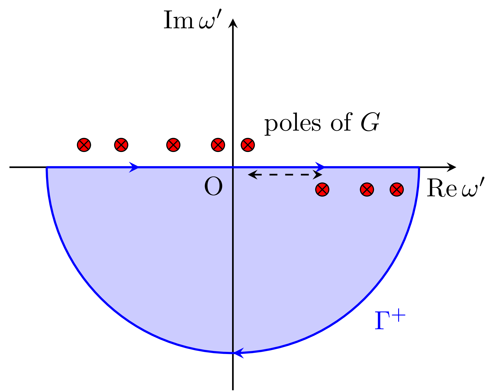

# $GW$ approximation

## $GW$ approximation
The $GW$ approximation is a method used in many-body perturbation theory to describe the electronic structure of systems.
The usefulness of $GW$ calculations in various systems has been demonstrated in the previous investigation. 
It improves upon the standard Density Functional Theory (DFT) by including the effects of electron-electron interactions more accurately.
This method is well known as a highly predictive method that does not rely on any empirical parameters.

In the GW approximation, the self-energy $𝛴$ is expressed as:
$$
𝛴(𝒓_1t_1,𝒓_2t_2) = iG(𝒓_1t_1,𝒓_2t_2)W(𝒓_1t_1^+,𝒓_2t_2),
$$
where $G$ and $W$ are one-particle Green's function and screened Coulomb interaction, respectively.
The Fourie representation of $𝛴(𝒓_1t_1,𝒓_2t_2)$,  $𝛴(𝒓_1,𝒓_2;𝜔)$ is represented as follows:
$$
𝛴(𝒓_1, 𝒓_2; 𝜔) = \frac{i}{2\pi} \int d𝜔' G(𝒓_1,𝒓_2; 𝜔-𝜔') W(𝒓_1,𝒓_2,𝜔')e^{-iη𝜔'},
$$
where $η$ is infinitesimally small positive value.
::: info
Since $W$ has time-inversion symmetry, i.e., $W(𝜔) = W(-𝜔)$, the following formula is also used in some textbooks
$$
𝛴(𝒓_1, 𝒓_2; 𝜔) = \frac{i}{2\pi} \int d𝜔' G(𝒓_1,𝒓_2; 𝜔+𝜔') W(𝒓_1,𝒓_2,𝜔')e^{iη𝜔'}.
$$
:::

Here,
$$
G(𝒓_1, 𝒓_2; 𝜔) = \sum_n \frac{𝜙_n(𝒓_1) 𝜙_n^*(𝒓_2)}{𝜔  - 𝜀_n + iη \text{sgn}(𝜀_n - E_\mathrm{F})}
$$
> [!INFO]
> See the [Basic](basic) for the derivation.

The screened Coulomb interaction $W$ is related to the bare Coulomb interaction $v$ and the dielectric function $𝜖$ by:
$$
W(𝒓_1,𝒓_2,𝜔) = \int d𝒓_3 \epsilon^{-1}(𝒓_1,𝒓_3;𝜔) v(𝒓_3,𝒓_2).
$$
In short notation, $W(𝜔) = 𝜀^{-1}(𝜔)v$.
The dielectric function is connected to the polarization function $P$, i.e., $ϵ = 1 - vP$.
One of approximation to describe $P$ is known as Rondom phase approximation (RPA). In the RPA, $P = Π$,
where $Π$ is the response function (density correlation function).
In the non-intracting system, $Π(𝒓_1t_1,𝒓_2t_2 = -G(𝒓_1t_1,𝒓_2t_2)G(𝒓_2t_2,𝒓_1t_2)$.
In the Fourie representation,
$$
Π(𝒓_1,𝒓_2; 𝜔) = -i \int \frac{d𝜔'}{2𝜋} G(𝒓,𝒓'; 𝜔+𝜔') G(𝒓',𝒓; 𝜔')
$$

### The meaning of $GW$
The $GW$ approximation can be understood as incorporating the screening effect of surrounding electrons into the exchange interaction in Hartree-Fock approach.
Note that $iGv$ gives the Fock exchange.
::: details The formula of $iGv$
$$
\begin{align}
𝛴^\mathrm{x} (𝒓_1,𝒓_2) &≡ \frac{i}{2\pi} \int d𝜔' G(𝒓_1,𝒓_2; 𝜔-𝜔') v(𝒓_1,𝒓_2)e^{-iη𝜔'} \\
& = \sum_{n} 𝜙_n(𝒓_1)\frac{1}{|𝒓_1 -𝒓_2|}𝜙^*_n(𝒓_2)\frac{i}{2\pi} \int d𝜔' \frac{e^{-iη𝜔'}}{𝜔- 𝜔'- 𝜀_n + iη \text{sgn}(𝜀_n - E_\mathrm{F})} \\
& = -\sum_{n}^\mathrm{occ} 𝜙_n(𝒓_1)\frac{1}{|𝒓_1 -𝒓_2|}𝜙^*_n(𝒓_2)
\end{align}
$$
We consider the contour integral in the lower half-plane of the complex $𝜔'$ plane (as shown in the figure), which includes only the poles of the occupied states. 
Since $e^{-iη𝜔'} → 0$, the $Γ^+$ in the figure does not contribute to the integral.
Therefore, by the residue theorem, the $𝜔'$ integral is "2𝜋i" for occupied states and 0 for unoccupied states. 
As a result, expected value of $iGv$ on state $n$ is as follows:
$$
\begin{align}
\braket{𝜙_n|𝛴^\mathrm{x} (𝒓_1,𝒓_2) |𝜙_n}
 = -\sum_{m}^\mathrm{occ} \int d𝒓_1 d𝒓_2 𝜙^*_n(𝒓_1)𝜙_m(𝒓_1)\frac{1}{|𝒓_1 -𝒓_2|}𝜙^*_m(𝒓_2)𝜙_n(𝒓_2)
\end{align}.
$$
This corresponds to the Fock exchange.
{ width=50% class="centered-image" }
:::

## $G_0W_0$ approach

Usually, the GW calculations are used as perturbative corrections to LDA/GGA.
Specifically, the eigenvalues and eigenfunctions obtained from LDA/GGA are chosen as the unperturbed states.
The Kohn-Sham equation employing LDA/GGA can be written as follows, with the eigenvalues and eigenfunctions denoted as $𝜀_n^0\ket{𝜙^0_n}$:
$$
\left(\frac{𝒑^2}{2m}  + V_\mathrm{H} + V_\mathrm{ext} + V_\mathrm{xc}^\mathrm{LDA}\right)\ket{𝜙^0_n} = 𝜀_n^0\ket{𝜙^0_n}
$$
Here, $V_\mathrm{H} + V_\mathrm{ext} + V_\mathrm{xc}^\mathrm{LDA}$ represents the Hartree potential, the potential due to ions, and the exchange-correlation potential in LDA/GGA, respectively. 

From this, the one-body Green's function $G_0$ is calculated as:
$$
G_0(𝒓_1, 𝒓_2; 𝜔) = \sum_n \frac{𝜙^0_n(𝒓_1) 𝜙^{0*}_n(𝒓_2)}{𝜔  - 𝜀^0_n + iη \text{sgn}(𝜀^0_n - E_\mathrm{F})}.
$$
Using $G_0$, the polarization function is calculated via the RPA, and the screened Coulomb interaction $W_0$ is obtained.
The subscript $0$ indicates that these quantities are computed from the unperturbed states.

The quasiparticle energy is determined as:
$$
𝜀_n \simeq 𝜀_n^0 + Z_n \braket{𝜙_n^0 |𝛴(𝜀_n^0) - V_\mathrm{xc}^\mathrm{LDA}|𝜙_n^0},
$$
where, $Z_n$ is the renormalization factor, given by:
$$
Z_n = \left( 1 - \left. \frac{\partial \varSigma(\omega)}{\partial \omega} \right|_{\omega = \epsilon_n} \right)^{-1}.
$$

## Known issue about the $GW$ Approximation

While the GW approximation provides a more accurate description of quasiparticle energies compared to standard Density Functional Theory (DFT), it has several limitations and challenges:

1. **Self-Consistency**: Achieving self-consistency in the GW calculations can be difficult. In practice, many calculations use a non-self-consistent approach (G$_0$W$_0$), where $G$ and $W$ are calculated using the DFT orbitals and eigenvalues. This can lead to inaccuracies in the results.

2. **Starting Point Dependence**: The results of GW calculations can be sensitive to the choice of the starting point, i.e., the initial DFT functional used to generate the orbitals and eigenvalues. Different starting points can lead to different quasiparticle energies.

3. **Computational Cost**: The GW approximation is computationally expensive due to the need to calculate the Green's function $G$ and the screened Coulomb interaction $W$. This makes it challenging to apply to large systems or complex materials.

4. **Vertex Corrections**: The GW approximation neglects vertex corrections, which can be important for accurately describing electron-electron interactions. Including these corrections can improve the accuracy but also increases the computational complexity.

5. **Limited Accuracy for Strongly Correlated Systems**: The GW approximation may not be accurate for systems with strong electron correlation effects, such as transition metal oxides or heavy fermion systems. In such cases, more advanced methods like Dynamical Mean Field Theory (DMFT) or GW+DMFT may be required.

Despite these challenges, the GW approximation remains a valuable tool for studying the electronic properties of materials, particularly for systems where electron-electron interactions play a significant role.

> [!IMPORTANT] For the self-consistency issue:
> The issues on Self-Consistency and Starting Point Dependence are overcome by introducing self-consistent scheme. Our implementation of quasi-particle self-consistent $GW$ is one of solution for these issues

> [!IMPORTANT] For the computational cost issue:
> Our code combines an implementation that enables large-scale parallel computing with the use of GPU accelerators, leading to the expansion of the applicable range of materials.

