# quasi-particle self-consistent $GW$

The quasi-particle self-consistent $GW$ (QSGW) method is an advanced computational technique used in condensed matter physics and materials science to calculate the electronic properties of materials.
It improves upon the standard $GW$ approximation by iteratively updating the one-particle (quasi-particle) Hamiltonian $H^0$.
This method provides more accurate quasi-particle energies and electronic band structures compared to traditional density functional theory (DFT) calculations.

Key features of QSGW:
- Self-consistent scheme
- Improved accuracy in predicting electronic properties.
- Applicable to a wide range of materials, including semiconductors, insulators, and metals.
::: warning
QSGW does NOT directly update the one-particle Green's function but does so through the one-particle Hamiltonian.
The former method is known as self-consistent $GW$, but it is also known as a less accurate method due to the neglect of vertex corrections.
:::

$$
H_0 = H_{\text{DFT}} + V^\mathrm{QSGW}_\text{xc} - V^\mathrm{LDA/GGA}_{\text{xc}}
$$
where 
$$
H_{\text{DFT}} = -\frac{\hbar^2}{2m}\nabla^2 + V_{\text{ext}} + V_{\text{H}} + V^\mathrm{LDA/GGA}_{\text{xc}}
$$
- $-\frac{\hbar^2}{2m}\nabla^2$: Kinetic energy term
- $V_{\text{ext}}$: External potential
- $V_{\text{H}}$: Hartree term (Coulomb interaction between electrons)
- $V_{\text{xc}}$: Exchange-correlation potential

in the QSGW, one-particle Hamiltonian is constracted by following formula
$$
\begin{align}
  \widetilde{𝛴}^\mathrm{c}_{nm}(𝐤) &
  = \Braket{\Psi_{𝐤n} | 
  {\rm Re}\left[
  {\frac{ {\varSigma}^{\rm c}(\varepsilon_{𝐤n}) + {\varSigma}^{\rm c}(\varepsilon_{𝐤m}) }{2}}
\right]  |{\Psi_{𝐤m}} }
\end{align}
$$

## Flowchart

```mermaid
graph TD
    A1[Get H_0 by solving one-particle equation with given ΔV^xc self-consistently] --> A2[Eigenvalues and eigenfunctions]
    A2 --> B1[MPBC]
    A2 --> B2[MPB]
    B1 --> C1[Core-exchange self-energy Σ^Cx]
    B2 --> C2[Exchange self-energy Σ^x]
    B2 --> D1[Screened Coulomb interaction W]
    D1 --> C3[Correlation self-energy Σ^c]
    C1 --> E1[GW self-energy Σ QSGW potential V^xc_QSGW]
    C2 --> E1
    C3 --> E1
    E1 --> F1{Σ - Σ^old ≤ Δ_QP}
    F1 -->|No: QSGW cycle| A1
    F1 -->|Yes| G1[Converge]
```

This flowchart outlines the process of obtaining the GW self-energy $𝛴$ and the QSGW potential $V^\mathrm{xc}_\mathrm{QSGW}$.
It starts with solving a one-particle equation to get $H^0$, followed by determining the its eigenvalues and eigenfunctions.
The process then branches into calculating core-exchange self-energy $𝛴^\mathrm{Cx}$, exchange self-energy $𝛴^\mathrm{x}$, and correlation self-energy $𝛴^\mathrm{c}$, which are combined to obtain the $GW$ self-energy $𝛴$ and the QSGW potential $V^\mathrm{xc}_\mathrm{QSGW}$.
The cycle continues until the condition $| 𝛴 - 𝛴^\mathrm{old}| ≤ Δ_\mathrm{QP}$ is met.
